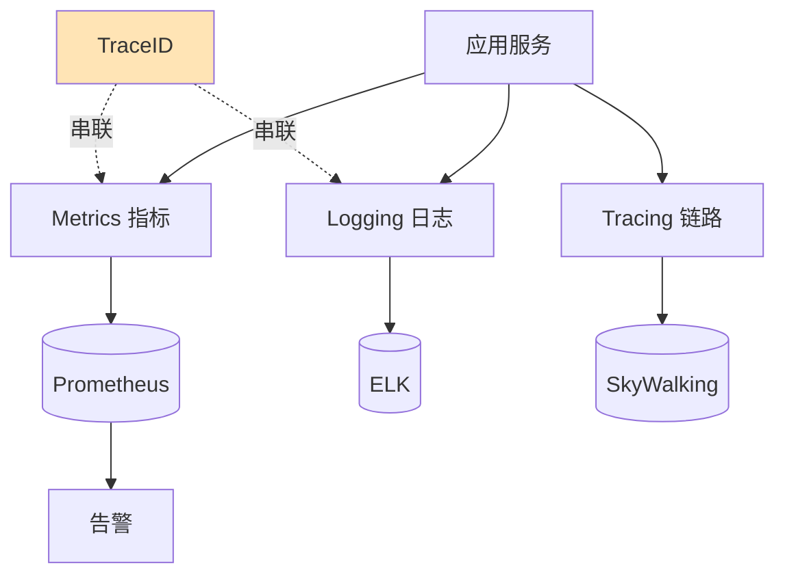

# 如何设计一个全链路监控系统？覆盖日志、指标、链路追踪。

【场景分析】
监控系统三支柱：Metrics（指标）、Logging（日志）、Tracing（链路追踪）。

【1. Metrics（指标监控）】
工具：Prometheus + Grafana
- 采集方式：Pull模式（Prometheus主动拉取）
- 指标类型：Counter / Gauge / Histogram / Summary
- 核心指标：
  - 系统层：CPU/内存/磁盘IO/网络
  - 应用层：QPS/RT/错误率/GC
  - 业务层：订单量/支付成功率
- 告警：Alertmanager → 钉钉/邮件/电话
- PromQL查询

【2. Logging（日志收集）】
工具：ELK Stack（Elasticsearch + Logstash + Kibana）
或 EFK（Filebeat替代Logstash）
- 采集：Filebeat/Fluentd收集应用日志
- 传输：Kafka缓冲
- 存储：Elasticsearch
- 查询：Kibana可视化
- 日志规范：
  - JSON格式
  - 必含字段：timestamp, traceId, level, message
  - 链路ID贯穿整个请求

【3. Tracing（分布式链路追踪）】
工具：Jaeger / SkyWalking / Zipkin
- 核心概念：
  - Trace：一次完整请求
  - Span：请求中的一个操作
  - SpanContext：跨服务传播
- 实现原理：
  - 请求入口生成TraceId
  - 跨服务调用时通过HTTP Header传播TraceId
  - 各服务上报Span到Collector
  - 汇聚展示完整调用链
- 关键功能：
  - 调用拓扑图
  - 耗时分析（哪个服务慢）
  - 异常定位

【统一架构】
```
应用服务 → Micrometer/Metrics → Prometheus → Grafana
应用服务 → Logback + TraceId → Filebeat → Kafka → ES → Kibana
应用服务 → SkyWalking Agent → OAP → UI
```

【告警体系】
- 分级告警：P0(电话)/P1(短信)/P2(钉钉)/P3(邮件)
- 告警收敛：相同告警合并，防止轰炸
- 告警关联：同一根因的多个告警关联
- SLO告警：基于错误预算的智能告警

【APM（应用性能管理）】
- 拓扑自动发现
- 慢接口排行
- JVM监控
- 依赖分析


## 核心流程图



## 记忆要点

- 监控三支柱：Metrics指标准实时的系统状态，Logging详尽的上下文日志，Tracing请求拓扑与耗时
- Metrics方案：Prometheus主动Pull拉取指标，结合Grafana展示与Alertmanager分级告警
- Logging规范：必须打上traceId贯穿全链路，采集Filebeat→缓冲Kafka→搜索ES→展示Kibana
- Tracing原理：入口生成TraceId，跨服务靠HTTP Header传播，按耗时和异常定位慢节点

## 结构化回答


**30 秒电梯演讲：** 像开车仪表盘：速度表（Metrics）告诉你快慢，行车记录仪（Logging）记录发生了什么，导航轨迹（Tracing）告诉你走哪条路最堵。

**展开框架：**
1. **Metrics** — Prometheus监控数值指标
2. **Logging** — ELK收集文本日志
3. **Tracing** — SkyWalking追踪分布式调用链

**收尾：** TraceId如何在微服务间传递？


## 视频脚本

> 预计时长：2 分钟 | 由浅入深

| 时间 | 画面/字幕 | 口播台词 | 讲解要点 |
|------|----------|----------|----------|
| 0:00 | 标题卡：全链路监控系统 | "全链路监控系统，一分钟讲透。" | 开场钩子 |
| 0:35 | 生活类比动画 | "打个比方——像开车仪表盘：速度表(Metrics)告诉你快慢，行车记录仪(Logging)记录发生了什么，导航轨迹(Tracing)告诉你走哪条路最堵。" | 核心类比 |
| 1:10 | 概念定义动画 | "一句话：Metrics看趋势、Logging查细节、Tracing找瓶颈。" | 核心定义 |
| 1:50 | Metrics 图解 | "Prometheus监控数值指标。" | Metrics |
