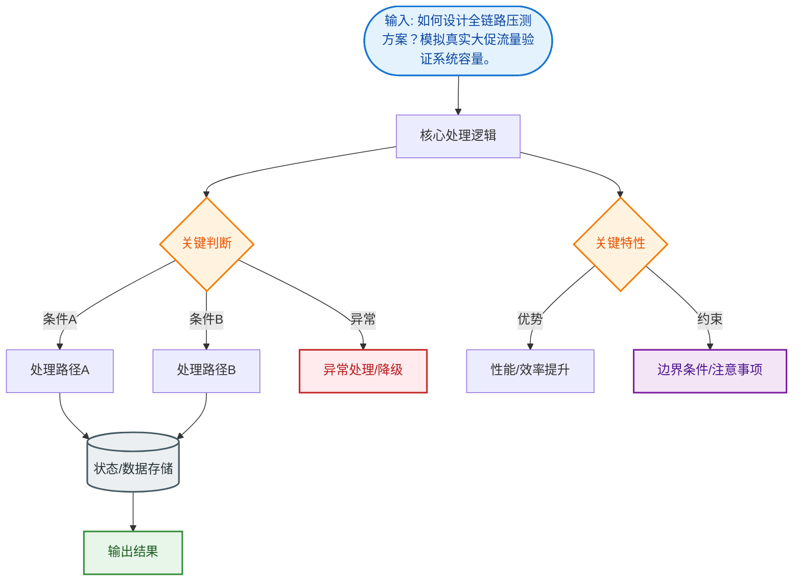

# 如何设计全链路压测方案？模拟真实大促流量验证系统容量。

【场景分析】
全链路压测目标：在真实环境中模拟大促流量，发现系统瓶颈，验证容量规划。

【压测分层】
1. 单机压测：单接口性能基线
2. 单链路压测：一个业务场景（如下单链路）
3. 全链路压测：覆盖所有核心链路的真实流量模拟

【全链路压测架构】
1. 压测平台：
   - 压测脚本管理（JMeter/Gatling/自研）
   - 压测数据准备
   - 压测执行控制
   - 实时监控大盘
2. 流量录制：
   - 生产环境录制真实请求
   - 回放放大N倍模拟峰值
3. 影子库/影子表：
   - 压测数据写影子表（不影响真实数据）
   - 全链路标记：压测请求Header标记 x-pressure-test: true
   - 各服务识别标记，写入影子存储

**数据隔离架构图**：
```text
压测流量 (Header: tag=pt)
    │
    ▼
┌─────────┐    ┌──────────────┐
│ 应用网关 │───▶│  路由中间件   │
└─────────┘    └──────┬───────┘
                      │  识别 Tag
          ┌───────────┼───────────┐
          ▼           ▼           ▼
    ┌──────────┐ ┌──────────┐ ┌──────────┐
    │ 正向DB   │ │ 正向Redis │ │ 正向MQ   │
    │ (真实)   │ │ (真实)   │ │ (真实)   │
    └──────────┘ └──────────┘ └──────────┘
    ┌──────────┐ ┌──────────┐ ┌──────────┐
    │ 影子DB   │ │ 影子Redis │ │ 影子Topic│
    │ (压测)   │ │ (压测)   │ │ (压测)   │
    └──────────┘ └──────────┘ └──────────┘
```

【压测数据准备】
- 用户数据：创建百万级压测账号（注意UserID的Hash路由分布，避免压测流量全部打到一个分片）
- 商品数据：准备充足库存
- 优惠券/活动：配置压测专用
- 数据隔离：压测数据与生产数据严格隔离

【压测执行】
1. 梯度加压：
   - 10% → 30% → 50% → 80% → 100% → 120%
   - 每个梯度持续5-10分钟
   - 观察各系统指标
2. 持续压测：
   - 峰值持续30分钟以上
   - 验证稳定性
3. 突发压测：
   - 模拟突发流量（秒杀场景）
   - 验证限流和降级

【瓶颈分析】
- CPU瓶颈：计算密集型 → 优化算法/加机器
- DB瓶颈：慢查询/连接池 → 读写分离/分库分表
- 网络瓶颈：带宽/连接数 → 压缩/连接池
- 锁瓶颈：分布式锁竞争 → 减小锁粒度
- GC瓶颈：频繁Full GC → JVM调优

【容量规划】
- 压测得出单机最大QPS
- 目标QPS = 大促预期峰值 × 安全系数(1.5)
- 需要机器数 = 目标QPS / 单机QPS
- 预留30%冗余应对突发

## 常见考点
1. **数据污染**：如何确保压测写入的数据不会干扰线上业务？（影子库表、独立的Redis Key前缀、独立的MQ Topic）
2. **链路透传**：压测标记如何在微服务调用链中透传？（ThreadLocal + RPC上下文序列化透传）
3. **第三方服务**：压测请求打到第三方支付/物流接口怎么办？（Mock挡板，模拟返回）
4. **结果分析**：如何区分压测产生的日志和监控数据，避免影响告警？（日志打标，监控系统过滤压测Tag）


## 核心流程图


## 记忆要点

- 核心数据隔离：流量打Header标记，请求路由到专属的影子库表、影子Redis和影子MQ
- 链路透传机制：压测标记通过ThreadLocal结合RPC上下文进行全链路序列化透传
- 压测执行策略：梯度加压找瓶颈，持续压测定容量，突发压测验限流降级
- 容量规划公式：目标QPS = 预期峰值 × 1.5安全系数，需机器数 = 目标QPS / 单机QPS

## 结构化回答


**30 秒电梯演讲：** 像彩排游行一样，在真实街道上用替身演练堵点。

**展开框架：**
1. **全链路标记透** — 全链路标记透传实现数据隔离
2. **流量录制与回** — 流量录制与回放模拟真实场景
3. **梯度施压寻找系统性** — 梯度施压寻找系统性能拐点

**收尾：** 压测数据如何与生产数据隔离？


## 视频脚本

> 预计时长：2 分钟 | 由浅入深

| 时间 | 画面/字幕 | 口播台词 | 讲解要点 |
|------|----------|----------|----------|
| 0:00 | 标题卡：全链路压测方案 | "全链路压测方案，一分钟讲透。" | 开场钩子 |
| 0:35 | 生活类比动画 | "打个比方——像彩排游行一样，在真实街道上用替身演练堵点。" | 核心类比 |
| 1:10 | 概念定义动画 | "一句话：真实环境模拟流量，通过数据隔离验证系统极限容量。" | 核心定义 |
| 1:50 | 全链路标记透传 图解 | "全链路标记透传实现数据隔离。" | 全链路标记透传 |
