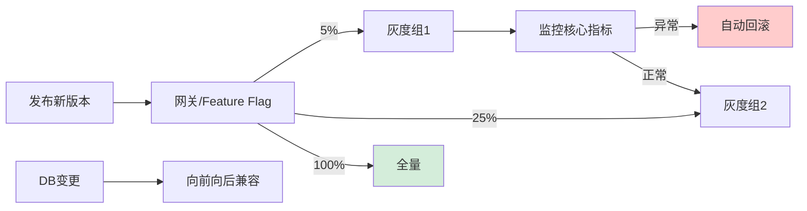

# 如何设计灰度发布方案？安全可控地发布新版本。

【场景分析】
灰度发布目标：逐步将新版本推给部分用户，发现问题及时回滚，降低发布风险。

【灰度策略】
1. 按比例灰度：
   - 5% → 10% → 30% → 50% → 100%
   - 每个阶段观察指标
2. 按用户特征灰度：
   - 内部用户 → VIP用户 → 普通用户
   - 按地域/版本灰度
3. 按流量灰度：
   - 金丝雀发布：先部署1个新版本实例
   - 蓝绿发布：新老版本并行，一键切换

【技术实现】
1. 网关路由（推荐）：
   - API网关根据请求特征路由到新/老版本
   - 规则：Header/Cookie/UserID取模
   ```nginx
   # Nginx按Cookie灰度
   upstream new_backend { server 10.0.0.1:8080; }
   upstream old_backend { server 10.0.0.2:8080; }
   map $cookie_canary $upstream {
     default old_backend;
     "true" new_backend;
   }
   ```
2. 服务网格（Istio）：
   - 基于Weight的流量分配
   - 精确到百分比
   - 无需修改代码
3. 特性开关（Feature Flag）：
   - 代码中新功能用开关包裹
   - 运行时动态控制开关
   - LaunchDarkly / Apollo配置中心

【灰度发布流程】
1. 准备阶段：
   - 新版本部署但不接流量
   - 自动化测试通过
   - 监控指标基线
2. 金丝雀：
   - 1-5%流量到新版本
   - 观察30分钟
   - 核心指标：错误率/RT/QPS
3. 逐步放量：
   - 每次放量后观察15分钟
   - 指标正常 → 继续放量
   - 指标异常 → 自动回滚
4. 全量发布：
   - 100%流量切到新版本
   - 保留老版本24小时（可快速回滚）
   - 确认稳定后清理老版本

【回滚策略】
- 快速回滚：切换流量到老版本（秒级）
- 数据回滚：新版本写的数据需兼容或清理
- 自动回滚：指标超过阈值自动触发

【数据库兼容】
- 向前兼容：新版本可读老数据
- 向后兼容：老版本可读新数据
- DDL变更：分多步（先加列不加约束 → 双写 → 切换 → 删旧列）


## 核心流程图




## 记忆要点

- 灰度策略：按流量比例或用户特征灰度，配合金丝雀(单实例)和蓝绿发布(新老并行)
- 技术实现对比：网关层基于Cookie/Header路由改配置即可，Istio可按权重精准切流免改代码
- 发布四步曲：部署不接流量 → 1~5%金丝雀观察30分 → 逐步放量15分/次 → 100%全量保旧版24h
- 数据库兼容：DDL多步走(先加列双写后删旧)，严格保证向前向后兼容以支持秒级回滚

## 结构化回答


**30 秒电梯演讲：** 试吃新菜，先给几个人尝尝没问题再端上全席。

**展开框架：**
1. **Feature** — 通过网关或Feature Flag控制流量路由
2. **核心指标监控** — 核心指标监控异常自动触发回滚
3. **数据库变更** — 数据库变更需遵循向前向后兼容原则

**收尾：** 灰度发布和蓝绿部署有什么区别？


## 视频脚本

> 预计时长：2 分钟 | 由浅入深

| 时间 | 画面/字幕 | 口播台词 | 讲解要点 |
|------|----------|----------|----------|
| 0:00 | 标题卡：灰度发布方案 | "灰度发布方案，一分钟讲透。" | 开场钩子 |
| 0:35 | 生活类比动画 | "打个比方——试吃新菜，先给几个人尝尝没问题再端上全席。" | 核心类比 |
| 1:10 | 概念定义动画 | "一句话：小范围试错，逐步放量，将发布风险控制在最小范围。" | 核心定义 |
| 1:50 | 网关或Feature 图解 | "通过网关或Feature Flag控制流量路由。" | 网关或Feature |
