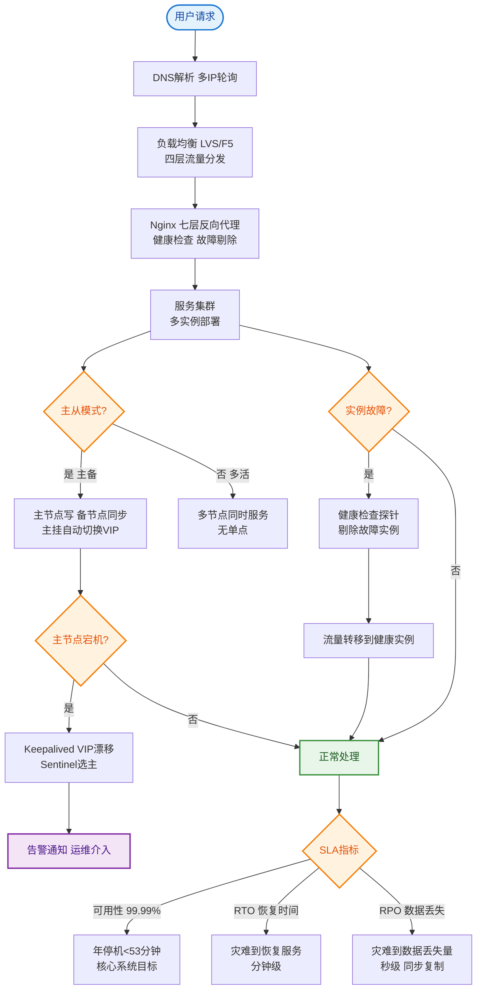

# 如何设计一个故障自愈系统？自动检测、诊断和恢复服务。

【场景分析】
故障自愈目标：减少人工介入，系统自动检测异常并执行恢复操作。

【故障自愈架构】
1. 检测层：
   - 监控告警：Prometheus指标异常
   - 日志分析：错误日志模式匹配
   - 健康检查：HTTP/TCP探针
   - 链路追踪：SkyWalking异常调用
2. 诊断层：
   - 根因分析：从告警追溯到根因
   - 故障图谱：CMDB依赖关系
   - AI诊断：历史故障模式匹配
3. 决策层：
   - 预案匹配：故障类型 → 预定义恢复方案
   - 影响评估：评估恢复操作的影响
   - 人工确认：高风险操作需人工确认
4. 执行层：
   - 自动恢复脚本
   - 运维编排（Ansible/Terraform）
   - K8s Operator

**自愈闭环流程图**：
```text
    ┌─────────────┐
    │   监控采集   │ (Metrics/Logs/Traces)
    └──────┬──────┘
           ▼
    ┌─────────────┐
    │   异常检测   │ (规则引擎/AI检测)
    └──────┬──────┘
           ▼
    ┌─────────────┐
    │   根因定位   │ (拓扑分析/关联分析)
    └──────┬──────┘
           ▼
    ┌─────────────┐
    │   决策评估   │ (匹配预案/风险评估)
    └──────┬──────┘
           ▼
    ┌─────────────┐     ┌──────────┐
    │   自动执行   │────▶│  K8s/API │
    └──────┬──────┘     └──────────┘
           ▼
    ┌─────────────┐
    │   效果验证   │ (恢复成功? 失败告警)
    └─────────────┘
```

【常见自愈场景】
1. 服务OOM：
   - 检测：Pod重启/OOM告警
   - 恢复：K8s自动重启Pod
   - 根因：分析Heap Dump
2. 节点故障：
   - 检测：心跳失败
   - 恢复：K8s驱逐Pod，调度到健康节点
3. 依赖服务超时：
   - 检测：RT飙升
   - 恢复：自动触发熔断降级
4. 数据库慢查询：
   - 检测：慢查询日志
   - 恢复：自动Kill慢SQL
5. 磁盘满：
   - 检测：磁盘使用率>90%
   - 恢复：自动清理日志/临时文件

【混沌工程】
- Chaos Monkey：随机Kill实例，验证自愈能力
- ChaosBlade：阿里开源故障注入工具
- 定期演练：模拟各类故障场景
- 目标：发现系统弱点，提前修复

【自愈安全边界】
- 低风险操作全自动（重启Pod/清理日志）
- 中风险操作需审批（扩缩容/切换路由）
- 高风险操作需人工确认（数据迁移/回滚）
- 操作审计：所有自愈操作记录审计日志

## 常见考点
1. **误操作防护**：自愈系统如何防止“误杀”健康节点？（多次采样确认、多指标联合判定、熔断保护机制）
2. **级联故障**：如果重启服务导致数据库压力过大崩溃，如何处理？（决策层考虑全局依赖，限制并发自愈操作）
3. **连接泄露**：应用重启时旧连接未关闭导致自愈失败怎么办？（配置K8s preStop Hook，利用sleep等待连接排空）
4. **状态恢复**：有状态服务（如Kafka、ES）故障时，如何实现自愈？（使用Operator管理状态集，严格按顺序滚动重启）


## 核心流程图


## 记忆要点

- 自愈闭环：监控采集 → 异常检测 → 根因定位 → 决策评估 → 自动执行 → 效果验证
- 防误杀机制：因为自动化可能误判，所以需多次采样确认、多指标联合判定
- 防级联故障：决策层必须限制并发自愈操作数，避免重启风暴压垮依赖的数据库
- 安全边界分级：低风险(重启Pod)全自动，中风险(扩缩容)需审批，高风险(数据回滚)人工确认

## 结构化回答


**30 秒电梯演讲：** 像免疫系统识别病毒并自动吞噬一样。

**展开框架：**
1. **检测、诊断、决策** — 检测、诊断、决策、执行四层架构
2. **预设常见故障的恢** — 预设常见故障的恢复脚本或规则
3. **通过混沌工程验证** — 通过混沌工程验证自愈有效性

**收尾：** 如何做根因分析？


## 视频脚本

> 预计时长：3 分钟 | 由浅入深

| 时间 | 画面/字幕 | 口播台词 | 讲解要点 |
|------|----------|----------|----------|
| 0:00 | 标题卡：故障自愈系统 | "故障自愈系统，这题我会分三步讲。" | 开场钩子 |
| 0:41 | 概念定义动画 | "一句话：自动检测异常并执行预设预案，实现无人值守的故障恢复。" | 核心定义 |
| 1:22 | 生活类比动画 | "打个比方——像免疫系统识别病毒并自动吞噬一样。" | 核心类比 |
| 2:03 | 检测、诊断、决策、执 图解 | "检测、诊断、决策、执行四层架构。" | 检测、诊断、决策、执 |
| 2:50 | 预设常见故障 图解 | "预设常见故障的恢复脚本或规则。" | 预设常见故障 |
