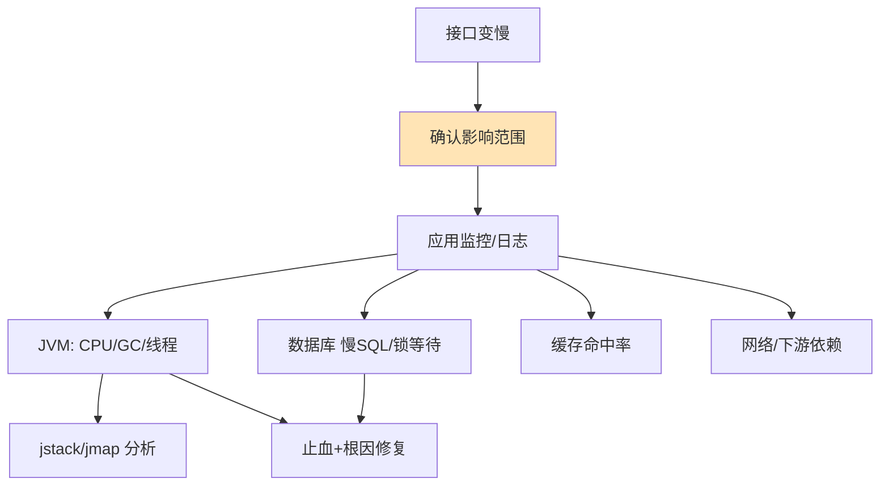
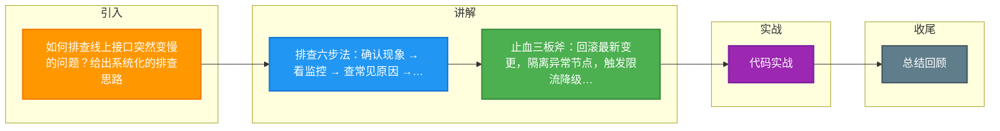

# 如何排查线上接口突然变慢的问题？给出系统化的排查思路。

【场景分析】
线上接口变慢是常见生产事故，需要系统化排查，从现象到根因。

【排查六步法】

【Step 1: 确认现象】
- 慢的是哪些接口？（全部还是个别）
- 什么时候开始的？（突然变慢还是渐进）
- 慢到什么程度？（从10ms到1s还是10s）
- 有没有部署变更？（刚发版/配置修改）

【Step 2: 看监控指标】
1. 应用层：
   - QPS是否飙升？（流量突增）
   - RT/响应时间分布（P50/P99/P999）
   - 错误率是否上升
2. JVM层：
   - GC频率和耗时（Full GC？）
   - 堆内存使用率
   - 线程数和线程状态
3. 数据库层：
   - 慢查询日志
   - 连接池使用率
   - 锁等待
4. 系统层：
   - CPU/内存/磁盘IO/网络

【Step 3: 常见原因排查】
1. 数据库问题（最常见）：
   - 慢查询：`SHOW PROCESSLIST` / 慢查询日志
   - 索引失效：EXPLAIN分析执行计划
   - 锁等待：`SHOW ENGINE INNODB STATUS`
   - 连接池耗尽：连接池监控
2. GC问题：
   - `jstat -gcutil` 查看GC情况
   - `jmap -dump` 导出Heap Dump分析
   - Full GC频繁 → 内存泄漏/大对象
3. 线程问题：
   - `jstack` 分析线程栈
   - 线程死锁/BLOCKED
   - 线程池满
4. 网络问题：
   - DNS解析慢
   - TCP连接积压
   - 带宽打满
5. 依赖服务慢：
   - 链路追踪（SkyWalking）定位慢节点
   - 外部API超时
6. 资源竞争：
   - 锁竞争（synchronized/Lock）
   - 日志IO瓶颈

【Step 4: 快速止血】
- 回滚最近变更
- 重启服务（治标不治本）
- 扩容（如果是容量问题）
- 限流降级（保护系统）
- Kill慢查询

【Step 5: 根因分析】
- Heap Dump分析（MAT工具）
- 火焰图分析CPU热点
- APM链路追踪定位瓶颈

【Step 6: 长期优化】
- 加索引/优化SQL
- 加缓存
- 异步化处理
- JVM参数调优

---

### 增强补充：深入排查细节

1. **CPU飙高排查（用户态 vs 内核态）**
   - 使用 `top -H -p <pid>` 查看线程CPU占用。
   - **用户态高**：通常是业务代码死循环、正则匹配复杂、序列化/反序列化消耗。
   - **内核态高**：通常是大量线程上下文切换（`vmstat`查看cs）、系统调用频繁（如网络IO读写）。

2. **Young GC 与 Full GC 的区分**
   - **Young GC 频繁但快**：可能是分配速率过高， Survivor 区太小，导致对象过早晋升。需调整 `-Xmn` 比例或 `-XX:SurvivorRatio`。
   - **Full GC 频繁且慢（STW）**：
     - **内存泄漏**：Old区持续增长，Dump分析找大对象引用链。
     - **直接内存溢出**：Netty堆外内存未释放，需检查 `-XX:MaxDirectMemorySize`。
     - **Metaspace满**：动态代理类过多、加载类过多，需调整 `-XX:MaxMetaspaceSize`。

3. **线程池耗尽的边界条件**
   - 检查线程池配置：`coreSize`, `maxSize`, `queueCapacity`。
   - **队列满 + 拒绝策略**：如果拒绝策略是 `CallerRunsPolicy`，可能导致主线程（如Tomcat HTTP线程）阻塞，进而导致整个服务吞吐量骤降（假死）。

### 排查流程图

```text
                      发现接口慢
                         |
          --------------------------------
          |              |               |
     CPU/内存高      正常/波动大      正常/无变化
          |              |               |
    [CPU Profile]     [网络/IO]      [线程Dump]
          |              |               |
    死循环/GC       带宽/磁盘IO    等锁/HTTP等待
          |              |               |
    优化代码/GC     扩容/限流      释放锁/依赖优化
```

## 常见考点
1.  **MySQL 连接池耗尽排查**：除了慢查询，如何排查是否为连接泄露？
    *   *提示*：查看 `wait_timeout` 和 `interactive_timeout` 配置，检查应用代码是否在 `finally` 块中关闭连接，或者是否有长事务未提交持有连接。
2.  **频繁 Young GC 导致接口变慢**：为什么 Young GC 次数多会导致响应时间 RT 波动？
    *   *提示*：虽然是并行收集，但大量对象分配和晋升会消耗 CPU 资源，且可能导致对象过早进入老年代，间接触发 Full GC。
3.  **如何区分网络带宽问题与网络延迟问题？**
    *   *提示*：带宽打满通常表现为所有请求都变慢（RT增加且吞吐上不去）；网络延迟通常表现为特定下游服务超时或波动，需结合 `ping`/`traceroute` 及链路追踪判断。


## 核心流程图




## 记忆要点

- 排查六步法：确认现象 → 看监控 → 查常见原因 → 快速止血 → 根因分析 → 长期优化
- 止血三板斧：回滚最新变更，隔离异常节点，触发限流降级保护核心链路
- CPU飙高排查：用top -H找高负载线程，jstack看栈；用户态高查死循环，内核态高查上下文切换
- 慢响应排查：DB慢用EXPLAIN看执行计划，锁阻塞看INNODB STATUS，Full GC频繁Dump查大对象

## 结构化回答


**30 秒电梯演讲：** 像医生看病，先量体温问症状，再做CT查病灶。

**展开框架：**
1. **先确认影响范** — 先确认影响范围和现象特征
2. **JVM** — 自上而下排查应用、JVM、数据库资源
3. **利用jstack** — 利用jstack、jmap等工具分析线程与内存

**收尾：** 如何分析Heap Dump？


## 视频脚本

> 预计时长：2 分钟 | 由浅入深

| 时间 | 画面/字幕 | 口播台词 | 讲解要点 |
|------|----------|----------|----------|
| 0:00 | 标题卡：排查线上接口突然变慢的问题 | "排查线上接口突然变慢的问题，一分钟讲透。" | 开场钩子 |
| 0:35 | 生活类比动画 | "打个比方——像医生看病，先量体温问症状，再做CT查病灶。" | 核心类比 |
| 1:10 | 概念定义动画 | "一句话：由表及里，从监控指标到资源栈，系统化定位性能瓶颈。" | 核心定义 |
| 1:50 | 先确认影响范围和 图解 | "先确认影响范围和现象特征。" | 先确认影响范围和 |

---

### 视频流程图




## 延伸：线上接口突然变慢如何系统化排查？给出从应用到基础设施的完整排查路径。

> 合并自 `scen-114`（相似度 69%）

【排查路径（从近到远，由表及里）】

**1. 应用层 (最直接)**
- **监控大盘**：先看全链路监控，确认是单机慢还是集群普遍慢？特定接口慢还是所有接口慢？
- **日志分析 (ELK)**：
  - 搜索关键字（Exception, Timeout, Slow）。
  - 关注耗时分布，看是计算慢还是 IO 等待。
- **线程堆栈**：
  - `jstack <pid> > dump.log`，分析线程状态。
  - **BLOCKED**：等待锁（需排查死锁或锁竞争）。
  - **RUNNABLE**：死循环或 CPU 密集计算。
  - **WAITING/TIMED_WAITING**：等待网络或数据库响应。
- **GC 状况**：
  - `jstat -gcutil <pid> 1000 10`，看 FGC (Full GC) 次数和时间。
  - 若 GC 频率高且停顿长（CMS > 1s, G1 > 500ms），可能是内存泄漏或堆内存不足。
- **链路追踪**：
  - 能看到具体是哪个 DB 调用或下游 RPC 耗时最长。

**2. 数据库层 (性能瓶颈高发区)**
- **慢查询日志**：开启 `slow_query_log`，分析 `long_query_time`。
- **执行计划**：`EXPLAIN` 检查 SQL。
  - `type`：是否全表扫描 (ALL)？
  - `key`：是否走了正确的索引？
  - `rows`：扫描行数是否过多？
- **DB 资源**：
  - CPU：IO 瓶颈还是计算瓶颈？
  - IOPS：磁盘读写是否饱和？
  - 连接数：`SHOW PROCESSLIST`，看是否连接池占满或存在大量 Sleep 状态。
- **锁冲突**：
  - 查看事务等待时间，是否存在行锁升级表锁或死锁。

**3. 缓存层 (加速器变拖油瓶)**
- **延迟测试**：`redis-cli --latency`，若微秒级波动正常，若毫秒级则异常。
- **内存与淘汰**：`INFO memory`，检查 `used_memory_rss`，是否达到 `maxmemory` 导致频繁驱逐？
- **BigKey/HotKey**：
  - BigKey 导致阻塞：`redis-cli --bigkeys`。
  - HotKey 导致单机负载高：需要拆分或使用本地缓存。
- **穿透/雪崩**：监控 Cache Hit Ratio，命中率突然暴跌意味着大量请求穿透到了 DB。

**4. 网络层 (底层因素)**
- **带宽**：网卡流量 (`ifstat`) 是否打满？
- **TCP**：`netstat -s | grep retransmitted`，重传率高说明网络不稳定。
- **DNS**：域名解析是否变慢？

**5. 下游依赖 (级联效应)**
- **第三方 API**：如果是 RPC 调用慢，看下游服务是否限流或熔断？
- **MQ 积压**：如果是异步接口，检查消费者消费速度是否跟得上生产速度。

【常见原因汇总】
- **DB**：索引失效、数据量激增、锁等待。
- **代码**：死循环、复杂的算法/正则、不合理的序列化。
- **资源**：连接池耗尽、线程池配置不合理（队列太大导致堆积）。
- **JVM**：频繁 Full GC、OOM。

## 常见考点
1. **CPU 100% 但吞吐量为 0 怎么查？**
   - 答：`top -H -p` 找到高 CPU 的线程 ID，转十六进制，`jstack` 中查找对应的线程堆栈，通常是在死循环或频繁计算。
2. **接口偶发慢（抖动）怎么查？**
   - 答：重点关注 GC（特别是 Young GC 增量对老年代的影响）和 STW（Stop-The-World）；检查网络是否有丢包；检查是否有定时任务（如日志归档、统计报表）抢占资源。
3. **频繁 Full GC 如何定位？**
   - 答：Dump 内存快照 (`jmap -dump:format=b,file=heap.hprof <pid>`)，用 MAT/JVisualVM 分析大对象归属，看是谁持有大量对象引用不释放。
4. **如何区分是 DB 慢还是应用慢？**
   - 答：在代码中记录 DB 执行时间 (DRUID 监控)，若 SQL 耗时短但总耗时久，则是应用逻辑慢（如序列化、循环调用）；若 SQL 耗时长，则是 DB 问题。

## 记忆要点

- 排查路径：由表及里，按应用层→数据库→缓存层→网络层依次推进
- 应用排查：查JVM（GC频率与OOM）与Jstack（看线程是BLOCKED还是WAITING）
- DB排查：用EXPLAIN看是否全表扫，查ProcessList看是否有锁等待或连接打满
- 偶发抖动：多为频繁Full GC的STW引起，或定时任务抢占底层资源导致

## 结构化回答


**30 秒电梯演讲：** 像水管查漏水，从水龙头一路查到总阀门。

**展开框架：**
1. **CPU** — 先看应用监控和日志，定位CPU/GC/线程问题。
2. **SQL** — 查数据库慢SQL、索引和锁等待。
3. **查缓存命中率** — 查缓存命中率及网络延迟。

**收尾：** 如何快速定位是DB还是应用的问题？


## 视频脚本

> 预计时长：3 分钟 | 由浅入深

| 时间 | 画面/字幕 | 口播台词 | 讲解要点 |
|------|----------|----------|----------|
| 0:00 | 标题卡：线上接口突然变慢如何系统化排查 | "线上接口突然变慢如何系统化排查，这题我会分三步讲。" | 开场钩子 |
| 0:41 | 概念定义动画 | "一句话：由近及远分层排查，定位性能瓶颈。" | 核心定义 |
| 1:22 | 生活类比动画 | "打个比方——像水管查漏水，从水龙头一路查到总阀门。" | 核心类比 |
| 2:03 | 先看应用监控和日志 图解 | "先看应用监控和日志，定位CPU/GC/线程问题。" | 先看应用监控和日志 |
| 2:50 | 查数据库慢SQL、索 图解 | "查数据库慢SQL、索引和锁等待。" | 查数据库慢SQL、索 |

### 视频流程图


