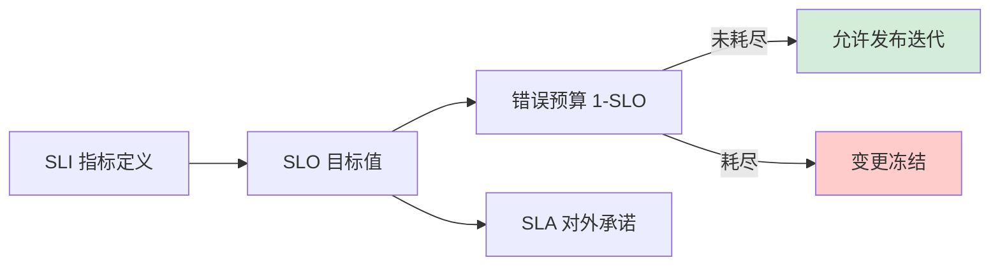

# 如何设计一个 SLA/SLO 保障体系？量化系统可靠性目标。

【场景分析】
SLA（Service Level Agreement）：服务等级协议，对用户的承诺。
SLO（Service Level Objective）：服务等级目标，内部追求的目标。
SLI（Service Level Indicator）：服务等级指标，具体度量值。

【SLI指标定义】
1. 可用性：服务正常运行时间占比
   - SLI = 成功请求数 / 总请求数
   - 或 SLI = 正常运行时长 / 总时长
2. 延迟：请求响应时间
   - SLI = P99延迟 < 200ms 的请求比例
3. 吞吐量：单位时间处理请求数
4. 正确性：数据一致性比例
5. 饱和度：资源使用率

【SLA级别】
- 99%：每月允许~7小时不可用
- 99.9%（三个9）：每月允许~43分钟
- 99.99%（四个9）：每月允许~4.3分钟
- 99.999%（五个9）：每月允许~26秒

【SLO设定原则】
- 基于用户需求而非内部能力
- 设置错误预算
- SLO应比SLA更严格（留缓冲）

【错误预算】
```
SLO = 99.9%（一个月30天）
错误预算 = 30 × 24 × 60 × 0.1% = 43.2分钟
```
- 错误预算内：可以大胆创新（发新功能/做实验）
- 错误预算耗尽：冻结非必要变更，专注稳定性

【保障体系】
1. 监控告警：
   - SLI实时监控
   - 错误预算消耗速率告警
   - Burn Rate（消耗速率）告警
2. 容量规划：
   - 基于SLO推算所需资源
   - 预留弹性扩容能力
3. 变更管理：
   - 错误预算充足时：正常发布
   - 错误预算紧张时：减慢发布
   - 错误预算耗尽：冻结发布
4. 故障复盘：
   - 每次故障消耗错误预算
   - 复盘根因，系统改进
   - 改进措施追踪
5. 混沌工程：
   - 定期注入故障验证SLO
   - 发现薄弱环节

【Google SRE实践】
- 50%时间运维，50%时间工程改进
- 自动化优先
- 事后复盘文化


## 核心流程图




## 记忆要点

- 概念递进：SLI是度量值，SLO是内部目标，SLA是对外承诺（SLO必须比SLA严格留缓冲）。
- 量化指标：三个9允许每月停机43分钟，四个9仅4.3分钟，五个9为26秒。
- 核心机制：因为消耗错误预算，所以预算耗尽时冻结非必要发布，专注稳定性。
- 保障体系：监控告警、容量规划、变更管理与混沌工程，结合Google 50%工程时间原则。

## 结构化回答

**30 秒电梯演讲：** 量化定义系统可靠性，利用错误预算平衡迭代与稳定性。打比方——像信用卡额度，预算内随便花，超限就冻结。落到工程上，SLI定义指标，SLO设定目标，SLA是对外承诺。

**展开框架：**
1. **SLI定义** — SLI定义指标，SLO设定目标，SLA是对外承诺
2. **错误预算管理发布风险** — 利用错误预算管理发布风险
3. **SLO数值越高** — SLO数值越高，允许的故障停机时间越少

**收尾：** 这几个点都能配合实战展开。您想继续聊哪个追问——比如 「错误预算如何使用」 或者 「如何选择SLI指标」？

## 视频脚本

> 预计时长：2 分钟 | 由浅入深

| 时间 | 画面/字幕 | 口播台词 | 讲解要点 |
|------|----------|----------|----------|
| 0:00 | 标题卡：SLA/SLO 保障体系 | "SLA/SLO 保障体系，一分钟讲透。" | 开场钩子 |
| 0:35 | 生活类比动画 | "打个比方——像信用卡额度，预算内随便花，超限就冻结。" | 核心类比 |
| 1:10 | 概念定义动画 | "一句话：量化定义系统可靠性，利用错误预算平衡迭代与稳定性。" | 核心定义 |
| 1:50 | SLI定义 图解 | "SLI定义指标，SLO设定目标，SLA是对外承诺。" | SLI定义 |
