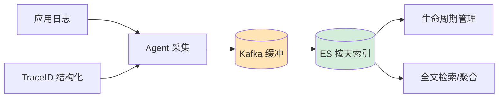

# 如何设计一个完整的日志收集分析系统？

【场景分析】
日志系统需求：实时采集、集中存储、快速检索、可视化分析、告警。

【日志分类】
1. 业务日志：用户行为、交易记录
2. 系统日志：GC日志、启动日志
3. 访问日志：Nginx access log
4. 错误日志：Exception堆栈
5. 审计日志：操作记录（合规需要）

【ELK架构】
Elasticsearch + Logstash/Fluentd + Kibana

1. 采集层：
   - Filebeat：轻量级Agent，部署在每个应用服务器
   - 监控日志文件变化，增量读取
   - 支持多行合并（Java异常堆栈）
2. 缓冲层：
   - Kafka：日志高峰缓冲，防止ES被打满
   - 日志写入Kafka → Logstash消费 → ES
3. 存储层：
   - Elasticsearch：全文检索引擎
   - 索引按天滚动：logs-2024.01.17
   - 老索引关闭/删除（节省资源）
4. 展示层：
   - Kibana：可视化查询
   - Dashboard：实时大盘
   - 告警：Watcher / ElastAlert

【日志规范】
```json
{
  "timestamp": "2024-01-17T10:00:00.000Z",
  "level": "INFO",
  "service": "order-service",
  "traceId": "a1b2c3d4",
  "spanId": "e5f6g7h8",
  "userId": "12345",
  "message": "Order created",
  "orderId": "ORD-2024-001",
  "duration": 45
}
```

【性能优化】
1. 写入优化：
   - 批量写入（Bulk API）
   - 调大refresh_interval（30s）
   - 副本数设0（写入期间）
2. 存储优化：
   - 冷热分离：热数据SSD，冷数据HDD
   - 索引生命周期管理（ILM）
   - 压缩：best_compression
3. 查询优化：
   - 按时间范围查询（利用分片裁剪）
   - 避免通配符查询
   - 使用keyword类型做精确匹配

【告警规则】
- ERROR日志 > 10条/分钟 → 告警
- 特定异常出现 → 告警
- 日志量突增/突降 → 告警


## 核心流程图




## 记忆要点

- 经典架构：采集层Filebeat → 缓冲层Kafka → 处理层Logstash → 存储层ES → 展示Kibana。
- 日志规范：必须包含timestamp、level、traceId和业务核心字段，采用JSON格式。
- 性能优化：写入靠批量与Kafka削峰，存储靠冷热分离与按天滚动，查询避免通配符。
- 容灾设计：Agent端需具备本地缓存能力，防止收集中心网络抖动时日志丢失。

## 结构化回答


**30 秒电梯演讲：** 像城市的快递系统，收集员收件，分拣中心转运，仓库按索引存放。

**展开框架：**
1. **Kafka** — 使用Kafka作为缓冲防止打挂存储端
2. **ES** — ES索引按天滚动并设置生命周期
3. **TraceID** — 日志需结构化输出包含TraceID

**收尾：** Filebeat如何处理多行日志？


## 视频脚本

> 预计时长：2 分钟 | 由浅入深

| 时间 | 画面/字幕 | 口播台词 | 讲解要点 |
|------|----------|----------|----------|
| 0:00 | 标题卡：完整的日志收集分析系统 | "完整的日志收集分析系统，一分钟讲透。" | 开场钩子 |
| 0:35 | 生活类比动画 | "打个比方——像城市的快递系统，收集员收件，分拣中心转运，仓库按索引存放。" | 核心类比 |
| 1:10 | 概念定义动画 | "一句话：通过Agent采集、缓冲队列解耦、全文检索存储，实现日志全生命周期管理。" | 核心定义 |
| 1:50 | 用Kafka作为缓冲 图解 | "使用Kafka作为缓冲防止打挂存储端。" | 用Kafka作为缓冲 |
