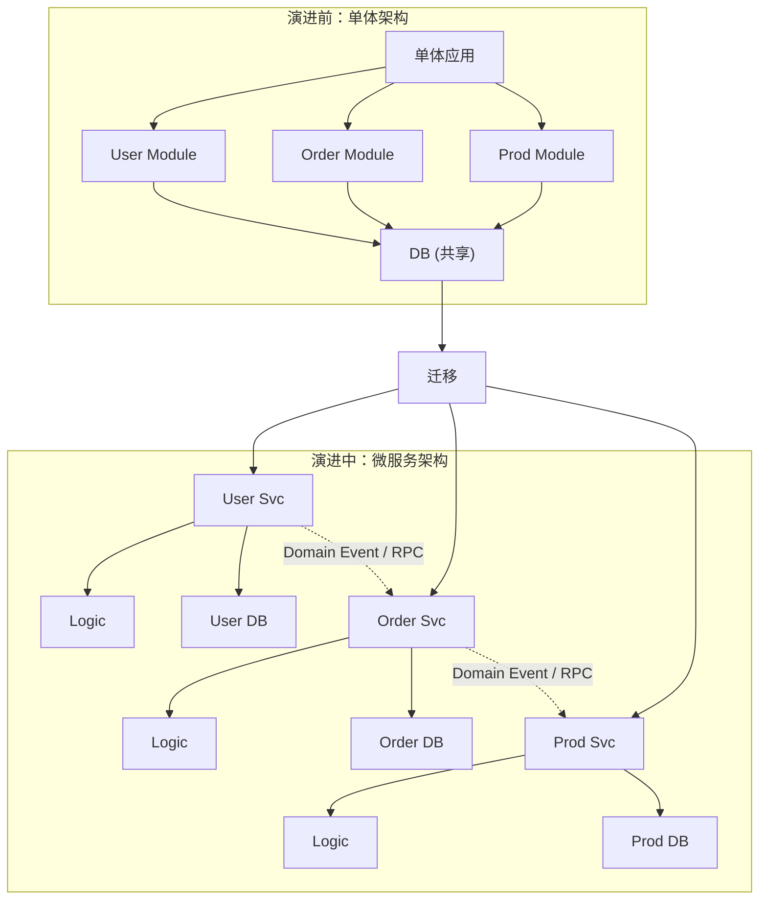

# 如何从单体架构演进到微服务架构？微服务拆分的原则和方法。

【场景分析】
单体到微服务的演进需求：代码膨胀、团队协作困难、部署耦合、技术栈受限。

【拆分原则】
1. 单一职责：每个服务只做一件事
2. 业务边界：按业务领域拆分，而非技术层
3. 数据自治：每个服务独享数据库
4. 粒度适中：不是越细越好（分布式事务代价）
5. 团队对齐：康威定律 — 架构跟随组织结构

【拆分方法 — DDD领域驱动设计】
1. 战略设计：
   - 领域：电商系统
   - 子域：商品、订单、支付、物流、用户
   - 核心域：订单（竞争力所在）
   - 支撑域：商品（必要但不核心）
   - 通用域：用户认证（通用能力）
2. 限界上下文：
   - 每个子域是一个限界上下文
   - 上下文之间通过API/事件交互
   - 上下文内模型统一
3. 战术设计：
   - 实体：有唯一标识的领域对象
   - 值对象：无标识的不可变对象
   - 聚合根：一致性边界
   - 领域服务：跨实体的业务逻辑
   - 领域事件：状态变更通知

【微服务拆分实例 — 电商系统】
```
用户服务
  - 注册/登录/个人信息/地址管理
商品服务
  - 商品CRUD/库存/分类
订单服务
  - 下单/取消/查询/状态流转
支付服务
  - 支付/退款/对账
物流服务
  - 发货/追踪/签收
营销服务
  - 优惠券/满减/秒杀
```

【演进策略（Strangler Fig模式）】
1. 绞杀者模式：
   - 新功能用微服务实现
   - 老功能逐步剥离为独立服务
   - API网关统一路由
   - 最终老系统被"绞杀"
2. 分步迁移：
   - 先拆边界清晰的（如用户服务）
   - 再拆有状态依赖的（如订单服务）
   - 最后拆复杂的（如支付服务）
3. 数据迁移：
   - 双写期：新老数据库并行写
   - 数据同步：Canal同步binlog
   - 读切换：逐步切读到新服务
   - 写切换：最后切换写流量

【拆分常见陷阱】
- 分布式事务：拆分后跨服务事务复杂
- 服务间循环依赖：A调B，B调A
- 共享数据库：拆服务不拆库，等于没拆
- 过度拆分：微服务变纳米服务

【数据一致性边界与拆分难点】
在拆分过程中，最大的挑战在于数据的处理。不能简单地通过 JOIN 查询关联表，需要通过聚合根来保证数据的一致性边界。

【架构演进图】


## 常见考点
1. **如何解决分布式事务问题？**
   - 追问点：是否了解柔性事务（Saga/TCC/本地消息表）？
2. **服务的粒度如何把控？**
   - 追问点：如果粒度太细会有什么问题（网络延迟、运维复杂度）？
3. **老系统改造如何不停服？**
   - 追问点：具体的数据双写和校验逻辑如何实现？
4. **领域模型如何映射到数据库表？**
   - 追问点：聚合根是否对应一张表？值对象如何持久化？

## 记忆要点

- 拆分原则：基于DDD领域驱动设计，保证单一职责与数据自治（拆服务必拆库）。
- 演进模式：采用绞杀者模式，通过API网关路由，新功能微服务化，逐步替换老单体。
- 数据迁移：遵循双写并行 → 数据同步校验 → 读流量切换 → 写流量切换的不停服流程。
- 避坑指南：切忌过度拆分（变纳米服务），避免服务间循环依赖和共享数据库。

## 结构化回答


**30 秒电梯演讲：** 将大公司拆成独立事业部，独立核算，通过合同协作。

**展开框架：**
1. **DDD** — DDD限界上下文是拆分的理论依据
2. **数据独享数据** — 数据独享数据库避免耦合
3. **利用双写和同** — 利用双写和同步工具平滑迁移数据

**收尾：** 如何确定微服务的拆分粒度？


## 视频脚本

> 预计时长：3 分钟 | 由浅入深

| 时间 | 画面/字幕 | 口播台词 | 讲解要点 |
|------|----------|----------|----------|
| 0:00 | 标题卡：从单体架构演进到微服务架构 | "从单体架构演进到微服务架构，这题我会分三步讲。" | 开场钩子 |
| 0:41 | 概念定义动画 | "一句话：基于业务边界划分限界上下文，通过绞杀者模式渐进式重构。" | 核心定义 |
| 1:22 | 生活类比动画 | "打个比方——将大公司拆成独立事业部，独立核算，通过合同协作。" | 核心类比 |
| 2:03 | DDD限界上下文 图解 | "DDD限界上下文是拆分的理论依据。" | DDD限界上下文 |
| 2:50 | 数据独享数据库 图解 | "数据独享数据库避免耦合。" | 数据独享数据库 |
