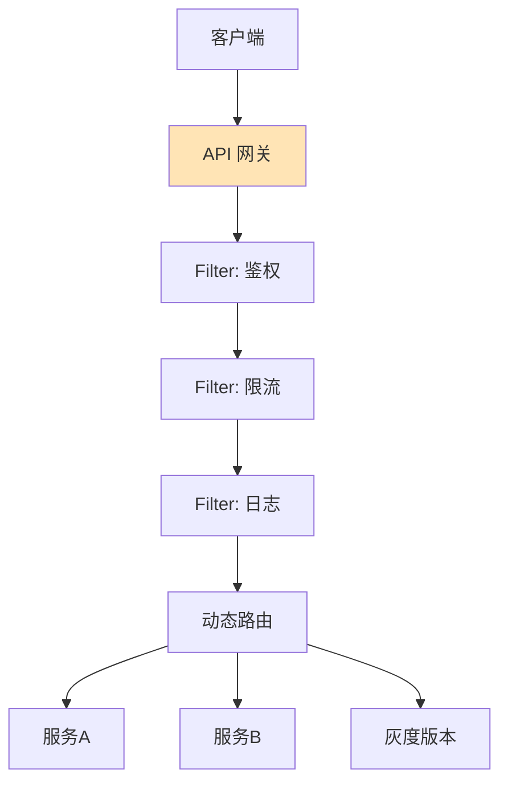

# 如何设计API网关？统一鉴权、限流、路由、监控。

【场景分析】
API网关是微服务架构的统一入口，负责非业务功能的横切关注点。

【核心职责】
1. 路由转发：外部请求路由到对应微服务
2. 鉴权认证：统一Token验证，无需各服务单独鉴权
3. 限流熔断：保护后端服务
4. 负载均衡：多实例负载均衡
5. 协议转换：HTTP↔gRPC，REST↔SOAP
6. 请求/响应改写：参数加密、响应裁剪
7. 监控日志：统一访问日志和指标
8. 灰度发布：流量按比例路由

【实战案例】
某电商大促期间，某第三方支付接口响应超时导致网关线程池耗尽。通过在网关层针对该特定第三方路由配置独立的隔离线程池和熔断策略（Fail-fast），避免了雪崩效应波及核心交易链路。

【主流方案对比】

| 方案 | 核心技术 | 优势 | 劣势 | 适用场景 |
| :--- | :--- | :--- | :--- | :--- |
| **Spring Cloud Gateway** | WebFlux (Reactor) | Java生态友好，整合Spring Cloud极其方便 | 内存占用相对较高，依赖JVM | Spring Cloud 全家桶项目 |
| **Kong / APISIX** | Nginx + Lua | 极高性能，插件生态丰富，动态配置无需reload | Lua开发调试门槛较高，配置相对复杂 | 高并发、Kubernetes 环境 |
| **Zuul 1.x** | Servlet 同步阻塞 | 简单易懂 | 性能瓶颈明显，已停止维护 | 老项目维护 |
| **Nginx** | C | 极致性能，资源占用低 | 业务逻辑开发复杂（需C/Lua），动态性差 | 纯流量转发，简单的鉴权限流 |

【网关架构设计】
```
客户端 → CDN → 负载均衡(LVS/F5) → API网关集群 → 微服务

API网关内部：
  Pre Filter:  鉴权 → 限流 → 日志 → 黑名单
  Routing:     按Path/Header路由到目标服务
  Post Filter: 响应改写 → 统一错误格式 → 监控上报
```

【关键设计】
1. 动态路由：
   - 路由规则存配置中心（Nacos/Apollo）
   - 网关监听配置变更，热更新
   - 无需重启网关
2. 统一鉴权：
   ```
   Token → 解析JWT → 校验签名 → 提取userId
   → 将userId注入Header → 转发给微服务
   ```
3. 聚合接口（BFF模式）：
   - 一个客户端请求需要多个微服务的数据
   - 网关层聚合多个服务响应
   - 减少客户端请求次数
4. 协议适配：
   - 外部RESTful → 内部gRPC
   - 不同客户端不同接口（移动端简化版）

【高可用】
- 网关无状态，水平扩展
- 多机房部署
- 配置中心故障时使用本地缓存配置
- 熔断降级保护网关自身

【代码示例：Spring Cloud Gateway 全局限流 Filter】
```java
@Component
public class RateLimiterFilter implements GlobalFilter, Ordered {
    @Override
    public Mono<Void> filter(ServerWebExchange exchange, GatewayFilterChain chain) {
        String ip = exchange.getRequest().getRemoteAddress().getAddress().getHostAddress();
        // 使用Redis + Lua脚本实现滑动窗口限流
        boolean allowed = redisTemplate.opsForValue().setIfAbsent("limit:" + ip, "1", 1, TimeUnit.SECONDS);
        if (!allowed) {
            exchange.getResponse().setStatusCode(HttpStatus.TOO_MANY_REQUESTS);
            return exchange.getResponse().setComplete();
        }
        return chain.filter(exchange);
    }
}
```


## 核心流程图




## 记忆要点

- 核心职责：统一入口处理非业务横切关注点（鉴权、限流、路由、协议转换、监控）。
- 高可用设计：网关自身必须无状态以支持横向扩容，配合多机房与本地降级缓存。
- 动态路由：路由规则存放在配置中心，网关监听变更实现热更新，无需重启。
- 选型对比：Nginx+Lua/APISIX主打极致高并发，Spring Cloud Gateway契合Java生态。

## 结构化回答


**30 秒电梯演讲：** 像公司前台，统一接待、验证身份并引导到具体部门。

**展开框架：**
1. **拦截非业务逻辑如鉴权** — 拦截非业务逻辑如鉴权、限流、日志
2. **作为反向代理** — 作为反向代理将流量路由至后端服务
3. **支持动态配置** — 支持动态配置和灰度发布

**收尾：** 网关如何实现动态路由？


## 视频脚本

> 预计时长：2 分钟 | 由浅入深

| 时间 | 画面/字幕 | 口播台词 | 讲解要点 |
|------|----------|----------|----------|
| 0:00 | 标题卡：API网关 | "API网关，一分钟讲透。" | 开场钩子 |
| 0:35 | 生活类比动画 | "打个比方——像公司前台，统一接待、验证身份并引导到具体部门。" | 核心类比 |
| 1:10 | 概念定义动画 | "一句话：作为系统统一入口，集中处理路由、鉴权等通用逻辑。" | 核心定义 |
| 1:50 | 拦截非业务逻辑如鉴权 图解 | "拦截非业务逻辑如鉴权、限流、日志。" | 拦截非业务逻辑如鉴权 |
