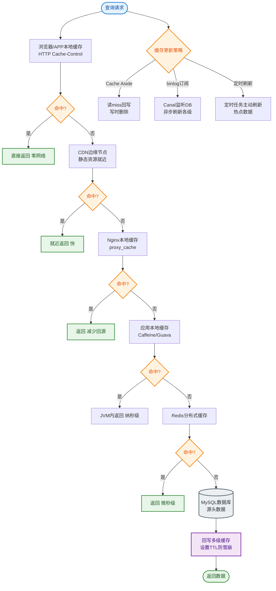

# 如何设计配置中心？支持动态配置、灰度发布、多环境管理。

【场景分析】
配置中心目标：统一管理所有微服务的配置，支持热更新，无需重启。

【核心功能】
1. 配置管理：增删改查配置项
2. 环境隔离：dev/test/staging/prod
3. 灰度发布：配置只对部分实例/IP生效
4. 版本管理：配置历史版本、回滚
5. 权限控制：不同角色管理不同配置
6. 动态推送：配置变更实时推送到客户端

【实战案例】
在上线日志级别调整功能时，错误配置了Logback的root level为OFF，导致线上所有实例瞬间停止输出日志。由于配置中心支持“一键回滚”且客户端本地有快照缓存，在30秒内回滚到上一版本并通过监听器自动触发Logback重载，恢复了日志记录，避免了长时间的监控盲区。

【主流方案对比】

| 方案 | 推送机制 | 优势 | 劣势 | 适用场景 |
| :--- | :--- | :--- | :--- | :--- |
| **Apollo** | HTTP长轮询 | 界面极其强大，权限管理细粒度，灰度发布完善 | 架构较重，依赖DB | 企业级应用，对权限和审计要求高 |
| **Nacos** | TCP/HTTP长轮询 | 轻量，配置+注册二合一，阿里生态成熟 | 权限控制相对较弱 | Spring Cloud Alibaba，中小规模集群 |
| **Spring Cloud Config** | Git Webhook | 简单，利用Git版本控制 | 实时性差（需配合MQ/Bus），无原生UI | 简单项目，强依赖GitOps流程 |
| **Consul** | HTTP长轮询 | CP一致性，集成服务发现 | 配置管理功能相对简单 | 基础设施服务，Go生态 |

【Apollo架构】
```
配置门户
  ↓
配置服务 ← 长轮询 ← 客户端
  ↓
MySQL (配置存储)

客户端工作流：
1. 启动时拉取配置
2. 本地缓存配置（容灾）
3. 长轮询监听变更
4. 变更时拉取新配置并通知监听器
```

【动态刷新原理】
1. 客户端定时（1秒）发起长轮询到Config Service
2. 服务端Hold住请求，有配置变更时返回
3. 客户端获取变更通知，拉取最新配置
4. 通过Spring的@RefreshScope或监听器刷新Bean

【灰度发布】
- 按IP灰度：配置变更只推送给指定IP的实例
- 按Label灰度：实例打标签，按标签推送
- 按比例灰度：随机推送给30%实例

【高可用设计】
- 多机房部署Config Service
- 客户端本地快照：配置中心不可用时使用本地缓存
- 数据库主从
- Apollo AdminService集群

【最佳实践】
- 敏感配置加密存储
- 配置变更需审批
- 配置变更触发通知（钉钉/邮件）
- 配置版本对比和回滚
- 不在配置中放大数据（放DB或OSS）

【配置推送架构图】
```
┌──────────┐      HTTP长轮询      ┌──────────────────┐
│ Client A │ ◄────────────────────► │ Config Service 1 │
│ (APP)    │  (Hold住30s, 变更即回) │                  │
└──────────┘                       └────────┬─────────┘
                                            │ 同步
                                     ┌──────▼──────┐
                                     │   MySQL DB  │
                                     └─────────────┘

变更流程：
1. Portal 修改 MySQL
2. Portal 通知 Config Service 释放Hold住的请求
3. Client 收到响应，主动拉取最新配置
4. 更新内存 Context, 触发 ApplicationEvent
```

【代码示例：Apollo客户端动态刷新监听器】
```java
@Component
public class ConfigChangeListener {
    @ApolloConfigChangeListener("application")
    private void onConfigChange(ConfigChangeEvent changeEvent) {
        for (String key : changeEvent.changedKeys()) {
            if (key.startsWith("thread.pool.")) {
                // 动态调整线程池参数
                dynamicThreadPool.updateConfig(key, changeEvent.getChange(key).getNewValue());
            }
        }
    }
}
```


## 核心流程图


## 记忆要点

- 核心功能：支持多环境隔离、灰度发布（按IP/标签推送）、版本回滚与权限审计。
- 高可用容灾：配置中心不可用时，客户端使用本地快照缓存继续维持运行。
- 推送机制：Apollo/Nacos基于HTTP长轮询，秒级感知配置变更推送到客户端。
- 最佳实践：敏感配置必须加密存储，大体积数据（如图片）切勿放入配置中心。

## 结构化回答


**30 秒电梯演讲：** 就像系统的控制台，改一个开关，所有机器自动生效。

**展开框架：**
1. **配置集中存储** — 配置集中存储与版本管理
2. **长轮询实现实** — 长轮询实现实时变更推送
3. **灰度发布控制** — 灰度发布控制生效范围

**收尾：** Apollo的长轮询如何实现？


## 视频脚本

> 预计时长：2 分钟 | 由浅入深

| 时间 | 画面/字幕 | 口播台词 | 讲解要点 |
|------|----------|----------|----------|
| 0:00 | 标题卡：配置中心 | "配置中心，一分钟讲透。" | 开场钩子 |
| 0:35 | 生活类比动画 | "打个比方——就像系统的控制台，改一个开关，所有机器自动生效。" | 核心类比 |
| 1:10 | 概念定义动画 | "一句话：集中管理微服务配置，支持变更热更新和灰度控制。" | 核心定义 |
| 1:50 | 配置集中存储与版 图解 | "配置集中存储与版本管理。" | 配置集中存储与版 |
