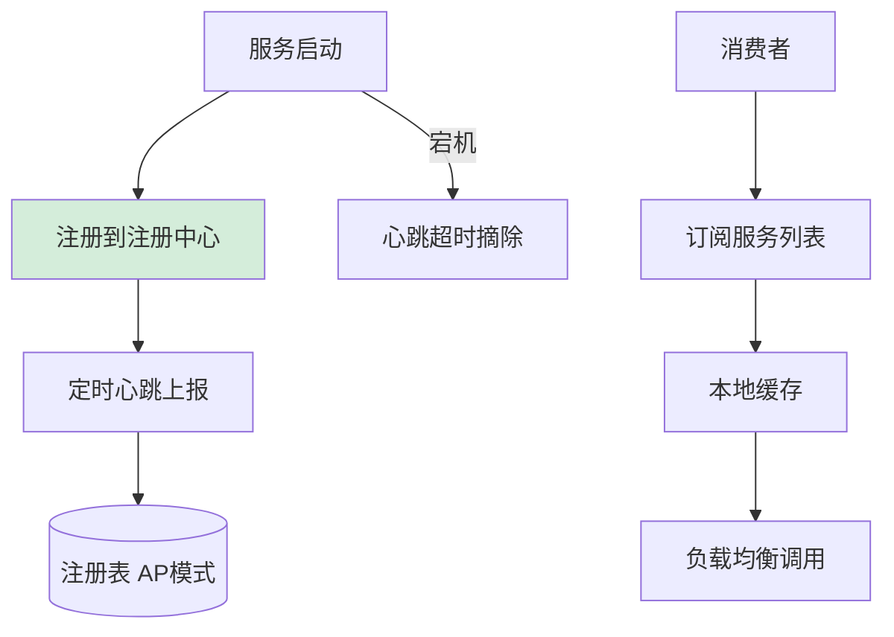

# 如何设计服务注册与发现机制？

【场景分析】
服务发现解决微服务间“如何找到对方”的问题。动态扩缩容时IP变化，不能用硬编码。

【实战案例】
某系统在云上扩容时，新启动的实例因“注册延迟”未及时注册到注册中心，导致大量请求在旧实例堆积引发超时。通过引入“预热机制”和“服务启动延迟注册”，确保实例在JVM预热完成后再接收流量，并配合客户端本地缓存列表避免注册中心抖动造成的不可用。

【两种模式】
1. 客户端发现：
   - 客户端直接查询注册中心获取服务列表
   - 客户端自己做负载均衡
   - 代表：Eureka、Nacos客户端
2. 服务端发现：
   - 请求先到代理（如Nginx/Envoy）
   - 代理查询注册中心并转发
   - 代表：K8s Service、Istio

【模式对比】

| 维度 | 客户端发现 | 服务端发现 |
| :--- | :--- | :--- |
| **架构** | 客户端知道所有服务端地址 | 客户端只知代理地址，对服务端透明 |
| **复杂度** | 客户端需集成SDK，逻辑较重 | 客户端轻量，逻辑集中在代理（Sidecar） |
| **负载均衡** | 客户端控制（灵活） | 代理控制（集中管理） |
| **代表产品** | Eureka, Nacos, Consul | K8s Service, Istio, Linkerd |

【核心流程】
1. 注册：
   - 服务启动时向注册中心注册（IP、端口、服务名）
   - 注册信息包括健康状态、元数据
2. 心跳：
   - 服务定期（30s）发送心跳保活
   - 超过3次心跳未收到 → 判定下线
3. 发现：
   - 消费者从注册中心获取提供者列表
   - 本地缓存列表（减少注册中心压力）
4. 变更通知：
   - 注册中心变更时推送/通知消费者
   - 消费者更新本地缓存

【CAP权衡】
1. AP模式（Eureka/Nacos AP）：
   - 优先可用性
   - 注册中心节点间数据最终一致
   - 节点故障不影响注册和发现
   - 可能短暂返回过期数据
2. CP模式（Zookeeper/Consul/etcd）：
   - 优先一致性
   - Raft/Paxos协议保证强一致
   - Leader选举期间不可用

【Nacos双模式】
- 默认AP：临时实例（心跳保活），适合微服务
- 可切CP：永久实例（主动注销），适合数据库

【健康检查】
- 临时实例：客户端心跳
- 永久实例：服务端主动探测（TCP/HTTP）
- 健康检查失败 → 标记不健康 → 摘除流量

【服务发现高级特性】
1. 元数据管理：
   - 实例标签：version=v2, region=east
   - 灰度路由：只调version=v2的实例
2. 权重路由：
   - 不同实例不同权重
   - 性能强的机器权重高
3. 同机房优先：
   - 优先调用同机房的实例
   - 降低网络延迟
4. 保护机制：
   - 注册中心网络分区时，不轻易剔除实例
   - Eureka自我保护模式

【选型建议】
Spring Cloud Alibaba：Nacos（推荐）
K8s原生：CoreDNS + Service
传统Java：Eureka（停止维护）/Zookeeper

【代码示例：基于权重的随机负载均衡算法】
```java
public Instance chooseByWeight(List<Instance> instances) {
    int totalWeight = instances.stream().mapToInt(Instance::getWeight).sum();
    int randomWeight = ThreadLocalRandom.current().nextInt(totalWeight);
    
    for (Instance instance : instances) {
        randomWeight -= instance.getWeight();
        if (randomWeight < 0) {
            return instance; // 命中权重区间
        }
    }
    return instances.get(0); // 兜底
}
```


## 核心流程图




## 记忆要点

- 模式对比：客户端发现（如Nacos）重SDK负载均衡，服务端发现（如K8s）重代理转发。
- CAP权衡：微服务注册优先选AP（最终一致，可用），基础组件选CP（强一致）。
- 核心流程：服务注册 → 定时心跳保活 → 消费者拉取并本地缓存 → 变更推送到消费者。
- 高级特性：结合元数据标签实现同机房优先路由与灰度发布，注册延迟需预热保护。

## 结构化回答


**30 秒电梯演讲：** 像电话黄页，商家入驻，用户按名字查号码打电话。

**展开框架：**
1. **IP** — 服务启动自动注册IP端口
2. **心跳机制保持** — 心跳机制保持健康状态
3. **客户端缓存服** — 客户端缓存服务列表

**收尾：** AP和CP模式如何选择？


## 视频脚本

> 预计时长：2 分钟 | 由浅入深

| 时间 | 画面/字幕 | 口播台词 | 讲解要点 |
|------|----------|----------|----------|
| 0:00 | 标题卡：服务注册与发现机制 | "服务注册与发现机制，一分钟讲透。" | 开场钩子 |
| 0:35 | 生活类比动画 | "打个比方——像电话黄页，商家入驻，用户按名字查号码打电话。" | 核心类比 |
| 1:10 | 概念定义动画 | "一句话：服务注册自己的地址，消费者动态查询并调用。" | 核心定义 |
| 1:50 | 服务启动自动注册 图解 | "服务启动自动注册IP端口。" | 服务启动自动注册 |
