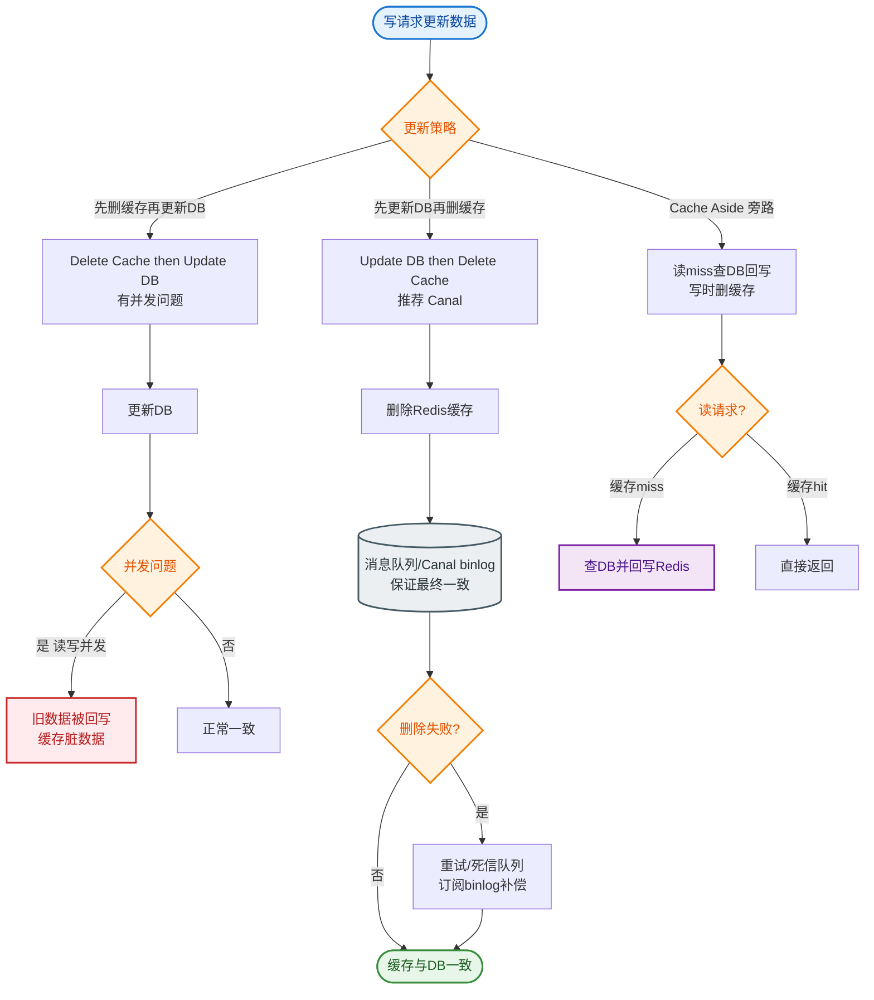

# 如何设计微服务的数据一致性方案？CQRS和事件驱动架构。

【场景分析】
微服务数据分散在各服务DB中，跨服务查询和一致性是核心挑战。

【实战案例】
在订单系统中，采用Saga模式处理长事务。订单创建后，通过消息队列异步通知库存和积分服务。曾因积分服务挂掉导致消息积压，修复后重复消费消息导致用户积分累加错误。后续引入“幂等性表”，基于BizId（业务唯一标识）去重，确保即使消息重试也只执行一次加积分操作。

【问题1：跨服务查询】
传统单体一个JOIN搞定，微服务需要跨多个API查询。

【CQRS（Command Query Responsibility Segregation）】
核心思想：读写分离，读模型和写模型分开。

1. 写路径（Command）：
   - 业务操作写各自服务的DB
   - 遵循DDD聚合根原则
   - 保证强一致性（ACID）
2. 读路径（Query）：
   - 独立的读模型（反范式化/物化视图）
   - 可以跨多个数据源聚合
   - 最终一致
3. 数据同步：
   - 写操作发出领域事件
   - 读模型订阅事件更新
   - Kafka/RabbitMQ作为事件总线

【事件溯源与 CQRS 结合架构】
```text
                 ┌──────────────────┐
                 │   Client UI      │
                 └────────┬─────────┘
                          │
       ┌──────────────────┴──────────────────┐
       │                                     │
       ▼                                     ▼
┌──────────────┐                    ┌──────────────┐
│  Write Side  │                    │  Read Side   │
├──────────────┤                    ├──────────────┤
│ Command      │                    │ Query        │
│ Handler      │                    │ Handler      │
└──────┬───────┘                    └──────┬───────┘
       │                                   │
       ▼                                   ▼
┌──────────────┐                    ┌──────────────┐
│   Event      │──── Publish ─────▶│  Event       │
│   Store (ES) │   (Async)         │  Processor   │
│(Append Only) │                    └──────┬───────┘
└──────────────┘                           │
       │                                   ▼
       │                         ┌──────────────┐
       │                         │ Read Model DB│
       │                         │ (View/SQL/ES)│
       │                         └──────────────┘
       │                                   │
       └───────── Replay (State Snap) ────┘
```

【事件驱动架构（EDA）】
1. 事件产生：
   - 订单创建 → OrderCreatedEvent
   - 支付完成 → PaymentCompletedEvent
   - 库存扣减 → StockDeductedEvent
2. 事件消费：
   - 积分服务：消费OrderCreatedEvent → 加积分
   - 推荐服务：消费OrderCreatedEvent → 更新推荐模型
   - 分析服务：消费所有事件 → 更新报表

【事件溯源（Event Sourcing）】
- 不存储当前状态，只存储所有事件
- 当前状态 = 回放所有事件
- 优点：完整审计、可回溯、时间旅行
- 缺点：复杂、查询难、事件版本兼容
- **关键优化**：引入快照，每隔N个事件保存一次状态快照。

【一致性方案对比】

| 方案 | 一致性级别 | 实现复杂度 | 性能影响 | 适用场景 |
| :--- | :--- | :--- | :--- | :--- |
| **2PC/XA** | 强一致性 | 低（数据库支持） | 高（锁资源，阻塞） | 传统单体，对一致性要求极高且并发低 |
| **TCC (Try-Confirm-Cancel)** | 最终一致 | 高（三个阶段） | 中 | 核心业务，需精准控制资源预留 |
| **Saga (编排/协同)** | 最终一致 | 中 | 低 | 长事务，业务流程长，非强一致场景 |
| **本地消息表** | 最终一致 | 中 | 低 | 依赖数据库的事务，常见于电商订单 |

【代码示例：本地消息表实现最终一致性】
```java
@Transactional(rollbackFor = Exception.class)
public void createOrder(Order order) {
    // 1. 执行业务逻辑：插入订单
    orderMapper.insert(order);
    
    // 2. 将待发送消息存入本地同一个DB的消息表（原子操作）
    LocalMessage message = new LocalMessage();
    message.setTopic("order-created");
    message.setContent(JSON.toJSONString(order));
    message.setStatus("SENDING");
    localMessageMapper.insert(message);
}

// 定时任务扫描消息表并发送 MQ
@Scheduled(fixedDelay = 5000)
public void sendPendingMessages() {
    List<LocalMessage> messages = localMessageMapper.listPendingMessages();
    messages.forEach(msg -> {
        try {
            rocketMQTemplate.syncSend(msg.getTopic(), msg.getContent());
            msg.setStatus("SENT");
            localMessageMapper.updateById(msg);
        } catch (Exception e) {
            // 记录日志，下次重试
            log.error("Send message failed: {}", msg.getId(), e);
        }
    });
}
```


## 核心流程图


## 记忆要点

- CQRS架构：核心思想是读写分离，写库保证强一致，读库构建反范式视图保证查询性能。
- 数据同步：写操作发出领域事件，读模型异步订阅事件，达到最终一致性。
- 事务方案：2PC强一致但阻塞，TCC高复杂需资源预留，Saga/本地消息表适合长事务最终一致。
- 事件溯源：只存状态变更事件不存当前状态，通过回放重建状态，需结合快照优化。

## 结构化回答


**30 秒电梯演讲：** 记账员写账本，统计员实时读账本做报表，各干各的。

**展开框架：**
1. **命令端负责业** — 命令端负责业务强一致写
2. **查询端依赖独** — 查询端依赖独立读模型
3. **事件总线同步** — 事件总线同步数据变更

**收尾：** CQRS的数据同步延迟如何处理？


## 视频脚本

> 预计时长：3 分钟 | 由浅入深

| 时间 | 画面/字幕 | 口播台词 | 讲解要点 |
|------|----------|----------|----------|
| 0:00 | 标题卡：微服务的数据一致性方案 | "微服务的数据一致性方案，这题我会分三步讲。" | 开场钩子 |
| 0:41 | 概念定义动画 | "一句话：读写分离，写操作发事件更新读模型，最终一致。" | 核心定义 |
| 1:22 | 生活类比动画 | "打个比方——记账员写账本，统计员实时读账本做报表，各干各的。" | 核心类比 |
| 2:03 | 命令端负责业务强 图解 | "命令端负责业务强一致写。" | 命令端负责业务强 |
| 2:50 | 查询端依赖独立读模型 图解 | "查询端依赖独立读模型。" | 查询端依赖独立读模型 |
