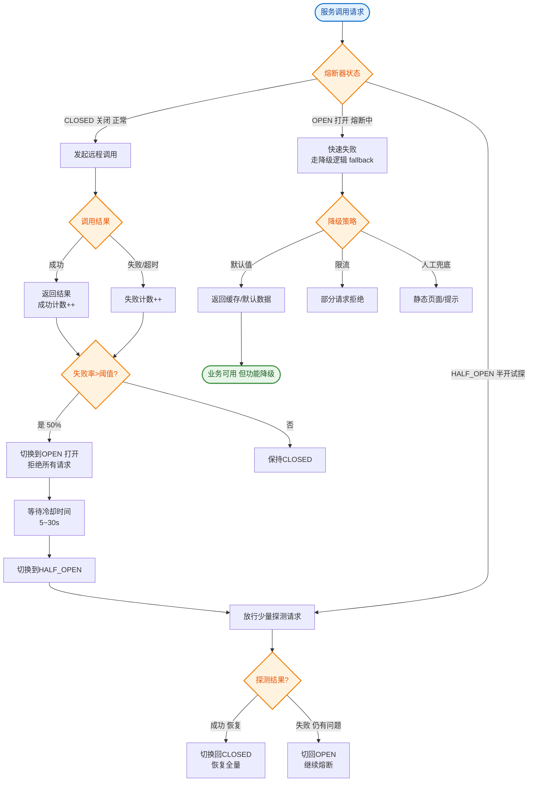

# 如何设计 Service Mesh（服务网格）架构？Istio 的核心概念。

【场景分析】
Service Mesh将服务治理能力从代码中剥离，通过Sidecar代理实现。

【为什么需要Service Mesh？】
传统微服务问题：
- 服务治理SDK（如Spring Cloud）与业务代码耦合
- 多语言支持困难（Java SDK不能用于Go/Python）
- 升级SDK需要改代码重新部署
- SDK功能臃肿

【Sidecar模式】
- 每个Pod部署一个代理容器（Sidecar）
- 所有进出流量经过Sidecar
- Sidecar负责：路由/负载均衡/熔断/限流/追踪/加密
- 业务代码完全无感知

【Istio 架构数据流转】
```text
                   ┌─────────────────────────────────────┐
                   │           Control Plane              │
                   │  (Pilot:配置下发, Citadel:证书管理)   │
                   └───────────────┬─────────────────────┘
                                   │ (xDS gRPC Stream)
                                   ▼
┌──────────────┐              ┌──────────────┐
│  Service A   │              │  Service B   │
│ ┌──────────┐ │  Traffic     │ ┌──────────┐ │
│ │   App    │ ├─────────────▶│ │   App    │ │
│ └────┬─────┘ │   (Loopback) │ └────┬─────┘ │
│      │       │              │      │       │
│ ┌────▼─────┐ │              │ ┌────▼─────┐ │
│ │  Envoy   │ │◀─────────────┤ │  Envoy   │ │
│ │ Sidecar  │ │  mTLS/RPC    │ │ Sidecar  │ │
│ └──────────┘ │              │ └──────────┘ │
└──────────────┘              └──────────────┘
```

【核心功能】
1. 流量管理：
   - VirtualService：定义路由规则
   - DestinationRule：负载均衡策略、熔断
   - Gateway：入口流量管理
   - 灰度发布：按权重/Header路由
2. 安全：
   - mTLS：服务间双向TLS加密
   - 授权：RBAC策略
   - 认证：JWT验证
3. 可观测性：
   - 指标：请求量/延迟/错误率
   - 链路追踪：自动TraceId传播
   - 访问日志
4. 弹性：
   - 重试：自动重试失败请求
   - 超时：请求超时控制
   - 熔断：连接池+异常检测
   - 故障注入：注入延迟/错误做混沌测试

【流量管理示例】
```yaml
apiVersion: networking.istio.io/v1beta1
kind: VirtualService
spec:
  http:
  - route:
    - destination:
        host: reviews
        subset: v1
      weight: 90
    - destination:
        host: reviews
        subset: v2
      weight: 10
```

【Sidecar性能开销】
- 额外1-3ms延迟（本地代理）
- CPU/内存开销（Envoy约100-200MB）
- 可通过eBPF（Cilium）减少开销

【演进趋势】
- Sidecarless（Ambient Mesh）：减少Sidecar开销
- eBPF替代Sidecar部分功能
- 多集群Mesh

## 常见考点
1. **控制面和数据面之间如何通信？**
   答：通过 xDS 协议（包括 LDS, CDS, RDS, EDS 等）进行 gRPC 流式通信。Pilot 将配置推送给 Envoy，Envoy 会监听配置变更。
2. **Sidecar 拦截流量的原理是什么？**
   答：利用 iptables 的 `nat` 表进行流量劫持。将出站流量重定向到 Sidecar 的代理端口（通常是 15001），入站流量重定向到入站代理端口（15006），Envoy 处理后再转发给目标应用。
3. **Istio 如何解决服务间调用的熔断和限流？**
   答：通过 `DestinationRule` 配置连接池和断路器设置（如最大连接数、最大请求数、连续错误次数等），Envoy 在本地执行这些策略，无需远程调用。
4. **数据平面崩溃对业务的影响？**
   答：Sidecar 与业务容器同生命周期，若 Sidecar 挂了，K8s 会重启整个 Pod。因此 Sidecar 的高可用性依赖于 K8s 的重启机制和 Envoy 自身的健壮性。


## 核心流程图


## 记忆要点

- 核心机制：业务无感知，治理逻辑全下沉至Sidecar代理，进出流量必经。
- 控制与数据面：控制面Pilot通过xDS协议下发配置，数据面Envoy执行路由与mTLS。
- 流量管理核心：VirtualService定路由（灰度），DestinationRule定策略（熔断）。
- 流量劫持：基于iptables NAT表重定向出入站流量到Sidecar（如15001端口）。
- 演进：Sidecar引入1-3ms延迟，趋势是eBPF或Ambient去Sidecar化。

## 结构化回答


**30 秒电梯演讲：** 给每个服务员配一个助手，专门负责传话、记菜单、招呼客人。

**展开框架：**
1. **Sidecar** — Sidecar拦截进出流量
2. **控制面统一下** — 控制面统一下发治理规则
3. **业务代码零侵** — 业务代码零侵入

**收尾：** Sidecar的性能开销如何优化？


## 视频脚本

> 预计时长：3 分钟 | 由浅入深

| 时间 | 画面/字幕 | 口播台词 | 讲解要点 |
|------|----------|----------|----------|
| 0:00 | 标题卡：Service Mesh（服务网格）架构 | "Service Mesh（服务网格）架构，这题我会分三步讲。" | 开场钩子 |
| 0:41 | 概念定义动画 | "一句话：将通信、熔断等治理能力下沉到Sidecar代理中。" | 核心定义 |
| 1:22 | 生活类比动画 | "打个比方——给每个服务员配一个助手，专门负责传话、记菜单、招呼客人。" | 核心类比 |
| 2:03 | Sidecar拦截进 图解 | "Sidecar拦截进出流量。" | Sidecar拦截进 |
| 2:50 | 控制面统一下发治 图解 | "控制面统一下发治理规则。" | 控制面统一下发治 |
