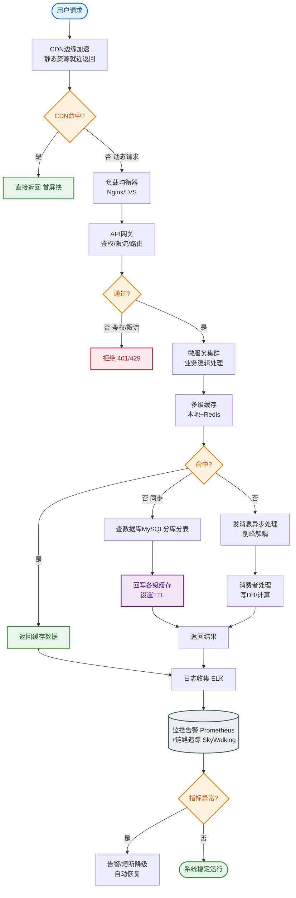
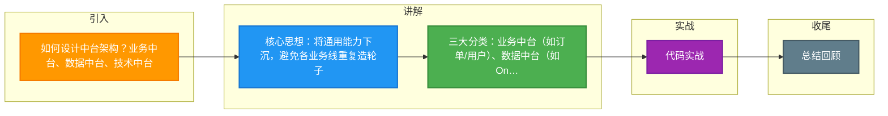

# 如何设计中台架构？业务中台、数据中台、技术中台。

【场景分析】
中台核心思想：将通用能力下沉，避免各业务线重复建设。

【三种中台】

【1. 业务中台】
将公共业务能力沉淀为可复用的服务。
- 用户中心：统一注册/登录/权限
- 商品中心：统一商品模型/类目
- 订单中心：统一订单流程
- 支付中心：统一支付能力
- 搜索中心：统一搜索服务
- 营销中心：统一优惠券/活动

业务中台原则：
- 可复用：多个业务线都需要
- 可扩展：支持不同业务的定制
- 高可用：多个业务依赖，不能挂

【2. 数据中台】
统一数据采集、存储、治理和服务。
- 数据采集：日志/埋点/binlog → Kafka
- 数据仓库：ODS → DWD → DWS → ADS
- 数据治理：数据质量/血缘/权限
- 数据服务：统一API对外提供数据
- BI分析：报表/大屏/决策支持

数据中台层次：
```text
原始数据(ODS) → 明细层(DWD) → 汇总层(DWS) → 应用层(ADS)
     ↓               ↓               ↓              ↓
  日志/DB        清洗/标准化      聚合/统计      业务报表
```

【3. 技术中台】
统一基础设施和工具。
- 微服务框架：统一RPC/注册中心
- 消息队列：统一MQ服务
- 缓存服务：统一Redis服务
- 数据库中间件：分库分表
- 监控平台：统一监控/告警
- CI/CD：统一发布流水线
- 容器平台：K8s集群

【中台 vs 微服务】
- 微服务：技术架构（怎么拆）
- 中台：组织架构和业务抽象（拆什么、给谁用）
- 中台通常由微服务实现

【中台架构分层示意】
```text
┌───────────────────────────────────────────┐
│           前台业务应用                     │
│  (电商 | 零售 | 金融 | 物流 ...)           │
└───────────────────┬───────────────────────┘
                    │ 共享/复用
┌───────────────────┴───────────────────────┐
│           业务中台                         │
│  (交易中心 | 商品中心 | 用户中心 | 营销)    │
└───────────────────┬───────────────────────┘
                    │ 数据支撑
┌───────────────────┴───────────────────────┐
│           数据中台                         │
│  (OneData / OneID / OneService)           │
└───────────────────┬───────────────────────┘
                    │ 基础设施
┌───────────────────┴───────────────────────┐
│           技术中台 (IaaS/PaaS)             │
│  (K8s / 中间件 / 研发效能 / 稳定性)        │
└───────────────────────────────────────────┘
```

【中台的陷阱】
1. 过度建设：投入大产出慢
2. 为了中台而中台：没有复用需求
3. 组织匹配：中台需要独立团队运营
4. 技术债务：老系统改造代价大

【合理的中台边界】
- 有3+业务线有相同需求 → 考虑中台化
- 中台能力需要独立团队维护
- 业务方可以“租用”中台能力
- 中台和前台通过API解耦

## 常见考点
1. **中台和共享服务平台有什么区别？**
   答：中台强调能力的复用和业务沉淀，通常包含数据闭环（数据中台）；而传统的共享服务更多是技术资源的集中管理（如共享DB、共享MQ），缺乏业务属性。
2. **业务中台如何解决不同业务线的个性化需求？**
   答：采用“核心能力 + 插件化/扩展点”的设计模式。核心流程稳定，差异化逻辑通过SPI（Service Provider Interface）或脚本引擎动态加载。
3. **如何衡量中台建设的价值？**
   答：主要指标包括：复用率（多少个业务接入）、研发效率提升（新业务构建速度）、成本节约（避免了多少重复建设）。
4. **数据中台的数据“脏乱差”问题怎么治理？**
   答：建立数据标准（命名规范、指标口径），引入数据质量监控（DQC），利用元数据管理追踪血缘，并实施数据生命周期管理（冷热分层）。


## 核心流程图


## 记忆要点

- 核心思想：将通用能力下沉，避免各业务线重复造轮子。
- 三大分类：业务中台（如订单/用户）、数据中台（如OneID）、技术中台（如K8s/MQ）。
- 概念对比：微服务是技术怎么拆，中台是业务沉淀什么给谁用。
- 个性化解法：中台提供核心能力，业务定制通过SPI扩展点实现。
- 避坑指南：3个以上业务线有相同需求才做中台，切忌脱离组织盲目建设。

## 结构化回答


**30 秒电梯演讲：** 中央厨房切好配菜，各餐厅直接拿来炒，不用自己从头洗切。

**展开框架：**
1. **业务中台沉淀可复** — 业务中台沉淀可复用服务
2. **数据中台统一** — 数据中台统一数据口径
3. **技术中台提供** — 技术中台提供基础设施

**收尾：** 中台和微服务的关系？


## 视频脚本

> 预计时长：2 分钟 | 由浅入深

| 时间 | 画面/字幕 | 口播台词 | 讲解要点 |
|------|----------|----------|----------|
| 0:00 | 标题卡：中台架构 | "中台架构，一分钟讲透。" | 开场钩子 |
| 0:35 | 生活类比动画 | "打个比方——中央厨房切好配菜，各餐厅直接拿来炒，不用自己从头洗切。" | 核心类比 |
| 1:10 | 概念定义动画 | "一句话：抽取通用业务能力和数据能力，避免重复建设。" | 核心定义 |
| 1:50 | 业务中台沉淀 图解 | "业务中台沉淀可复用服务。" | 业务中台沉淀 |

### 视频流程图



