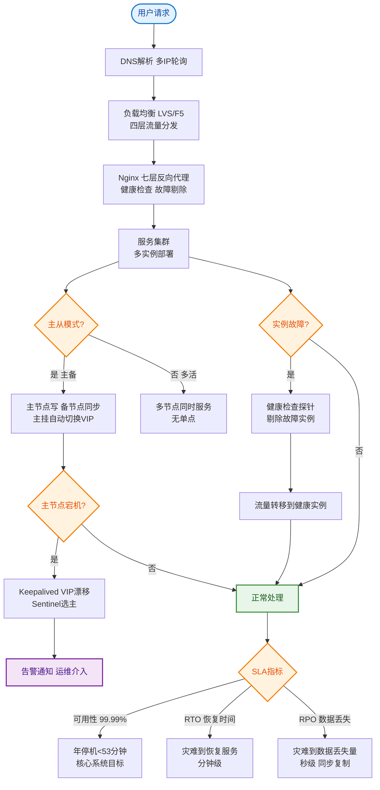
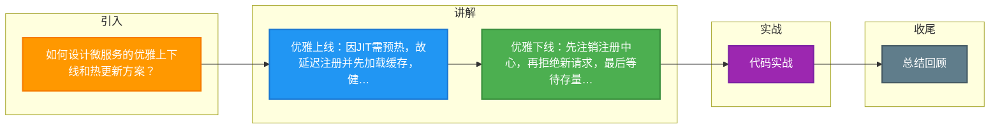

# 如何设计微服务的优雅上下线和热更新方案？

【场景分析】
服务上下线时如果不优雅处理，会导致请求失败、用户报错。

【优雅上线】
1. 延迟注册：
   - 服务启动后不立即注册
   - 等待Spring容器完全初始化
   - 等待预热完成（缓存加载等）
   - `@PostConstruct` 或 ApplicationReadyEvent
2. 慢启动预热：
   - 新实例注册后，初始只分配少量流量
   - 逐步增加流量（类似金丝雀）
   - JVM预热：JIT编译需要时间
   - 连接池预热：提前建立DB/Redis连接
3. 健康检查：
   - readinessProbe通过后才注册
   - 注册中心确认注册成功后通知消费者
   - 消费者收到通知后逐步增加新实例权重

【优雅下线】
1. 主动注销：
   - Spring Boot优雅停机：`server.shutdown=graceful`
   - @PreDestroy 注销注册中心
   - 注册中心通知消费者摘除该实例
2. 等待流量排空：
   - 等待进行中的请求处理完成
   - 拒绝新请求（网关层摘除）
   - 设置最大等待时间（如30秒）
   - `spring.lifecycle.timeout-per-shutdown-phase=30s`
3. 资源清理：
   - 关闭数据库连接池
   - 关闭线程池
   - 刷新缓冲区
   - 关闭MQ消费者
4. 确认退出：
   - 确保所有请求处理完毕
   - 确认注册中心已摘除
   - 进程退出

【K8s Pod 终止流程详解】
```text
K8s API Server (Delete Pod)
       │
       ▼
 1. Pod 状态设置为 Terminating
       │
       ├───────────────────────────────────▶ [Endpoints Controller]
       │                                      │
       │                                      ▼
       │                               从 Service List 摘除 Pod
       │                                      │ (异步, 可能需要几秒)
       │                                      ▼
       ▼
 2. 执行 preStop Hook (e.g., sleep 10)   (等待流量收敛)
       │
       ▼
 3. 发送 SIGTERM 信号给容器内 PID 1
       │
       ▼
 4. 应用进程接收信号:
      - 停止接受新请求
      - 注册中心下线实例
      - 等待存量请求处理完成
       │
       ├───────────────────────────────────▶ [Ingress/Gateway]
       │         (最终感知实例下线)          (停止转发流量)
       │
       ▼
 5. 等待 terminationGracePeriodSeconds (默认30s)
       │
       ▼ (超时或处理完成)
 6. 发送 SIGKILL 强制杀进程
       │
       ▼
 7. Pod 删除完成
```

【热更新（不停机更新配置）】
1. 配置中心监听：
   - @RefreshScope注解
   - ConfigurationProperties自动刷新
2. 代码热加载：
   - Spring DevTools（开发环境）
   - JRebel（商业方案）
3. 类热替换限制：
   - 只能替换方法体，不能改类结构
   - 新增类/方法需重启

## 常见考点
1. **K8s 下线时 preStop 为什么要 sleep？**
   答：因为 K8s 从 Endpoints 列表摘除 Pod 是异步操作，且 Ingress/NodePort 等层面的代理（如 Nginx）也是有缓存或轮询间隔的。如果不 sleep，应用进程立刻停止，此时外部流量可能还未感知到 Pod 下线，导致请求 502。Sleep 5-10 秒是为了给网络层面的收敛留出时间。
2. **Java 应用中如何正确处理 SIGTERM 信号？**
   答：在 Java 中，可以通过 `Runtime.getRuntime().addShutdownHook(new Thread(() -> { ... }))` 注册钩子。Spring Boot 已经封装了 `DisposableBean` 或 `@PreDestroy`，在容器关闭时自动调用，确保优雅停机逻辑执行。
3. **注册中心下线和应用停止的顺序问题？**
   答：必须先“摘除”自己（从注册中心剔除，或标记为不可用），等待一小段时间让客户端感知并更新本地缓存，然后再停止接受请求并关闭进程。如果反了，客户端会继续把请求发给正在关闭的进程。
4. **Spring Cloud 中 RefreshScope 的原理是什么？**
   答：RefreshScope 是一个自定义的 Scope，当配置变更时，ContextRefresher 会触发该 Scope 缓存清理。下次访问 Bean 时，Spring 会重新创建 Bean 实例并绑定新的属性。注意这会导致 Bean 内部的状态丢失（除非通过 @ConfigurationProperties 绑定）。


## 核心流程图


## 记忆要点

- 优雅上线：因JIT需预热，故延迟注册并先加载缓存，健康检查通过后再放量。
- 优雅下线：先注销注册中心，再拒绝新请求，最后等待存量任务执行完。
- K8s下线坑：摘除Pod是异步，因网络收敛慢，故preStop必须sleep几秒防502。
- K8s停机：默认30秒等待期，先SIGTERM处理收尾，超时则SIGKILL强杀。
- 热更新：通过配置中心结合@RefreshScope注解，实现Bean重建与配置刷新。

## 结构化回答


**30 秒电梯演讲：** 换班时，新人准备好再接客，旧人接待完最后客人再下班。

**展开框架：**
1. **就绪检查确保** — 就绪检查确保服务启动完再注册
2. **停机前先注销** — 停机前先注销服务地址
3. **预留时间处理** — 预留时间处理剩余请求

**收尾：** K8s的preStop钩子有什么用？


## 视频脚本

> 预计时长：2 分钟 | 由浅入深

| 时间 | 画面/字幕 | 口播台词 | 讲解要点 |
|------|----------|----------|----------|
| 0:00 | 标题卡：微服务的优雅上下线和热更新方案 | "微服务的优雅上下线和热更新方案，一分钟讲透。" | 开场钩子 |
| 0:35 | 生活类比动画 | "打个比方——换班时，新人准备好再接客，旧人接待完最后客人再下班。" | 核心类比 |
| 1:10 | 概念定义动画 | "一句话：上线前预热，下线时等待请求完成并摘除流量。" | 核心定义 |
| 1:50 | 就绪检查 图解 | "就绪检查确保服务启动完再注册。" | 就绪检查 |

### 视频流程图



