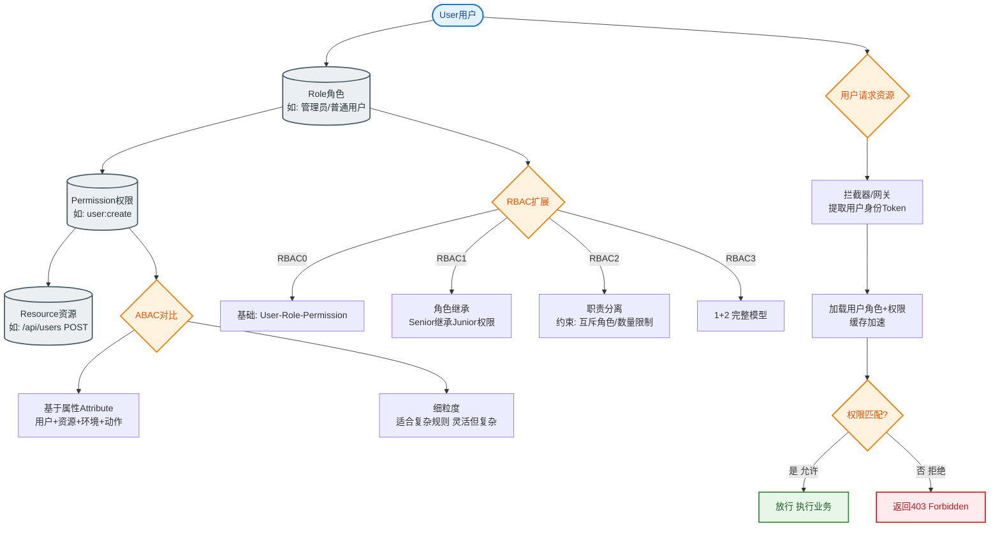

# 如何设计一个防刷系统？防止黄牛/机器人/恶意攻击。

【场景分析】
防刷目标：识别并拦截非正常用户行为，保护系统资源和业务公平性。

【防刷分层架构】
1. 网络层：
   - IP限频：单IP单位时间请求上限
   - IP黑名单：已知恶意IP直接拒绝
   - WAF：Web应用防火墙（SQL注入/XSS/CC攻击）
   - DDoS防护：流量清洗
2. 设备层：
   - 设备指纹：设备唯一标识（浏览器Canvas/WebGL指纹）
   - 一机多号检测：同设备多账号
   - 模拟器检测：运行环境异常
   - Root/越狱检测
3. 行为层：
   - 行为频率：注册/登录/下单频率异常
   - 行为模式：点击轨迹/停留时间/滑动速度
   - 验证码：图形/滑块/点选/行为验证
4. 业务层：
   - 实名认证：手机/身份证验证
   - 关系图谱：团伙刷单检测
   - 风控规则引擎：异常订单特征

【验证码演进】
1. 图形验证码：简单但易被OCR识别
2. 滑块验证码：拼图滑动，平衡体验和安全
3. 行为验证码：鼠标轨迹分析
4. 无感验证：后台行为分析，仅可疑用户弹出验证
5. 短信验证码：成本高但效果好

【风控引擎设计】
```
请求 → 规则引擎 → 风险评分 → 决策
         ↑                    ├→ 放行
    规则库                   ├→ 验证码
    模型库                   ├→ 拒绝
    特征库                   └→ 人工审核
```

【规则示例】
- 同IP每分钟注册>5次 → 拦截
- 新注册账号1分钟内下单>3次 → 拦截
- 收货地址聚集在同一区域 → 可疑
- 设备指纹与上次不同 → 二次验证

【ML风控模型】
- 特征：用户画像 + 行为序列 + 设备特征 + 网络特征
- 模型：XGBoost / DNN
- 输出：风险概率0-1
- 阈值：>0.8拒绝，0.5-0.8验证码，<0.5放行

【实时计算】
- Flink流处理实时计算用户行为特征
- Redis存储实时特征（近1小时点击数/下单数）
- 风控决策延迟<50ms

【防刷系统架构图】
```
    用户请求
       │
       ▼
┌──────────────┐
│   CDN/WAF    │ ──→ IP黑名单/流量清洗
└──────┬───────┘
       │
       ▼
┌──────────────┐
│  API 网关     │ ──→ 限流: Nginx/Gateway
└──────┬───────┘       (令牌桶/漏桶)
       │
       ▼
┌──────────────────────────────┐
│      风控决策引擎 (异步/Sync) │
│  ┌────────┐    ┌───────────┐  │
│  │ 实时库 │◄───│ 规则/模型 │  │
│  │ Redis │    │ (离线训练) │  │
│  └────────┘    └───────────┘  │
└──────┬───────────────┬─────────┘
       │               │
   低风险          高/中风险
       │               │
       ▼               ▼
┌───────────┐   ┌─────────────┐
│  放行业务 │   │ 验证码/拒绝 │
└───────────┘   └─────────────┘
```

## 常见考点
1. **高并发下的风控策略**：风控逻辑耗时会影响业务性能，如何解决？（答：同步变异步，先放行请求进入队列或进行轻量级校验，重计算异步流式处理，发现违规后回滚或封禁）
2. **设备指纹生成原理**：如何保证唯一性且难以伪造？（答：综合 Canvas 渲染差异、字体列表、硬件信息（GPU/CPU）、屏幕分辨率等生成 Hash，配合环境特征检测）
3. **团伙攻击识别**：单点看不出问题，如何发现刷单团伙？（答：构建知识图谱，通过手机号、设备ID、IP、收货地址等节点建立关系，发现强连通子图）
4. **误杀处理**：风控太严误伤正常用户怎么办？（答：设置申诉通道，策略上线先 Shadow 模式（只记录不拦截）校验准确率，动态调整阈值）


## 核心流程图


## 记忆要点

- 四层防御：网络层(WAF/IP限频)、设备层(指纹)、行为层(轨迹/验证码)、业务层(图谱)。
- 风控引擎：请求进规则引擎评估，按风险评分决定放行、验证或拒绝。
- 高并发解法：风控耗时大，故核心链路同步轻校验，重逻辑转异步流处理。
- 团伙防范：因单点无异样，故需用知识图谱挖掘同IP/设备的强连通子图。
- 误杀处理：严控误伤，策略上线必先跑影子模式观察准确率再拦截。

## 结构化回答


**30 秒电梯演讲：** 保安查证件，看脸、看动作，可疑的拦下来盘问。

**展开框架：**
1. **多层防御从网** — 多层防御从网络到业务
2. **设备指纹识别** — 设备指纹识别机器身份
3. **风控引擎计算** — 风控引擎计算风险分数

**收尾：** 如何检测设备指纹？


## 视频脚本

> 预计时长：3 分钟 | 由浅入深

| 时间 | 画面/字幕 | 口播台词 | 讲解要点 |
|------|----------|----------|----------|
| 0:00 | 标题卡：防刷系统 | "防刷系统，这题我会分三步讲。" | 开场钩子 |
| 0:41 | 概念定义动画 | "一句话：多维识别(IP/设备/行为)，分级处置(放行/验证/拦截)。" | 核心定义 |
| 1:22 | 生活类比动画 | "打个比方——保安查证件，看脸、看动作，可疑的拦下来盘问。" | 核心类比 |
| 2:03 | 多层防御从网络到业务 图解 | "多层防御从网络到业务。" | 多层防御从网络到业务 |
| 2:50 | 设备 图解 | "设备指纹识别机器身份。" | 设备 |
