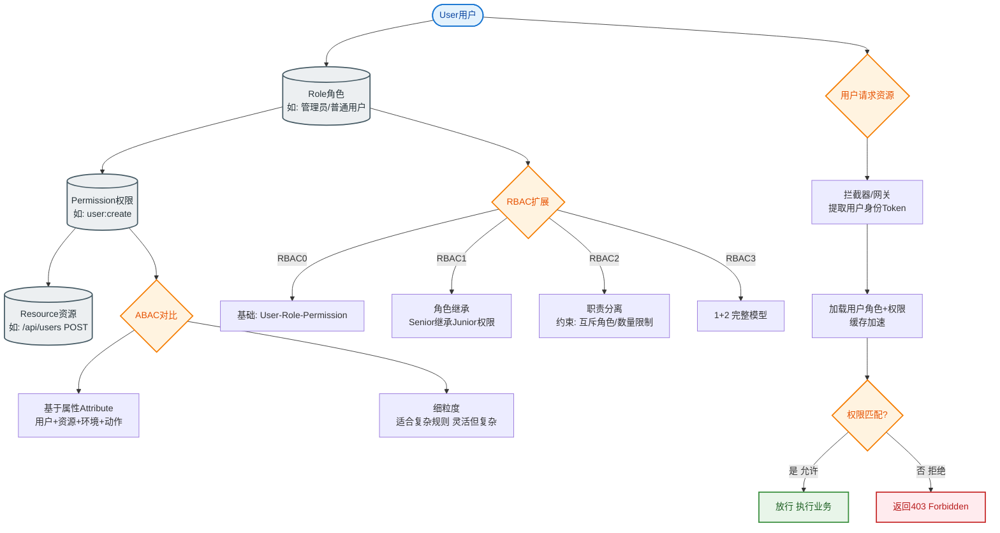
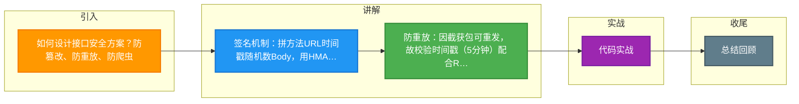

# 如何设计接口安全方案？防篡改、防重放、防爬虫。

【场景分析】
API安全三要素：身份认证、数据完整性、防重放。

【接口签名方案】
1. 客户端构造签名：
   sign = HMAC-SHA256(
     method + url + timestamp + nonce + body,
     secretKey
   )
2. 请求头携带：
   X-App-Key: app123
   X-Timestamp: 1700000000
   X-Nonce: a1b2c3d4
   X-Signature: [计算出的签名]
3. 服务端验证：
   - 用相同算法重算签名
   - 对比签名是否一致

【防篡改】
- 请求参数参与签名计算
- 修改任何参数 → 签名不匹配 → 拒绝
- HTTPS传输加密（防中间人）

【防重放】
- Timestamp：请求有效期内有效（如5分钟）
- Nonce：唯一随机数，Redis记录5分钟内已用过的Nonce
- 组合校验：timestamp过期 → 拒绝；nonce重复 → 拒绝

【防爬虫】
1. 频率限制：
   - 单用户/IP/设备QPS限制
   - 超过阈值 → 拦截或要求验证
2. 行为分析：
   - 真人请求有随机间隔
   - 爬虫请求间隔均匀
   - 异常模式检测
3. 数据保护：
   - 关键数据不直接返回（需要登录）
   - 数据加密/混淆
   - 反调试代码
4. 反爬技术：
   - User-Agent检查
   - Cookie/Session验证
   - 动态Token
   - 验证码挑战
5. 法律手段：
   - robots.txt
   - 数据使用协议

【API网关安全】
```
请求 → 网关
  ├→ 身份认证（AppKey/AppSecret验证）
  ├→ 签名验证
  ├→ 防重放（Timestamp + Nonce）
  ├→ 限流（QPS/并发）
  ├→ 黑名单检查
  ├→ WAF规则
  └→ 路由到微服务
```

【OAuth2 API安全】
- AccessToken认证
- Scope权限控制
- RefreshToken轮换
- Token撤销

【监控告警】
- 异常请求模式（大量429/401）
- 签名失败率突增
- 新IP/新设备大量请求
- 非常规时间段大量请求

【## 常见考点】】
1. **时钟漂移问题**：客户端和服务端时间不一致导致签名验证失败，如何解决？（允许一定时间误差，如±5分钟）
2. **Body 参与签名的性能**：大文件上传（如图片/视频）参与签名计算耗时较长，如何优化？（只对文件Hash或部分元数据签名，流式上传不直接签Body）
3. **密钥轮换机制**：AppKey泄露或定期更换时，如何保证服务不中断？（使用双密钥共存期，或密钥版本控制）
4. **HTTPS 加密与签名的关系**：有了 HTTPS 为什么还需要应用层签名？（HTTPS 只防传输窃听/篡改，不防客户端作恶/重放；签名用于业务层身份确认和防篡改）


## 核心流程图


## 记忆要点

- 签名机制：拼方法URL时间戳随机数Body，用HMAC-SHA256生成Sign防篡改。
- 防重放：因截获包可重发，故校验时间戳（5分钟）配合Redis记录Nonce去重。
- 防爬虫：通过网关限流、行为分析、动态Token与验证码挑战增加爬取成本。
- HTTPS局限：因HTTPS仅防链路窃听，不防业务作恶，故应用层必须加签名。
- 时钟漂移：服务端存在时间差，签名校验需允许正负5分钟误差。

## 结构化回答

**30 秒电梯演讲：** 通过签名验签保证数据完整，通过时空维度防重放与爬虫。打比方——像给信件签名盖章防篡改，加日期戳防旧信重投，设门禁防陌生人骚扰。落到工程上，HMAC摘要算法，密钥协商。

**展开框架：**
1. **接口签名** — HMAC摘要算法，密钥协商
2. **防重放** — Timestamp限时效，Nonce去重
3. **防篡改** — 全参数参与签名，HTTPS传输

**收尾：** 这几个点都能配合实战展开。您想继续聊哪个追问——比如 「签名算法如何选择」 或者 「Nonce如何存储和管理」？

## 视频脚本

> 预计时长：2 分钟 | 由浅入深

| 时间 | 画面/字幕 | 口播台词 | 讲解要点 |
|------|----------|----------|----------|
| 0:00 | 标题卡：接口安全方案 | "接口安全方案，一分钟讲透。" | 开场钩子 |
| 0:35 | 生活类比动画 | "打个比方——像给信件签名盖章防篡改，加日期戳防旧信重投，设门禁防陌生人骚扰。" | 核心类比 |
| 1:10 | 概念定义动画 | "一句话：通过签名验签保证数据完整，通过时空维度防重放与爬虫。" | 核心定义 |
| 1:50 | 接口签名 图解 | "HMAC摘要算法，密钥协商。" | 接口签名 |

### 视频流程图



