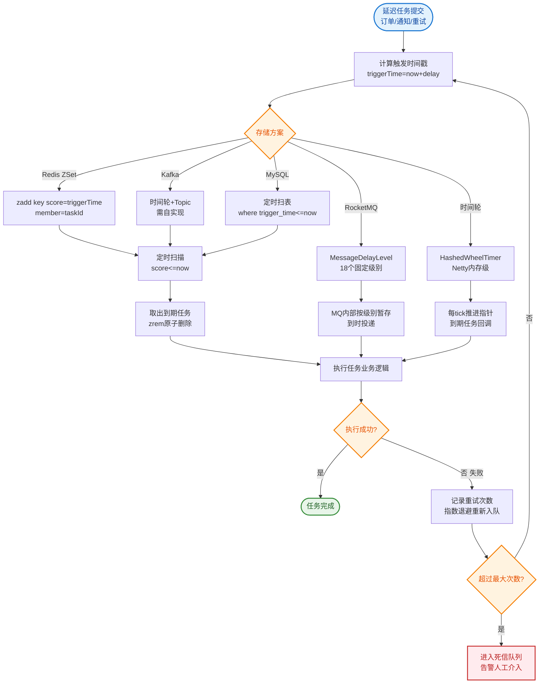

# 如何设计一个分布式定时任务系统？

【场景分析】
分布式定时任务需求：定时执行、分片并行、失败重试、任务编排、可视化管理。

**实战案例**：早期使用 Spring `@Scheduled` 进行多实例部署，导致每月账单日所有实例同时跑账单计算任务，重复执行且造成数据库死锁。迁移至 XXL-JOB 后，利用“路由策略=第一个”确保单机执行，并通过“分片广播”将原本耗时3小时的全量计算缩短至20分钟。

【常见场景】
- 定时数据同步（每小时同步ES）
- 定时报表生成（每日生成日报）
- 定时清理（每天清理过期数据）
- 定时推送（每日营销短信）
- 定时结算（每月财务结算）

【方案对比】
| 方案 | 架构模式 | 优点 | 缺点 | 适用场景 |
|------|----------|------|------|----------|
| Spring @Scheduled | 单机 | 极简 | 无集群支持，重复执行 | 简单后台小任务 |
| Quartz | DB锁 | 功能全，依赖少 | 性能瓶颈在DB，集群复杂 | 传统单体应用 |
| XXL-JOB | 中心化调度 | 优秀的UI，运维方便 | 调度中心单点风险(可HA) | 通用业务调度 |
| Elastic-Job | 去中心化 | 高可用，弹性扩容 | 强依赖ZK，无原生UI | 分片任务海量数据处理 |
| PowerJob | 网格计算 | 工作流强大，支持MapReduce | 学习成本略高 | 复杂计算编排 |

【XXL-JOB核心架构】
```
┌─────────────┐
│ 调度中心     │
│ (Admin DB)  │
└──────┬──────┘
       │ 网络通信
       ▼
┌────────────────────────────┐
│        集群/容器            │
│  ┌──────────┐  ┌──────────┐ │
│  │ 执行器1   │  │ 执行器2   │ │
│  │(Executor)│  │(Executor)│ │
│  └──────────┘  └──────────┘ │
└────────────────────────────┘
       ▲
       │ 回调执行结果
       │
┌──────┴──────┐
│  调度日志    │
└─────────────┘
```

【分片广播】
- 100万用户的数据处理任务
- 拆分为10个分片，每分片处理10万

```java
@XxlJob("processUserData")
public void process() {
    int shardIndex = XxlJobHelper.getShardIndex();  // 当前分片号 0-9
    int shardTotal = XxlJobHelper.getShardTotal();   // 总分片数 10
    // 只处理 userId % shardTotal == shardIndex 的用户
    List<Long> userIds = userRepository.findByMod(shardIndex, shardTotal);
    userIds.forEach(this::syncUserToES);
}
```

【任务编排（DAG）】
```
任务A(数据采集) → 任务B(数据清洗) → 任务C(数据分析)
                              ↓
                        任务D(报表生成)
```

【失败处理】
- 自动重试：失败后重试N次
- 失败告警：钉钉/邮件通知
- 人工干预：可视化界面手动重跑
- 子任务隔离：一个分片失败不影响其他

【幂等设计】
- 定时任务可能重复执行
- 业务逻辑需幂等
- 去重表/状态机保证

【## 常见考点】】
1. **路由策略选择**：XXL-JOB 的“故障转移”和“轮询”有什么区别？（故障转移：优先发给正常节点；轮询：平均分发；前者适合单次长任务，后者适合大量短任务）
2. **集群如何避免重复执行**：如果调度中心触发多个执行器，如何保证只执行一次？（调度中心利用 DB 行锁或分布式锁抢占任务，只有一个节点能抢到执行权）
3. **失败重试的陷阱**：任务执行一半失败并重试，如何保证数据一致性？（业务逻辑必须实现幂等，或采用 TCC 思想，重试前先回滚或检查状态）
4. **海量任务调度性能**：如果有 10 万个定时任务每秒触发，调度中心会成为瓶颈吗？（会，通常需要水平扩展调度中心，或使用网格计算架构如 PowerJob 将调度分散）


## 核心流程图


## 记忆要点

- 单机痛点：多实例@Scheduled会重复执行甚至DB死锁，所以需引入分布式调度
- 集群防重：调度中心通过DB行锁或分布式锁抢占任务，确保路由只触发单节点
- 分片广播：海量数据按 hash(userId) % 总分片数 路由，多机并行极大提升处理速度
- 失败重试陷阱：重试极易产生脏数据，因为网络抖动，所以业务代码必须实现幂等
- 路由选型：FIRST适合单点长耗时任务，ROUND适合大量短任务，FAILOVER自动剔除宕机节点

## 结构化回答


**30 秒电梯演讲：** 像公司老板（调度中心）给员工（执行器）派活，干不完重做，大家分工协作。

**展开框架：**
1. **调度中心分片** — 调度中心分片，避免单机瓶颈
2. **支持任务依赖编排** — 支持任务依赖编排（DAG）
3. **故障自动转移** — 故障自动转移，失败支持重试

**收尾：** XXL-JOB如何实现分片广播？


## 视频脚本

> 预计时长：2 分钟 | 由浅入深

| 时间 | 画面/字幕 | 口播台词 | 讲解要点 |
|------|----------|----------|----------|
| 0:00 | 标题卡：分布式定时任务系统 | "分布式定时任务系统，一分钟讲透。" | 开场钩子 |
| 0:35 | 生活类比动画 | "打个比方——像公司老板(调度中心)给员工(执行器)派活，干不完重做，大家分工协作。" | 核心类比 |
| 1:10 | 概念定义动画 | "一句话：分布式调度中心负责任务分发与协调，执行器负责具体业务逻辑。" | 核心定义 |
| 1:50 | 调度中心分片 图解 | "调度中心分片，避免单机瓶颈。" | 调度中心分片 |
