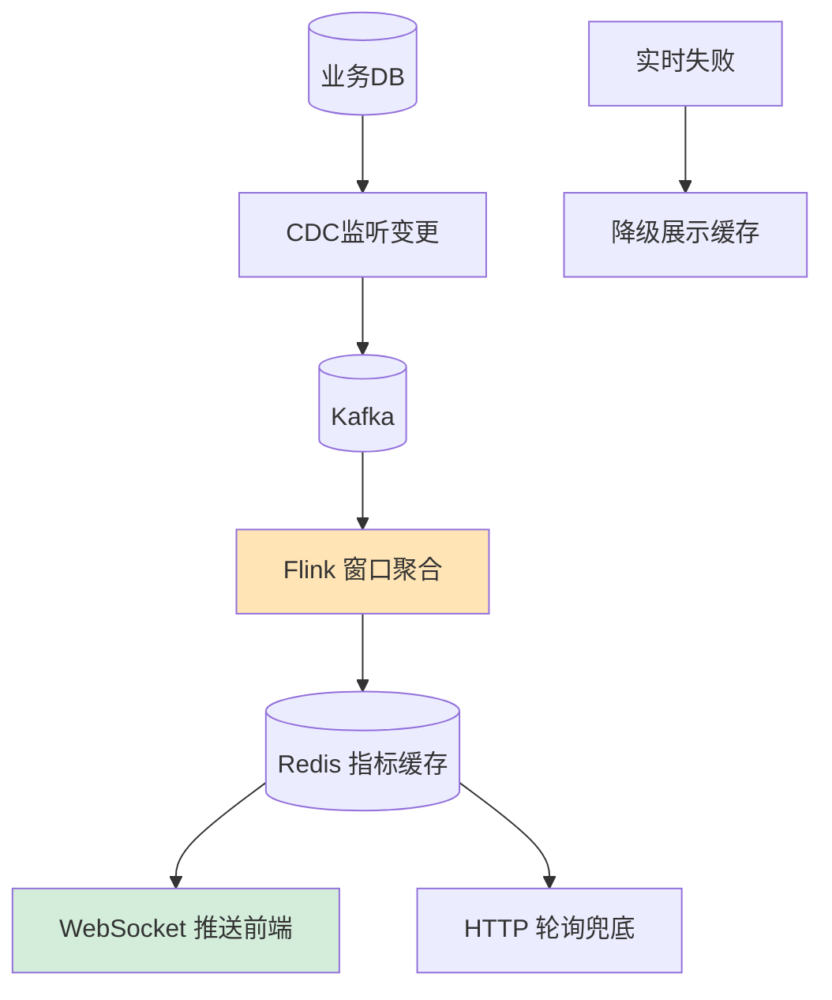

# 如何设计一个实时数据大屏系统？类似双11大屏。

【场景分析】
数据大屏需求：实时展示核心指标（GMV/订单量/在线人数）、秒级刷新、炫酷可视化。

**实战案例**：某次大促直播，实时在线人数接口因复杂联表查询（用户表+订单表+日志表）导致响应超时，前端大屏数据卡顿。优化后，采用了“空间换时间”策略，利用 Redis HyperLogLog 实时独立计算 UV，GMV 指标通过消息流直接聚合计算，完全抛弃了实时查询数据库。

【架构设计】
```
数据源 → 采集 → 计算 → 存储 → 展示
  ↓          ↓        ↓       ↓       ↓
MySQL    Canal    Flink   Redis   前端大屏
日志     Filebeat  Spark   ClickHouse
MQ       Kafka
```

【数据采集层】
1. 业务数据：Canal监听MySQL binlog → Kafka
2. 日志数据：Filebeat采集 → Kafka
3. 埋点数据：SDK上报 → Kafka
4. 第三方数据：API拉取

【实时计算层】
- 实时计算GMV
- 使用 Flink 窗口函数进行聚合

```java
DataStream<OrderEvent> orders = env
    .addSource(new FlinkKafkaConsumer<>("orders", ...));

// 每秒触发一次计算，输出到Redis
orders
    .keyBy(OrderEvent::getCategory) // 按品类分类
    .window(TumblingProcessingTimeWindows.of(Time.seconds(1)))
    .aggregate(new SumAggregator())
    .addSink(new RedisSink<>(new RedisSinkMapper(
        "SCREEN:GMV:CATEGORY:" // Key前缀
    )));
```

【存储层】
1. Redis：实时指标（当前GMV/订单数）
   - `SCREEN:GMV:TOTAL` → String，存储总GMV
   - `SCREEN:GMV:REALTIME` → ZSet，存储各省份实时GMV（用于地图热力）
2. ClickHouse：明细数据
   - 支持亿级数据秒级聚合
   - 大屏下钻查询
3. MySQL：历史数据
   - 每日/每小时归档

【存储选型对比】
| 组件 | 角色 | 优势 | 劣势 | 适用指标 |
|------|------|------|------|----------|
| Redis | 实时热数据 | 极高QPS，支持简单计算 | 内存成本高，无复杂分析 | GMV总计，在线人数 |
| ClickHouse | 冷热明细 | 列式存储，查询极速 | 并发写入能力不如ES | 历史趋势，地域分布 |
| ES | 搜索/聚合 | 灵活查询，分词强 | 聚合计算资源消耗大 | 用户画像，关键词检索 |

【展示层】
1. 数据推送：
   - WebSocket实时推送指标更新
   - 每秒推送一次
2. 可视化组件：
   - 滚动数字（CountUp动画）
   - 中国地图（各省份销售热力图）
   - 折线图（趋势变化）
   - 饼图（品类占比）
3. 技术栈：
   - ECharts / D3.js / DataV
   - WebGL渲染（大数据量）

【性能优化】
- 数据预聚合：Flink每秒聚合一次，减少前端渲染压力
- CDN缓存：静态大屏背景
- 分级刷新：核心指标1秒，次要指标5秒
- 采样展示：数据量大时只展示TOP N

【容灾设计】
- 数据降级：实时计算不可用时展示最近缓存
- 多机房大屏数据同步
- 大屏不可用时备选展示方式


## 核心流程图




## 记忆要点

- 核心痛点：大屏严禁直接联表查DB，必须走预聚合链路
- 数据流转：Canal监听/MQ采集 -> Flink窗口实时聚合计算 -> Redis/ClickHouse存储
- 存储分工：Redis存高频核心指标(GMV/UV)，ClickHouse存海量明细供下钻查询
- 大屏推送：后端通过WebSocket主动推，前端按秒级频率接收，分指标差异化刷新
- 容灾降级：Flink宕机不可用时，大屏自动降级展示Redis或CDN内的近期缓存数据

## 结构化回答


**30 秒电梯演讲：** 像交通指挥中心，摄像头实时采集（CDC），大屏即时处理（Flink），红绿灯秒级响应。

**展开框架：**
1. **CDC** — CDC监听数据库变更，Kafka缓冲消息
2. **Flink** — Flink窗口聚合计算，写入Redis
3. **WebSocket** — 前端WebSocket订阅，实时推送指标

**收尾：** 如何保证大屏数据的实时性？


## 视频脚本

> 预计时长：2 分钟 | 由浅入深

| 时间 | 画面/字幕 | 口播台词 | 讲解要点 |
|------|----------|----------|----------|
| 0:00 | 标题卡：实时数据大屏系统 | "实时数据大屏系统，一分钟讲透。" | 开场钩子 |
| 0:35 | 生活类比动画 | "打个比方——像交通指挥中心，摄像头实时采集(CDC)，大屏即时处理(Flink)，红绿灯秒级响应。" | 核心类比 |
| 1:10 | 概念定义动画 | "一句话：实时采集流数据，低延迟计算聚合，前端推拉结合展示。" | 核心定义 |
| 1:50 | CDC监听数据库变更 图解 | "CDC监听数据库变更，Kafka缓冲消息。" | CDC监听数据库变更 |

### 视频流程图


