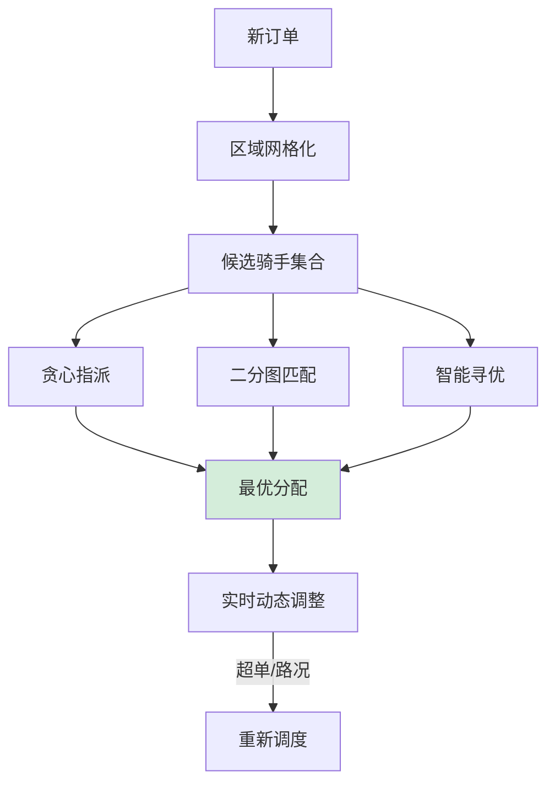

# 如何设计外卖配送调度系统？类似美团/饿了么。

【场景分析】
配送调度核心：在极短时间内为大量订单匹配最优骑手，考虑距离、方向、载重、时间窗。

【调度问题建模】
- 输入：订单（取餐点、送达点、时间要求）、骑手（位置、状态、载单量）
- 输出：订单→骑手的最优分配
- 目标：总配送时间最短、骑手利用率最高、超时最少
- 本质：多约束优化问题（NP-Hard）

【调度算法】
1. 贪心算法（基础）：
   - 每个订单分配距离最近的空闲骑手
   - 简单但不全局最优
2. 匈牙利算法：
   - 构建订单-骑手二分图
   - 最小权匹配
   - 适合小规模
3. 蚁群算法/遗传算法（启发式）：
   - 模拟生物群体寻优
   - 适合大规模
4. 强化学习（前沿）：
   - 训练智能体学习调度策略
   - 持续优化

【实战案例】
暴雨天或爆单时，单纯追求“全局最优”会导致大量骑手被派往拥堵区域，导致外围订单无人接单（死锁）。实战中需引入“供需平衡”权重：当某区域排队订单>骑手数2倍时，强制降低该区域派单优先级，引导部分骑手向周边扩散。

【代码示例】
```python
# 调度引擎：计算加权得分 (Python伪代码)
def calculate_score(order, rider):
    distance = get_distance(rider.loc, order.pickup_loc) # 距离
    urgency = (order.deadline - now).total_seconds()     # 紧迫度
    
    # 基础分：距离越近分越高
    score = 1000 / (distance + 0.1) 
    
    # 紧急加权：剩余时间越少，加分越多
    if urgency < 600: # 少于10分钟
        score *= 1.5 
        
    # 方向惩罚：如果顺路则分高，反之扣分
    direction_factor = check_direction(rider.vector, order.delivery_loc)
    score *= direction_factor
    
    return score
```

【系统架构】
```
订单生成 → 调度引擎 → 分配结果 → 骑手APP推送
              ↑
        骑手状态/位置/路况
```

【实时数据】
1. 骑手位置：GPS每3秒上报
2. 订单状态：创建/已接单/取餐中/配送中/已完成
3. 路况数据：第三方地图API
4. 商家出餐时间预估

【核心模块】
1. 区域划分：
   - 城市划分为网格/商圈
   - 每个区域独立调度
2. 骑手画像：
   - 技能等级、历史表现、偏好路线
3. 订单合并（拼单）：
   - 同向订单合并配送
   - 最多3单合并
4. 动态调价：
   - 供需不平衡时调价
   - 高峰/天气加价
5. 超时预警：
   - 实时计算预计送达时间
   - 超时风险高的优先调度

【调度模式对比】

| 模式 | 触发时机 | 优点 | 缺点 |
| :--- | :--- | :--- | :--- |
| **实时调度** | 订单一来立即分配 | 响应快，用户体验好 | 缺乏全局视野，可能导致后续订单无人送 |
| **批次调度** | 每隔N秒或积攒M单后统一计算 | 全局最优，能合并顺路单，效率高 | 用户等待感强，计算压力大 |
| **混合调度** | 实时兜底 + 批次优化 | 兼顾速度与效率 | 逻辑复杂，需处理抢占与取消逻辑 |

【技术选型】
- 位置存储：Redis GEO
- 路径规划：图数据库（Neo4j）+ 地图API
- 实时计算：Flink
- 调度引擎：Java/Go高性能服务
- 骑手推送：WebSocket/APP Push

【性能要求】
- 调度延迟 < 3秒
- 支持单城市百万订单/日
- 万级骑手实时位置追踪


## 核心流程图




## 记忆要点

- 本质模型：多约束条件下的最优分配，属于NP-Hard问题，需平衡响应时间与全局最优
- 调度模式对比：实时调度快但视野短，批次调度(积压N秒)能全局统筹且利于拼单合并
- 核心打分：综合距离、剩余时间紧迫度、顺路方向特征计算订单与骑手的匹配权重
- 位置技术：骑手实时坐标存Redis GEO，支持毫秒级圈定半径范围内的骑手
- 极端削峰：暴雨爆单时若排队量超承载，必须降级某区域优先级或触发动态加价

## 结构化回答

**30 秒电梯演讲：** 在多约束下实时分配订单给最优骑手的运筹优化问题。打比方——像滴滴打车调度员，瞬间决定哪辆车接哪单最快最顺路。落到工程上，时间最短、效率最高、成本最低。

**展开框架：**
1. **多目标优化** — 时间最短、效率最高、成本最低
2. **分阶段调度** — 贪心指派、二分图匹配、智能寻优
3. **区域网格化** — 缩小搜索范围，提高并发

**收尾：** 这几个点都能配合实战展开。您想继续聊哪个追问——比如 「如何优化调度算法」 或者 「骑手位置如何实时追踪」？

## 视频脚本

> 预计时长：3 分钟 | 由浅入深

| 时间 | 画面/字幕 | 口播台词 | 讲解要点 |
|------|----------|----------|----------|
| 0:00 | 标题卡：外卖配送调度系统 | "外卖配送调度系统，这题我会分三步讲。" | 开场钩子 |
| 0:41 | 概念定义动画 | "一句话：在多约束下实时分配订单给最优骑手的运筹优化问题。" | 核心定义 |
| 1:22 | 生活类比动画 | "打个比方——像滴滴打车调度员，瞬间决定哪辆车接哪单最快最顺路。" | 核心类比 |
| 2:03 | 多目标优化 图解 | "时间最短、效率最高、成本最低。" | 多目标优化 |
| 2:50 | 分阶段调度 图解 | "贪心指派、二分图匹配、智能寻优。" | 分阶段调度 |
