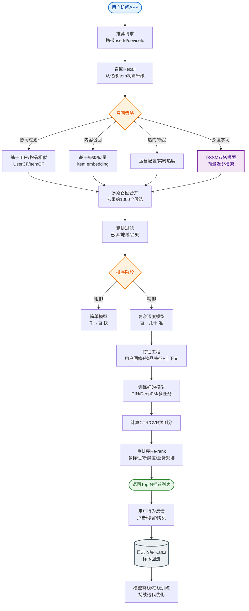
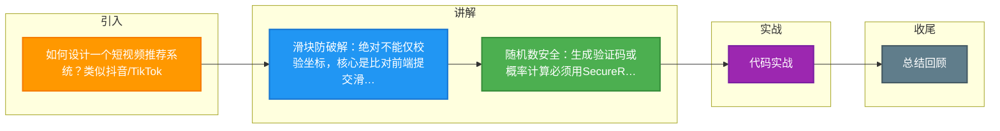

# 如何设计一个短视频推荐系统？类似抖音/TikTok。

【场景分析】
验证码目的：区分人机、防暴力破解、防爬虫、防刷接口。

【验证码类型与实现原理】
1. **图形验证码**：
   - 服务端生成随机字符串（字符集排除易混淆字符如0o, 1lI）→ 绘制成图片（加干扰线/噪点/背景色/扭曲变形）。
   - **存Redis**（Key=`captcha:sess:{sessionId}`, Value=加密后的Code或Hash, TTL=5min）。
   - **用户输入** → 服务端比对（建议使用恒定时间比较算法防止时序攻击）。
2. **短信验证码**：
   - 生成6位数字（熵值足够）→ 调用短信网关API（如阿里云SMS）。
   - **防刷策略**：Redis Key=`sms:limit:{phone}` (TTL=60s) 限制发送频率；Key=`sms:count:{ip}` (TTL=1h) 限制IP总量。
   - 存Redis（Key=`sms:code:{phone}`, Value=Code, TTL=5min）。
3. **滑块验证码**：
   - **生成逻辑**：原图 + 缺口图，通过Canvas合成拼图背景。服务端加密生成Token（包含X坐标、Y坐标、原图ID）。
   - **校验逻辑**：客户端提交滑动轨迹（time, x, y） → 服务端计算轨迹平滑度、加速度、抖动（模拟人操作） → 比对坐标偏差（通常允许±2-5px误差）。
4. **智能无感验证**：
   - 收集设备指纹、环境特征、行为数据。
   - 服务端风控引擎打分（0-100分），高风险才触发滑块/点选。

【实战案例】
滑块验证码极易被机器学习模拟攻击（识别缺口位置并生成拟人轨迹）。实战中不要仅依赖坐标校验，应引入“埋点行为分析”：记录鼠标移动过程中的`mousemove`事件频率、按下与抬起的时间差、甚至鼠标移动时的加速度曲线，机器生成的轨迹通常过于平滑或加速度突变不符合物理规律。

【代码示例】
```java
// 滑块轨迹校验逻辑 (Java)
public boolean verifyTrack(List<Point> track, int targetX) {
    if (track.isEmpty()) return false;
    
    // 1. 坐标偏差检查
    int lastX = track.get(track.size() - 1).x;
    if (Math.abs(lastX - targetX) > 5) return false;
    
    // 2. 轨迹平滑度检查 (简单方差计算)
    double variance = calculateVariance(track);
    if (variance < 0.5) return false; // 过于平滑，疑似机器
    
    // 3. 速度突变检查 (防止匀速移动)
    // 真人滑动速度是：快-慢-快，机器往往是匀速
    return checkSpeedPattern(track);
}
```

【系统架构】
```text
                      ┌──────────────┐
                      │   客户端     │
                      └──────┬───────┘
                             │
       (1) 请求验证码 (Token/SessionID)
                             ↓
       ┌─────────────────────────────────────┐
       │           API 网关 / LB              │
       └─────────────────┬───────────────────┘
                         ↓
       ┌─────────────────────────────────────┐
       │        验证码生成服务               │
       │  ┌─────┐ ┌──────┐ ┌──────┐ ┌─────┐  │
       │  │图形 │ │短信  │ │滑块  │ │智能 │  │
       │  └──┬──┘ └───┬──┘ └───┬──┘ └──┬──┘  │
       └─────┼────────┼────────┼───────┼────┘
             │        │        │       │
             ↓        │        │       ↓
      ┌──────────┐    │   ┌──────────┐
      │   Redis  │    │   │ 风控引擎 │
      │(存储状态)│    │   │(数据分析)│
      └──────────┘    │   └──────────┘
                      │
             (发送短信)│
                      ↓
               ┌────────────┐
               │ 第三方短信 │
               │   服务商   │
               └────────────┘
```

【安全设计深度解析】
- **一次性使用**：验证成功后立即DEL Redis Key，或在Redis存一个标记位。
- **防暴力破解**：Key=`verify:fail:{ip}`，失败5次锁定该IP 1小时。
- **随机数安全**：使用`SecureRandom`而非`Random`，避免伪随机。
- **传输安全**：全程HTTPS，验证码在服务端哈希存储（如SHA256），明文不落库/不落日志。
- **短信成本控制**：验证码在发送前先校验手机号格式、归属地（拦截高风险区号），对于同IP连续请求不同手机号的行为直接封禁，防止短信接口被恶意刷单消耗。


## 核心流程图


## 记忆要点

- （题目为短视频，答案为验证码，按答案总结）核心目的：区分人机，防暴力破解、防爬虫与接口刷单
- 滑块防破解：绝对不能仅校验坐标，核心是比对前端提交滑动轨迹的方差与加速度（防机器匀速）
- 随机数安全：生成验证码或概率计算必须用SecureRandom，禁用Random防特征预测
- 短信防刷：Redis强制限制同手机号60s频控及同IP总量，并前置图形验证码拦截脚本
- 安全闭环：验证通过后必须立刻DEL Redis Key，防止验证码被重放攻击恶意复用

## 结构化回答

**30 秒电梯演讲：** 从海量内容池中，根据实时兴趣召回并排序出用户最爱的视频。打比方——像无限续摊的自助餐厅，服务员根据你口味不断端上新菜。落到工程上，协同过滤、向量检索、热门兜底。

**展开框架：**
1. **多路召回** — 协同过滤、向量检索、热门兜底
2. **多目标排序** — 平衡点击率、完播率、互动率
3. **流量池机制** — 新内容冷启动分级曝光

**收尾：** 这几个点都能配合实战展开。您想继续聊哪个追问——比如 「如何预测视频完播率」 或者 「多目标排序如何加权」？

## 视频脚本

> 预计时长：3 分钟 | 由浅入深

| 时间 | 画面/字幕 | 口播台词 | 讲解要点 |
|------|----------|----------|----------|
| 0:00 | 标题卡：短视频推荐系统 | "短视频推荐系统，这题我会分三步讲。" | 开场钩子 |
| 0:41 | 概念定义动画 | "一句话：从海量内容池中，根据实时兴趣召回并排序出用户最爱的视频。" | 核心定义 |
| 1:22 | 生活类比动画 | "打个比方——像无限续摊的自助餐厅，服务员根据你口味不断端上新菜。" | 核心类比 |
| 2:03 | 多路召回 图解 | "协同过滤、向量检索、热门兜底。" | 多路召回 |
| 2:50 | 多目标排序 图解 | "平衡点击率、完播率、互动率。" | 多目标排序 |

### 视频流程图



