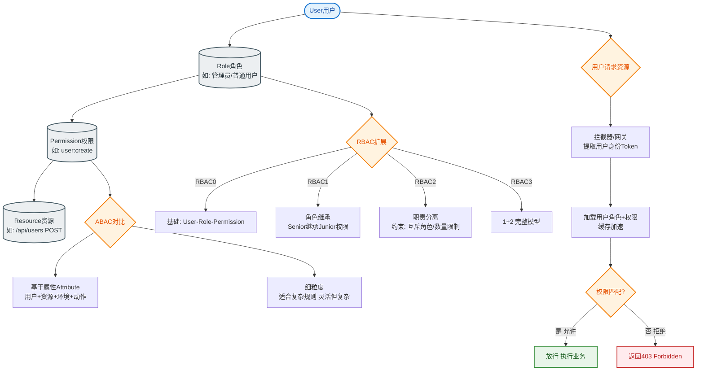

# 如何设计一个验证码系统？支持图形/短信/滑块多种形式。

【场景分析】
验证码目的：区分人机、防暴力破解、防爬虫、防刷接口。

【验证码类型与实现原理】
1. **图形验证码**：
   - 服务端生成随机字符串（字符集排除易混淆字符如0o, 1lI）→ 绘制成图片（加干扰线/噪点/背景色/扭曲变形）。
   - **存Redis**（Key=`captcha:sess:{sessionId}`, Value=加密后的Code或Hash, TTL=5min）。
   - **用户输入** → 服务端比对（建议使用恒定时间比较算法防止时序攻击）。
2. **短信验证码**：
   - 生成6位数字（熵值足够）→ 调用短信网关API（如阿里云SMS）。
   - **防刷策略**：Redis Key=`sms:limit:{phone}` (TTL=60s) 限制发送频率；Key=`sms:count:{ip}` (TTL=1h) 限制IP总量。
   - 存Redis（Key=`sms:code:{phone}`, Value=Code, TTL=5min）。
3. **滑块验证码**：
   - **生成逻辑**：原图 + 缺口图，通过Canvas合成拼图背景。服务端加密生成Token（包含X坐标、Y坐标、原图ID）。
   - **校验逻辑**：客户端提交滑动轨迹（time, x, y） → 服务端计算轨迹平滑度、加速度、抖动（模拟人操作） → 比对坐标偏差（通常允许±2-5px误差）。
4. **智能无感验证**：
   - 收集设备指纹、环境特征、行为数据。
   - 服务端风控引擎打分（0-100分），高风险才触发滑块/点选。

【系统架构】
```text
                      ┌──────────────┐
                      │   客户端     │
                      └──────┬───────┘
                             │
       (1) 请求验证码 (Token/SessionID)
                             ↓
       ┌─────────────────────────────────────┐
       │           API 网关 / LB              │
       └─────────────────┬───────────────────┘
                         ↓
       ┌─────────────────────────────────────┐
       │        验证码生成服务               │
       │  ┌─────┐ ┌──────┐ ┌──────┐ ┌─────┐  │
       │  │图形 │ │短信  │ │滑块  │ │智能 │  │
       │  └──┬──┘ └───┬──┘ └───┬──┘ └──┬──┘  │
       └─────┼────────┼────────┼───────┼────┘
             │        │        │       │
             ↓        │        │       ↓
      ┌──────────┐    │   ┌──────────┐
      │   Redis  │    │   │ 风控引擎 │
      │(存储状态)│    │   │(数据分析)│
      └──────────┘    │   └──────────┘
                      │
             (发送短信)│
                      ↓
               ┌────────────┐
               │ 第三方短信 │
               │   服务商   │
               └────────────┘
```

【安全设计深度解析】
- **一次性使用**：验证成功后立即DEL Redis Key，或在Redis存一个标记位。
- **防暴力破解**：Key=`verify:fail:{ip}`，失败5次锁定该IP 1小时。
- **随机数安全**：使用`SecureRandom`而非`Random`，避免伪随机。
- **传输安全**：全程HTTPS，验证码在服务端哈希存储（如SHA256），明文不落库/不落日志。
- **短信成本控制**：
  - 验证码复用：验证码有效期内，同一手机号请求多次不消耗新次数（返回旧码或提示频繁）。
  - 语音验证码兜底：针对短信接收困难的用户。

【## 常见考点】
1. **如何防止短信接口被刷爆？**
   - 限流（IP/手机号/设备ID）、图形验证码前置校验、黑名单机制。
2. **滑块验证码的前端加密可以破解吗？**
   - 前端加密仅防君子，核心逻辑必须在服务端。主要校验的是轨迹数据（加速度、是否匀速），而非仅仅坐标。
3. **为什么验证码用完后要删除Redis中的Key？**
   - 防止重放攻击（Replay Attack），确保验证码只能被使用一次。
4. **Redis宕机怎么办？**
   - 验证码服务降级（直接拒绝或进入宽松模式），依赖Redis持久化（RDB/AOF）重启后恢复，但验证码通常短期丢失可接受。


## 核心流程图


## 记忆要点

- 核心存储：验证码全凭Redis，过期时间定5min，对比需防时序攻击
- 多维防刷：手机号限60s、IP限1h；接口防刷必前置图形验证码
- 滑块深防：前端不安全，核心在后端校验轨迹（加速度与平滑度）
- 短信成本：同号请求复用旧码或提示频繁；防爆破锁定失败5次的IP
- 安全铁律：SecureRandom生码、HTTPS明文不落日志、用完即删防重放

## 结构化回答

**30 秒电梯演讲：** 通过安全挑战区分人机，防御恶意自动化攻击。打比方——像小区门口的保安，问个问题确认你是真人不是机器。落到工程上，图文识别、短信校验、行为轨迹。

**展开框架：**
1. **多种形态** — 图文识别、短信校验、行为轨迹
2. **安全设计** — 一次有效、限时失效、频次限制
3. **降级策略** — 无感通过为主，高风险才弹窗

**收尾：** 这几个点都能配合实战展开。您想继续聊哪个追问——比如 「滑块验证码如何防破解」 或者 「无感验证的原理是什么」？

## 视频脚本

> 预计时长：1 分 30 秒 | 由浅入深

| 时间 | 画面/字幕 | 口播台词 | 讲解要点 |
|------|----------|----------|----------|
| 0:00 | 标题卡：验证码系统 | "验证码系统，一分钟讲透。" | 开场钩子 |
| 0:25 | 生活类比动画 | "打个比方——像小区门口的保安，问个问题确认你是真人不是机器。" | 核心类比 |
| 0:50 | 概念定义动画 | "一句话：通过安全挑战区分人机，防御恶意自动化攻击。" | 核心定义 |
| 1:20 | 多种形态 图解 | "图文识别、短信校验、行为轨迹。" | 多种形态 |
