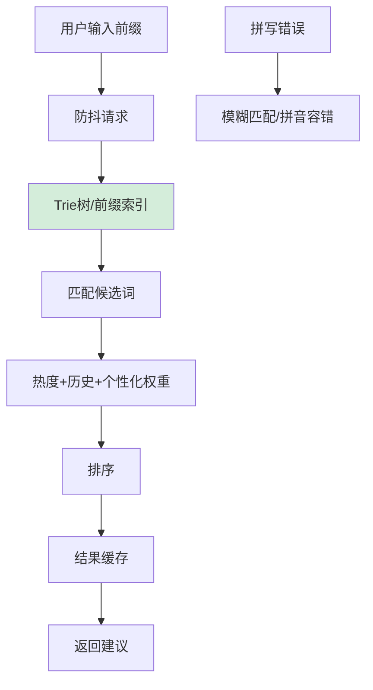

# 如何设计搜索自动补全（Suggest）系统？输入即时推荐。

【场景分析】
搜索建议需求：用户输入时实时推荐、毫秒级响应、个性化、热门词优先、纠错能力。

**【实战案例】**
在某电商大促期间，曾出现“airp”前缀查询量飙升，由于未对Key做内存限制，导致Redis内存溢出。后来通过只保留Top 50热词并将长前缀截断至6位解决。

【数据来源】
1. **热门搜索词**：根据全局搜索频率（PB级数据离线计算T+1更新）。
2. **用户历史搜索**：个人搜索记录（实时权重最高）。
3. **内容匹配**：倒排索引匹配实际存在的标题/品牌名。
4. **运营干预**：手动置顶品牌词、活动词（白名单）。

【核心数据结构 — Trie（字典树）】
- 适合前缀匹配，内存占用大（存储开销大），不适合海量词直接内存化。
```text
        root
       / | \
      a  b  i
     /|   \
    p p    p
   /|      \
  p l       h
  ↓          \
apple     iphone
```

【Redis实现（推荐方案：前缀树 + ZSet）】
- **数据结构**：每个前缀对应一个ZSet。
- **Key设计**：`suggest:{prefix}`
- **Value**：ZSet(Member=完整词, Score=热度权重*权重系数)
  - 热度权重 = 搜索次数 * 1 + 点击次数 * 5 + 转化次数 * 10
- **查询**：`ZRANGE suggest:ap 0 9` 获取以"ap"开头的Top 10热门词。

**【代码示例：Go语言 - 生成前缀Key】**
```go
func GeneratePrefixKeys(keyword string) []string {
    var keys []string
    runes := []rune(keyword)
    maxLen := 6 // 实战优化：只存前6位
    if len(runes) > maxLen {
        runes = runes[:maxLen]
    }
    for i := 1; i <= len(runes); i++ {
        keys = append(keys, "suggest:"+string(runes[:i]))
    }
    return keys
}
```

【热点词更新流程】
- **实时更新**：用户搜索词后，异步将该词的所有前缀（2-6位）对应的ZSet分数自增。
  ```text
  用户搜索"iphone15" →
    ZINCRBY suggest:i 1 "iphone15"
    ZINCRBY suggest:ip 1 "iphone15"
    ZINCRBY suggest:iph 1 "iphone15"
    ...
  ```
- **离线更新**：每天凌晨全量重置ZSet，基于昨日全量日志计算，清除噪音数据。

【性能优化策略】
1. **前缀截断**：只存前2-6个字符的前缀。超过6个字符的输入，通常搜索意图已明确，结果集很少。
2. **容量控制**：每个前缀ZSet保留Top 50或Top 100，利用`ZREMRANGEBYRANK`裁剪，防止内存爆炸。
3. **客户端缓存**：本地LRU Cache，热门前缀（如'a', 'i'）结果缓存30-60秒。
4. **交互优化**：防抖，停止输入200ms后才发请求。
5. **预取**：输入"i"时，如果返回结果中包含高频词"iphone"，后台预加载"iphone"的联想结果。

【多源数据合并策略】
- **加权融合**：TotalScore = (PersonalScore * 0.6) + (GlobalScore * 0.4)。
- **插入排序**：优先展示用户历史搜索（高亮显示），后续补全全局热门词。

**【方案对比：存储与检索选型】**
| 特性 | Redis ZSet方案 | ElasticSearch方案 | 内存Trie方案 |
| :--- | :--- | :--- | :--- |
| **响应延迟** | 毫秒级 (<10ms) | 较高 (20-50ms) | 极低 (<1ms) |
| **内存开销** | 可控 (Top N截断) | 较低 (依赖磁盘) | 极大 (全量词) |
| **个性化支持** | 强 (需额外ZSet) | 强 (复杂Query) | 弱 (需扩展结构) |
| **拼音/纠错** | 弱 (需辅助结构) | 强 (内置插件) | 极弱 |
| **适用场景** | 高并发实时补全 | 复杂搜索/长尾词 | 词汇量极小的系统 |

【## 常见考点】
1. **如果用户输入"ipho"但想找的是"ophone"（打错字），怎么处理？**
   - **纠错机制**：在Redis方案外增加FST（Finite State Transducer）或使用ES的`fuzziness`查询，基于编辑距离提示"您是否要搜索：iphone"。
2. **如何保证拼音搜索？**
   - 建立"拼音→汉字"的映射表。搜索"zhongguo"时，前缀匹配"zhongguo"对应的ZSet（value为"中国"）。通常需专门维护拼音倒排索引。
3. **为什么不用MySQL的Like查询？**
   - `like 'prefix%'`无法利用索引（最左前缀虽可用索引，但高并发下IO开销大且无法做权重排序），数据库抗压能力远低于Redis。
4. **内存不够存所有前缀怎么办？**
   - 只存储高频前缀（如前90%流量覆盖的词根）；低频前缀回源到ElasticSearch查询。


## 核心流程图




## 记忆要点

- 核心存储：Redis ZSet方案。因为需高频前缀查询与权重排序，所以Key设计为前缀，Value存完整词及热度分数。
- 性能优化：防内存爆炸需前缀截断（最多前6位）与容量控制（ZSet保留Top 50）。
- 更新机制：实时增量异步更新ZSet分数，离线T+1全量重置清除噪音数据。
- 多源融合：因为要兼顾个性化，所以采用加权融合策略（个人历史0.6+全局热词0.4）。

## 结构化回答

**30 秒电梯演讲：** 基于前缀树或索引结构，毫秒级返回匹配的搜索建议词。打比方——像输入法的联想功能，敲几个字就猜出你想输啥。落到工程上，Trie树或Redis前缀索引。

**展开框架：**
1. **数据结构** — Trie树或Redis前缀索引
2. **排序权重** — 综合热度、历史记录、个性化偏好
3. **性能优化** — 限制前缀长度、结果缓存、防抖请求

**收尾：** 这几个点都能配合实战展开。您想继续聊哪个追问——比如 「Trie树的内存如何优化」 或者 「如何实现搜索纠错」？

## 视频脚本

> 预计时长：2 分钟 | 由浅入深

| 时间 | 画面/字幕 | 口播台词 | 讲解要点 |
|------|----------|----------|----------|
| 0:00 | 标题卡：搜索自动补全（Suggest）系统 | "搜索自动补全（Suggest）系统，一分钟讲透。" | 开场钩子 |
| 0:35 | 生活类比动画 | "打个比方——像输入法的联想功能，敲几个字就猜出你想输啥。" | 核心类比 |
| 1:10 | 概念定义动画 | "一句话：基于前缀树或索引结构，毫秒级返回匹配的搜索建议词。" | 核心定义 |
| 1:50 | 数据结构 图解 | "Trie树或Redis前缀索引。" | 数据结构 |
