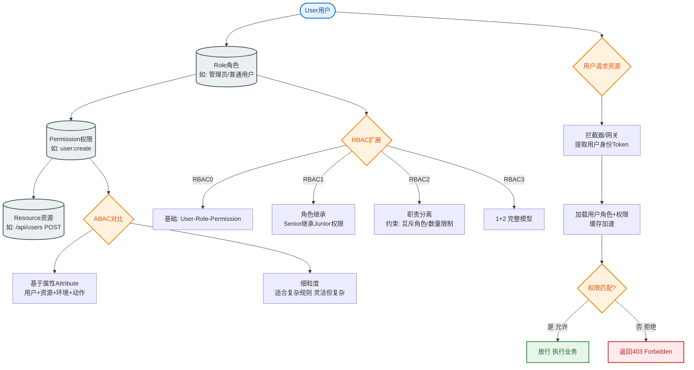

# 如何设计一个分布式Session方案？微服务下Session如何管理？

【场景分析】
微服务架构下，服务多实例部署，负载均衡会导致请求落在不同机器，本地内存Session无法共享，需要分布式方案。

**【实战案例】**
某B2B平台从Session Sticky迁移到Spring Session+Redis后，解决了促销期负载不均导致单机宕机的问题，但初期因忘记开启Redis Key的TTL，导致内存泄漏，最终加上`@EnableRedisHttpSession(maxInactiveIntervalInSeconds=1800)`解决。

**【方案对比】**
| 方案 | 优点 | 缺点 | 适用场景 |
| :--- | :--- | :--- | :--- |
| **Session Sticky** | 实现简单，无外部依赖 | 宕机丢失，负载不均，不适合水平扩展 | 单机应用或简单内部系统 |
| **Session复制** | 数据同步快，无单点 | N*N网络风暴，延迟高，节点数<5 | 小规模传统集群 |
| **集中存储** | 高可用，重启不丢，易扩展 | 强依赖Redis，每次请求网络IO | 主流微服务/高并发系统 |
| **JWT (无状态)**| 服务端无压力，跨域友好 | 无法主动失效，Token大传输开销 | 移动端API、分布式SSO |
| **JWT + 黑名单**| 兼顾无状态与安全 | 黑名单维护有成本，增加Redis依赖 | 需强制登出的高安全场景 |

【Spring Session + Redis 架构】
```text
   Client (Cookie: SESSIONID)
      ↓
   ┌─────────┐
   │ Nginx   │
   └────┬────┘
        ↓
   ┌──────────────────────┐
   │ Service A / B / C    │
   │ (Spring Session Filter)│
   └───────┬──────────────┘
           │ 读取/写入
           ↓
   ┌──────────────────────┐
   │      Redis Cluster   │
   │  Key: sess:123456    │
   │  Val: {attr: value}  │
   └──────────────────────┘
```

**【代码示例：Java - Spring Session Redis配置】**
```java
@EnableRedisHttpSession(
    maxInactiveIntervalInSeconds = 1800, // 30分钟过期
    redisNamespace = "myapp:sessions"   // Key前缀
)
public class SessionConfig {
    @Bean
    public LettuceConnectionFactory redisConnectionFactory() {
        return new LettuceConnectionFactory(new RedisStandaloneConfiguration("redis.host", 6379));
    }
}
```

【JWT 方案深度解析】
- **结构**：Header (算法/类型) . Payload (数据) . Signature (签名)。
- **双Token机制**：
  - `AccessToken`：有效期短（15-30分钟），用于访问API。
  - `RefreshToken`：有效期长（7-14天），用于刷新AccessToken，仅存Redis或HTTPOnly Cookie。
- **安全实践**：
  - 使用非对称加密（RS256）私钥签名，公钥验签（微服务间共享公钥）。
  - JWT不要存敏感信息（Base64仅编码不加密，可解码）。
  - 必须使用HTTPS，防止被拦截。

【## 常见考点】
1. **JWT无法主动失效，用户点击"退出登录"怎么办？**
   - 前端删除Token；服务端将Token加入Redis黑名单（适合低并发）；或者将Redis中的RefreshToken删除（高并发推荐），令其无法刷新。
2. **如果Token被黑客截获了怎么办？**
   - HTTPS是底线。可以通过绑定设备指纹、IP变动检测来提高安全性，或者使用Token指纹校验。
3. **Redis存储Session序列化有什么坑？**
   - 不同语言的序列化协议不通（Java用JDK序列化，Go读不了）；建议用JSON或Protobuf序列化存入Redis。
4. **大规模集群下，Redis Session会成为瓶颈吗？**
   - 读写QPS极高（每次请求都读写Redis），一般Redis扛得住。若扛不住，可对Session数据进行冷热分离（如将部分大字段存数据库，SessionID存Redis）。


## 核心流程图


## 记忆要点

- 方案选型：集中式存储高可用易扩展，适合主流微服务；而JWT无状态适合移动端与跨域SSO。
- 致命坑点：因为极易忘记设置过期时间，所以Redis Session必须配置TTL（如1800秒）防内存泄漏。
- JWT安全实践：采用双Token机制（短Access+长Refresh），且因Base64易解码，绝对不能存敏感信息。
- 主动失效：JWT退出登录时，因自身无法立即失效，必须结合Redis黑名单或删除RefreshToken。

## 结构化回答

**30 秒电梯演讲：** 解决微服务多实例间用户登录状态共享与身份认证问题。打比方——像把钱包从身上(本地)换成存银行(Redis)，哪里都能取。落到工程上，Session存Redis，所有实例共享。

**展开框架：**
1. **集中存储** — Session存Redis，所有实例共享
2. **无状态方案** — JWT自包含信息，服务端无需存会话
3. **安全策略** — Access Token短期+Refresh Token长期

**收尾：** 这几个点都能配合实战展开。您想继续聊哪个追问——比如 「JWT如何实现主动失效」 或者 「Session和Token的优劣对比」？

## 视频脚本

> 预计时长：2 分钟 | 由浅入深

| 时间 | 画面/字幕 | 口播台词 | 讲解要点 |
|------|----------|----------|----------|
| 0:00 | 标题卡：分布式Session方案 | "分布式Session方案，一分钟讲透。" | 开场钩子 |
| 0:35 | 生活类比动画 | "打个比方——像把钱包从身上(本地)换成存银行(Redis)，哪里都能取。" | 核心类比 |
| 1:10 | 概念定义动画 | "一句话：解决微服务多实例间用户登录状态共享与身份认证问题。" | 核心定义 |
| 1:50 | 集中存储 图解 | "Session存Redis，所有实例共享。" | 集中存储 |
