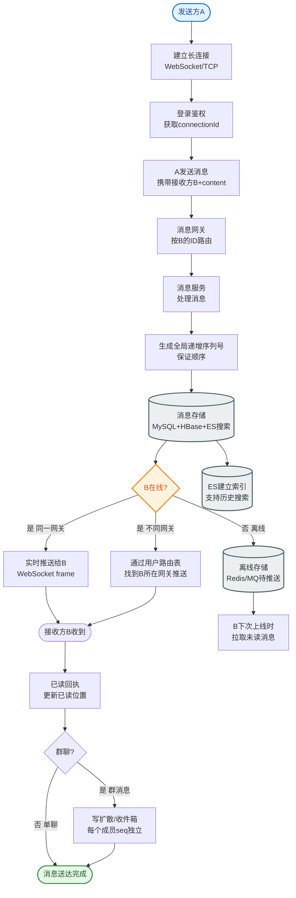

# 如何设计一个消息通知中心？统一管理APP/短信/邮件/站内信通知。

【场景分析】
通知中心作为基础设施，需解耦业务与通道，解决消息触达的**并发**、**可靠性**、**限流**及**成本控制**问题。

**【实战案例】**
某社交平台曾因短信网关故障导致1万条验证码发送失败，通过引入多通道降级策略（自动降级到邮件+站内信），并在代码中实现了指数退避重试机制，将最终送达率提升至99.9%。

【核心架构设计】
```text
┌──────────┐      ┌───────────┐      ┌─────────────┐      ┌──────────┐
│ 业务系统 │ ───→ │ 通知API   │ ───→ │  消息队列   │ ───→ │ 消费者   │
│(订单/登录)│      │ (校验/封装)│      │ (Kafka/RMQ) │      │ (Worker) │
└──────────┘      └───────────┘      └─────────────┘      └────┬─────┘
                                                               ↓
                                                      ┌──────────────────┐
                                                      │   通知处理引擎    │
                                                      │ 1. 频率限流      │
                                                      │ 2. 通道路由      │
                                                      │ 3. 模板渲染      │
                                                      │ 4. 变量替换      │
                                                      └────────┬─────────┘
                                                               ↓
                      ┌──────────┬──────────┬──────────┬──────────┐
                      │ APP推送  │  短信    │  邮件    │ 站内信   │
                      └──────────┴──────────┴──────────┴──────────┘
```

【核心模块详解】
1. **模板管理**：
   - 支持`Velocity`/`Freemarker`语法：`您好${user}，您的订单${orderNo}已发货。`
   - 多语言支持：根据用户Locale选择模板。
   - 敏感词过滤：自动拦截政治/色情词汇。
2. **通道路由策略（降本与保达）**：
   - **保达优先**：验证码类 → 短信优先，失败转语音。
   - **成本优先**：营销类 → APP推送/站内信，失败转邮件，尽量不用短信。
   - **用户偏好**：以用户设置的配置为准（如"夜间勿扰"）。
3. **频率控制（防骚扰）**：
   - 基于Redis计数器实现滑动窗口算法。
   - Key规则：`limit:notify:{userId}:{type}`（如营销类1天1条，系统类1天5条）。
4. **去重与合并**：
   - **内容去重**：相同内容5分钟内只发一次（指纹去重）。
   - **聚合合并**：短时间多条赞/评论，合并为"A、B等10人赞了你的帖子"。
5. **到达率追踪（回调闭环）**：
   - APP：厂商通道回调（需处理厂商限制，如iOS生产环境无法回执）。
   - 短信：异步接收网关状态报告（成功/失败/未知），失败触发重试（如转备用通道）。

**【代码示例：Go语言 - 滑动窗口频率限流】**
```go
// 使用Redis ZSet实现滑动窗口限流
func IsAllowed(userID, notifyType string, limit int64) bool {
    key := fmt.Sprintf("limit:notify:%s:%s", userID, notifyType)
    now := time.Now().Unix()
    pipe := redis.Client.Pipeline()
    
    // 移除窗口外的数据
    pipe.ZRemRangeByScore(ctx, key, "0", strconv.FormatInt(now-86400, 10))
    // 添加当前记录
    pipe.ZAdd(ctx, key, &redis.Z{Score: float64(now), Member: now})
    // 统计数量
    countCmd := pipe.ZCard(ctx, key)
    _, _ = pipe.Exec(ctx)
    
    return countCmd.Val() <= limit
}
```

【用户偏好配置模型】
```json
{
  "userId": "user_001",
  "rules": {
    "transaction": { "channels": ["sms", "app"], "quiet_hours": false },
    "marketing": { "channels": ["email"], "quiet_hours": true, "start": "23:00", "end": "08:00" }
  }
}
```

**【方案对比：通知通道特性】**
| 通道 | 成本 | 实时性 | 到达率限制 | 主要用途 |
| :--- | :--- | :--- | :--- | :--- |
| **APP推送** | 低 | 秒级 | 受厂商策略影响(易离线) | 营销、动态提醒 |
| **短信** | 高 | 秒级 | 极高(除非关机) | 验证码、紧急通知 |
| **邮件** | 中 | 分钟级 | 中(可能入垃圾箱) | 账单、周报、营销 |
| **站内信** | 低 | 秒级 | 100%(需登录) | 系统公告、消息中心 |


## 核心流程图


## 记忆要点

- 核心架构：业务系统→API→消息队列→处理引擎→多渠道，利用MQ实现业务与通道解耦。
- 路由与降级：验证码保达优先（短信转语音），而营销类成本优先（APP推送转邮件）。
- 防骚扰限流：基于Redis ZSet实现滑动窗口限流，按用户与类型控制日发送上限。
- 高可用保障：通过指纹内容去重（防重复发）、多通道降级重试（提升送达率）及异步回调闭环。

## 结构化回答

**30 秒电梯演讲：** 统一消息分发平台，根据策略和偏好多通道触达用户。打比方——像公司的总机，把消息按紧急程度转到电话、短信或邮件。落到工程上，业务方只发消息，不关心具体通道。

**展开框架：**
1. **统一接入** — 业务方只发消息，不关心具体通道
2. **智能路由** — 按成本、优先级、用户偏好选择通道
3. **频率控制** — 防骚扰，同类消息合并发送

**收尾：** 这几个点都能配合实战展开。您想继续聊哪个追问——比如 「如何实现通知去重和合并」 或者 「频率控制如何设计」？

## 视频脚本

> 预计时长：2 分钟 | 由浅入深

| 时间 | 画面/字幕 | 口播台词 | 讲解要点 |
|------|----------|----------|----------|
| 0:00 | 标题卡：消息通知中心 | "消息通知中心，一分钟讲透。" | 开场钩子 |
| 0:35 | 生活类比动画 | "打个比方——像公司的总机，把消息按紧急程度转到电话、短信或邮件。" | 核心类比 |
| 1:10 | 概念定义动画 | "一句话：统一消息分发平台，根据策略和偏好多通道触达用户。" | 核心定义 |
| 1:50 | 统一接入 图解 | "业务方只发消息，不关心具体通道。" | 统一接入 |
