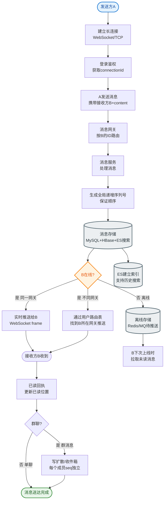

# 如何设计一个亿级用户的消息已读未读系统？

【场景分析】
已读未读需求：群聊/公告/通知的已读未读计数、详情列表、实时更新。

【挑战】
- 万人大群：一条消息需要记录10000人的已读状态
- 计数实时性：用户打开即标记已读
- 存储成本：每条消息×每个用户的状态

【方案1：Bitmap（推荐）】
```
key: msg:read:{messageId}
value: Bitmap
  bit 0: user1 已读
  bit 1: user2 已读
  bit 2: user3 未读
  ...

操作：
- 标记已读：SETBIT msg:read:{msgId} {userId} 1
- 查询已读：GETBIT msg:read:{msgId} {userId}
- 已读总数：BITCOUNT msg:read:{msgId}
- 未读总数：总人数 - 已读总数
```
优点：1万人只需1.2KB，极省内存
缺点：稀疏场景浪费（大群但少人在线）

【方案2：Redis Set】
```
已读Set: SADD msg:read:{msgId} {userId}
未读Set: SADD msg:unread:{msgId} {userId}

- 已读总数：SCARD msg:read:{msgId}
- 查询：SISMEMBER msg:read:{msgId} {userId}
```
优点：直观
缺点：内存占用大（每人存userId）

【方案3：计数器 + 增量同步】
```
- 每条消息维护未读计数器：INCR/DECR
- 用户维护已读位点：last_read_msg_id
- 未读数 = 最新消息ID - 用户已读位点
```
适合有序消息场景（如群聊Timeline）

**【方案选型对比】**

| 维度 | Bitmap (位图) | Redis Set (集合) | 计数器+位点 | 
| :--- | :--- | :--- | :--- |
| **内存占用** | 极低 (1万人~1.2KB) | 高 (每用户~10B+) | 最低 (仅存数值) |
| **适用场景** | 大群已读统计、布尔状态 | 小群、需要获取已读人列表 | 单聊/Timeline流式未读 |
| **获取详情** | 较难 (需遍历) | 直接返回 (SMEMBERS) | 不支持 | 
| **操作复杂度** | O(1) | O(1) | O(1) |

【群聊已读未读】
```
发送消息：
1. 消息写入群Timeline
2. 初始化未读计数：群成员数-1
3. 初始化Bitmap（全0）

用户打开消息：
1. SETBIT标记已读
2. 未读计数DECR
3. 推送已读状态给发送者

查询未读数：
- 个人：直接查计数器
- 群消息：总人数 - BITCOUNT
```

**【实战代码示例】**
```java
// 批量标记已读：用户进入会话，一键清除未读
public void markReadBatch(Long userId, Long groupId, List<Long> msgIds) {
    String keyPrefix = "msg:read:";
    // 使用Redis Pipeline批量执行，减少网络RTT
    redisTemplate.executePipelined((RedisCallback<Object>) connection -> {
        msgIds.forEach(msgId -> {
            connection.setBit((keyPrefix + msgId).getBytes(), userId, true);
        });
        return null;
    });
}
```

**【实战案例】**
在早高峰千万级IM系统中，曾遇到使用Set存储大群已读ID导致Redis内存飙升的问题。后改为**Bitmap分片存储**，将userId分桶映射到不同Bitmap Key（如 `msg:read:{msgId}:{shardId}`），避免单个Key过大且支持并行计算，内存降低80%以上。

【@提醒的已读未读】
- 被@的消息单独维护已读状态
- 未读@消息高优先级展示

【数据迁移】
- 热数据（7天内）：Redis
- 冷数据：归档MySQL/ES
- 按消息ID分片

【性能优化】
- 批量标记已读：用户打开会话时批量标记多条消息
- 异步更新：先返回成功，异步更新计数
- 缓存未读总数：Redis计数器 + 定时校正


## 核心流程图


## 记忆要点

- 方案选型：万人大群用Bitmap极省内存，而获取具体已读列表用Set，流式单聊用计数器+位点。
- Bitmap机制：因为位图极度压缩，所以1万人只需1.2KB，SETBIT标记已读，BITCOUNT统计数量。
- 架构痛点：单一Bitmap Key过大易阻塞，大群需按UserId分桶映射至不同Key拆分存储。
- 性能优化：用户点开会话时，利用Redis Pipeline批量SETBIT清除未读，减少网络开销。

## 结构化回答

**30 秒电梯演讲：** 利用位图或计数器海量压缩存储，高效计算消息的已读状态。打比方——像老师点名册上的格子，打钩代表已读，一页能管全班。落到工程上，一个比特位代表一个用户的已读状态。

**展开框架：**
1. **Bitmap方案** — 一个比特位代表一个用户的已读状态
2. **空间优化** — 万人群聊仅占1.2KB内存
3. **计数器方案** — 用位置差计算未读数，适合有序消息

**收尾：** 这几个点都能配合实战展开。您想继续聊哪个追问——比如 「万人大群的已读未读如何存储」 或者 「如何减少已读标记的Redis写入」？

## 视频脚本

> 预计时长：2 分钟 | 由浅入深

| 时间 | 画面/字幕 | 口播台词 | 讲解要点 |
|------|----------|----------|----------|
| 0:00 | 标题卡：亿级用户的消息已读未读系统 | "亿级用户的消息已读未读系统，一分钟讲透。" | 开场钩子 |
| 0:35 | 生活类比动画 | "打个比方——像老师点名册上的格子，打钩代表已读，一页能管全班。" | 核心类比 |
| 1:10 | 概念定义动画 | "一句话：利用位图或计数器海量压缩存储，高效计算消息的已读状态。" | 核心定义 |
| 1:50 | Bitmap方案 图解 | "一个比特位代表一个用户的已读状态。" | Bitmap方案 |
