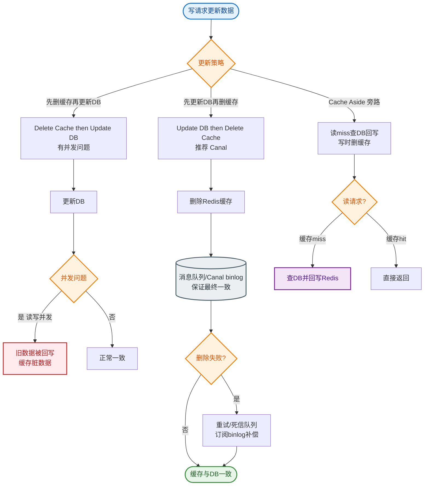
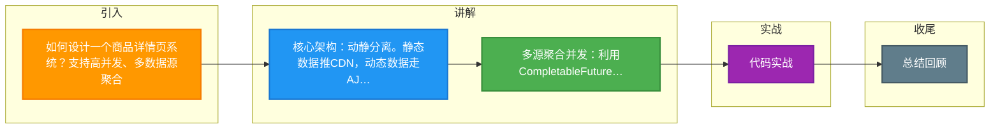

# 如何设计一个商品详情页系统？支持高并发、多数据源聚合。

【场景分析】
商品详情页特点：读多写少、多数据源（商品/价格/库存/评论/推荐）、CDN友好、动态+静态混合。

【数据来源】
- 商品基础信息（标题/图片/描述）
- 价格/促销信息（变化频繁）
- 库存状态（实时变化）
- 评论/评分（量大）
- 推荐商品（个性化）
- 规格/参数

**【实战代码示例】**
```java
// 并行聚合多数据源 (Java CompletableFuture)
public ProductDetail getProductDetail(Long skuId) {
    // 1. 基础信息 (查本地缓存/DB)
    CompletableFuture<BaseInfo> baseFuture = CompletableFuture.supplyAsync(() -> baseService.get(skuId));
    // 2. 价格库存 (查Redis)
    CompletableFuture<PriceStock> priceFuture = CompletableFuture.supplyAsync(() -> priceService.get(skuId));
    // 3. 个性化推荐 (查推荐引擎)
    CompletableFuture<List<Long>> recommendFuture = CompletableFuture.supplyAsync(() -> recommendService.get(skuId));

    // 等待所有任务完成
    CompletableFuture.allOf(baseFuture, priceFuture, recommendFuture).join();
    return ProductDetail.of(baseFuture.get(), priceFuture.get(), recommendFuture.get());
}
```

【动静分离方案】
1. 静态数据：
   - 商品标题/图片/描述/参数
   - 生成静态HTML/JSON
   - 推送到CDN边缘缓存
   - 变更时刷新CDN
2. 动态数据：
   - 价格/库存/促销
   - 通过AJAX异步加载
   - 接口缓存（Redis 30秒）
3. 个性化数据：
   - 推荐商品/用户评论
   - 异步加载，不影响首屏

**【渲染架构对比】**

| 维度 | SSR (服务端渲染) | CSR (客户端渲染) | SSR + CSR (混合) |
| :--- | :--- | :--- | :--- |
| **首屏速度** | 快 (HTML直出) | 慢 (需等待JS加载) | 快 (核心内容直出) |
| **SEO友好度** | 高 | 差 | 高 |
| **服务端压力**| 高 (每次请求都渲染) | 低 (仅提供API) | 中 |
| **开发复杂度**| 中 | 低 | 高 |

【页面渲染方案】
1. SSR（服务端渲染）：
   - 服务端聚合数据 → 渲染HTML
   - CDN缓存整个页面
   - 适合静态内容
2. CSR（客户端渲染）：
   - 前端异步请求多个API
   - 灵活但首屏慢
3. SSR + CSR混合：
   - 核心信息SSR（SEO友好）
   - 动态信息CSR

【缓存架构】
```
CDN(HTML静态页) → Nginx缓存(动态数据) → Redis(价格/库存) → MySQL
```

【多级缓存策略】
1. CDN：静态HTML缓存（TTL=1小时）
2. Nginx：proxy_cache缓存动态API（TTL=30秒）
3. Redis：价格/库存/评论缓存（TTL=10秒）
4. 本地缓存：热点商品缓存（TTL=5秒）

【热点商品处理】
- 本地缓存：Caffeine缓存TOP1000商品
- 多副本：Redis热点Key多副本分散
- 预热：大促前预热所有活动商品
- 降级：缓存不可用时返回简化页面

**【实战案例】**
某电商大促期间，由于运营配置错误导致某爆款商品价格在短时间内频繁变动，触发了CDN缓存刷新机制，导致大量流量穿透到后端架构层，引起雪崩。**改进方案**是引入"版本号"机制（URL带v参数或Header带版本），价格变更仅更新版本号而非立即刷新CDN，让CDN自然过期或用户被动刷新，避免全量回源。

【数据聚合优化】
- 并行调用：CompletableFuture并行获取多数据源
- GraphQL：按需获取字段
- BFF层：网关层聚合API
- 数据预聚合：后台定时生成聚合数据

【缓存一致性】
- 商品信息变更 → CDN刷新 → 多级缓存失效
- 价格变更 → 实时更新Redis → 前端轮询
- 库存变更 → Redis原子操作 → 实时展示


## 核心流程图


## 记忆要点

- 核心架构：动静分离。静态数据推CDN，动态数据走AJAX异步加载。
- 多源聚合并发：利用CompletableFuture并行查基础信息、价格库存与推荐，降低整体响应延迟。
- 多级缓存：CDN(静态页)→Nginx(API)→Redis(动态数据)→本地缓存，层层拦截拦截海量并发。
- 防雪崩策略：价格频繁变更不直接刷CDN，而用版本号机制让其自然过期，避免穿透打挂后端。

## 结构化回答

**30 秒电梯演讲：** 动静分离与多级缓存，解决高并发读与数据聚合问题。打比方——像装修房子，不动的墙(静态)一次砌好，常换的家具(动态)随时搬。落到工程上，静态上CDN，动态异步加载。

**展开框架：**
1. **动静分离** — 静态上CDN，动态异步加载
2. **多级缓存** — CDN->Nginx->Redis->DB层层过滤
3. **并发聚合** — CompletableFuture并行获取数据源

**收尾：** 这几个点都能配合实战展开。您想继续聊哪个追问——比如 「动静分离如何实现」 或者 「多数据源如何高效聚合」？

## 视频脚本

> 预计时长：2 分钟 | 由浅入深

| 时间 | 画面/字幕 | 口播台词 | 讲解要点 |
|------|----------|----------|----------|
| 0:00 | 标题卡：商品详情页系统 | "商品详情页系统，一分钟讲透。" | 开场钩子 |
| 0:35 | 生活类比动画 | "打个比方——像装修房子，不动的墙(静态)一次砌好，常换的家具(动态)随时搬。" | 核心类比 |
| 1:10 | 概念定义动画 | "一句话：动静分离与多级缓存，解决高并发读与数据聚合问题。" | 核心定义 |
| 1:50 | 动静分离 图解 | "静态上CDN，动态异步加载。" | 动静分离 |

### 视频流程图



