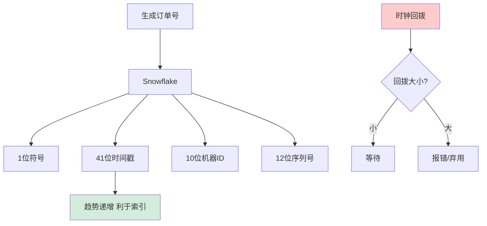

# 如何设计一个全局唯一订单号生成方案？包含时间、机器、序列号。

【场景分析】
订单号要求：全局唯一、趋势递增（利索引）、可反解（含业务信息）、不可猜测。

【常见方案】

【1. Snowflake变体（推荐）】
```
64 bit订单号：
| 1bit符号 | 41bit时间戳 | 5bit机房 | 5bit机器 | 12bit序列号 |

时间戳：毫秒级，可用69年
机房ID：0-31
机器ID：0-31
序列号：每毫秒0-4095

单机每秒：409.6万个ID
```

订单号反解：
```java
long orderId = generate();
long timestamp = (orderId >> 22) + EPOCH;
long dataCenter = (orderId >> 17) & 0x1F;
long workerId = (orderId >> 12) & 0x1F;
long sequence = orderId & 0xFFF;
```

【2. 业务含义编号】
```
订单号格式：
DD + yyyyMMdd + 机器号(2位) + 序列号(6位)
DD20240117100123456

优点：可读性强，一眼看出是订单+日期
缺点：长度不固定，无法严格递增
```

【3. 号段模式】
```
DB表：
id_segment(biz_type, max_id, step, version)

服务每次取一批ID（step=1000）到内存
内存分配完再取下一批
双Buffer：用到20%时异步加载下一批
```

【4. Redis自增】
```
INCR order:seq:{yyyyMMdd}
订单号 = 日期 + Redis自增值
缺点：依赖Redis可用性
```

【时钟回拨处理】
```java
long currentMillis = System.currentTimeMillis();
if (currentMillis < lastMillis) {
    // 时钟回拨
    long offset = lastMillis - currentMillis;
    if (offset < 5) {
        Thread.sleep(offset);  // 小回拨等待
    } else {
        throw new ClockBackException();  // 大回拨报错
    }
}
```

【机器ID分配】
- ZooKeeper/etcd自动分配
- 启动时注册，获取唯一workerId
- Redis原子分配

【号段模式高可用】
- DB主从
- 服务多实例（各持有不同号段）
- DB不可用时使用本地缓存号段兜底

## 常见考点
1. **Snowflake 算法在单机高并发下序列号用完了怎么办？**
   - 序列号溢出（达到4095）时，通常会阻塞直到下一毫秒到来。为了优化性能，部分实现会支持「毫秒内借位」，或者直接向下一毫秒进位，这会导致生成的 ID 时间戳略大于当前物理时间，但保证单调递增。
2. **号段模式数据库宕机，服务端如何续命？**
   - 采用「双 Buffer」机制。当 Buffer1 在用，Buffer2 已加载好。如果 DB 宕机，Buffer1 用完后服务不可用。改进方案是引入「MPP 多级缓存」，每个实例在启动时预加载一个紧急号段到本地文件，DB 完全不可用时降级使用本地号段（需保证各实例号段不重叠）。
3. **如何保证生成的 ID 不被恶意猜测/遍历？**
   - Snowflake ID 规律性太强，容易被推测出单日订单量。可在序列号或机器 ID 部分加入随机因子，或者使用「雪花算法 + 雪漂移」算法，使得 ID 在表面上失去连续性，但仍保持全局唯一和趋势递增（利于数据库索引）。


## 核心流程图



## 记忆要点

- Snowflake核心结构：1符+41毫秒+5机房+5机器+12序列，单机每秒约400万。
- 时钟回拨处理：小回拨（<5ms）睡眠等待，大回拨直接抛异常报错。
- 号段模式高可用：双Buffer提前异步加载，DB宕机时降级使用本地紧急号段。
- 防猜测加随机因子：在序列号或机器位混入随机数，保证趋势递增但表面无规律。
- 机器ID分配：启动时通过ZK/etcd注册获取，保证全局唯一不重复。

## 结构化回答

**30 秒电梯演讲：** Snowflake算法结合时间、机器ID与序列号生成趋势递增唯一ID。打比方——像车牌号，包含地区(机房)、号码(机器)和序号，全局唯一还能看出归属。落到工程上，1位符号+41位时间+10位机器+12位序列。

**展开框架：**
1. **Snowflake** — 1位符号+41位时间+10位机器+12位序列
2. **趋势递增** — 依赖时间戳，利于数据库索引
3. **时钟回拨** — 小回拨等待，大回拨报错或弃用

**收尾：** 这几个点都能配合实战展开。您想继续聊哪个追问——比如 「Snowflake时钟回拨如何处理」 或者 「号段模式如何保证高可用」？

## 视频脚本

> 预计时长：2 分钟 | 由浅入深

| 时间 | 画面/字幕 | 口播台词 | 讲解要点 |
|------|----------|----------|----------|
| 0:00 | 标题卡：全局唯一订单号生成方案 | "全局唯一订单号生成方案，一分钟讲透。" | 开场钩子 |
| 0:35 | 生活类比动画 | "打个比方——像车牌号，包含地区(机房)、号码(机器)和序号，全局唯一还能看出归属。" | 核心类比 |
| 1:10 | 概念定义动画 | "一句话：Snowflake算法结合时间、机器ID与序列号生成趋势递增唯一ID。" | 核心定义 |
| 1:50 | Snowflake 图解 | "1位符号+41位时间+10位机器+12位序列。" | Snowflake |
