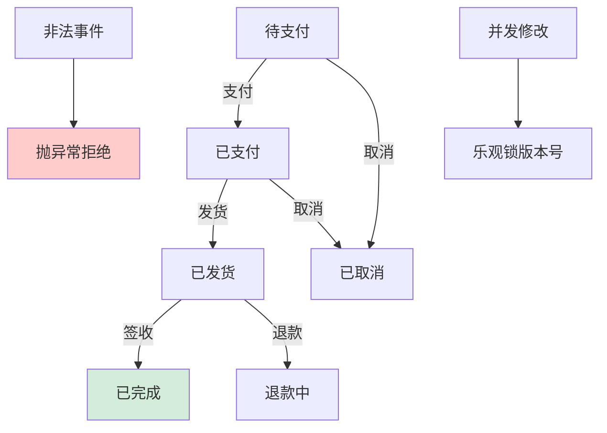
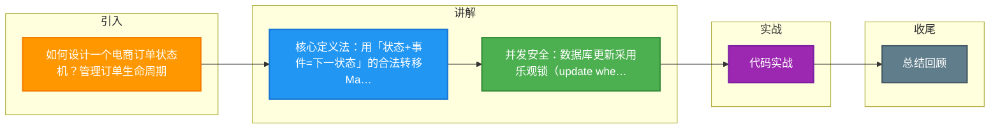

# 如何设计一个电商订单状态机？管理订单生命周期。

【场景分析】
订单状态流转是电商核心逻辑，需要状态机保证状态变更的合法性和一致性。

【订单状态定义】
```
待付款(PENDING_PAYMENT)
  → 待发货(PENDING_SHIPMENT)     [用户支付]
  → 已取消(CANCELLED)             [用户取消/超时]
待发货(PENDING_SHIPMENT)
  → 待收货(PENDING_RECEIPT)       [商家发货]
待收货(PENDING_RECEIPT)
  → 已完成(COMPLETED)             [用户确认/自动确认]
  → 退款中(REFUNDING)             [用户申请退款]
已完成(COMPLETED)
  → 退款中(REFUNDING)             [售后退款]
退款中(REFUNDING)
  → 已退款(REFUNDED)              [退款成功]
  → 已完成(COMPLETED)             [拒绝退款]
```

【状态机实现】
```java
// 状态转移定义
enum OrderStatus {
    PENDING_PAYMENT, PENDING_SHIPMENT, PENDING_RECEIPT,
    COMPLETED, CANCELLED, REFUNDING, REFUNDED
}

enum OrderEvent {
    PAY, CANCEL, SHIP, CONFIRM, REFUND_REQUEST, REFUND_APPROVE, REFUND_REJECT
}

// 合法状态转移表
Map<Pair<OrderStatus, OrderEvent>, OrderStatus> transitions = Map.of(
    pair(PENDING_PAYMENT, PAY), PENDING_SHIPMENT,
    pair(PENDING_PAYMENT, CANCEL), CANCELLED,
    pair(PENDING_SHIPMENT, SHIP), PENDING_RECEIPT,
    pair(PENDING_RECEIPT, CONFIRM), COMPLETED,
    pair(PENDING_RECEIPT, REFUND_REQUEST), REFUNDING,
    pair(COMPLETED, REFUND_REQUEST), REFUNDING,
    pair(REFUNDING, REFUND_APPROVE), REFUNDED,
    pair(REFUNDING, REFUND_REJECT), COMPLETED
);

// 状态转移方法
public void triggerEvent(Long orderId, OrderEvent event) {
    Order order = orderRepo.findById(orderId);
    OrderStatus nextStatus = transitions.get(pair(order.getStatus(), event));
    if (nextStatus == null) {
        throw new IllegalStateTransitionException();
    }
    // 乐观锁更新
    int rows = orderRepo.updateStatus(orderId, order.getStatus(), nextStatus);
    if (rows == 0) {
        throw new ConcurrentModificationException();
    }
    // 发送状态变更事件
    eventBus.publish(new OrderStatusChangedEvent(orderId, nextStatus));
}
```

【乐观锁保证并发安全】
```sql
UPDATE orders 
SET status = #{newStatus}, version = version + 1
WHERE id = #{orderId} AND status = #{oldStatus} AND version = #{version}
-- 影响行数=0说明状态已被其他请求修改
```

【订单超时取消】
- 延迟队列：创建订单时发延迟消息（15分钟）
- 定时扫描：每分钟扫描超时订单
- 取消逻辑：检查是否已支付 → 未支付则取消 → 

## 常见考点
1. **如果支付回调晚于超时取消时间到达，如何处理？**
   - **幂等性检查**：支付回调首先检查订单状态。若已取消，需先判断是否允许「支付后恢复订单」（通常不建议）。
   - **处理流程**：发现已取消 → 发起「异常退款流程」（原路退回）或记录工单人工介入。保证资金与订单状态最终一致。
2. **用户取消订单后，优惠券/库存如何回滚？**
   - **事务补偿**：在状态机变更事务内，同步调用库存回滚和优惠券归还；若下游不可用，使用「本地消息表」记录，最终异步补偿。
3. **如何防止并发支付导致的重复发货？**
   - 数据库层面的 `UPDATE` 结合乐观锁是第一道防线。
   - 第二道防线是利用分布式锁（Redis Lua脚本），状态变更前加锁 `order_lock:{orderId}`，处理完释放，确保串行化处理状态变更。


## 核心流程图




## 记忆要点

- 核心定义法：用「状态+事件=下一状态」的合法转移Map表控制流转，非法抛异常。
- 并发安全：数据库更新采用乐观锁（update where version=?）防重复操作。
- 超时支付晚到：回调若发现已取消，不恢复订单而是走异常退款流程保证资金一致。
- 异步回滚：状态变更后发MQ事件，异步完成库存回滚与优惠券归还。

## 结构化回答

**30 秒电梯演讲：** 定义合法的状态流转规则，利用状态机模式管理订单生命周期。打比方——像红绿灯指挥交通，只有绿灯才能通行，不能随意变道，防止交通瘫痪。落到工程上，明确待付、待发、完成等核心状态。

**展开框架：**
1. **状态定义** — 明确待付、待发、完成等核心状态
2. **流转规则** — 事件触发状态变更，非法变更抛异常
3. **并发控制** — 乐观锁版本号防止并发修改冲突

**收尾：** 这几个点都能配合实战展开。您想继续聊哪个追问——比如 「如何保证订单状态变更的并发安全」 或者 「订单超时取消如何实现」？

## 视频脚本

> 预计时长：2 分钟 | 由浅入深

| 时间 | 画面/字幕 | 口播台词 | 讲解要点 |
|------|----------|----------|----------|
| 0:00 | 标题卡：电商订单状态机 | "电商订单状态机，一分钟讲透。" | 开场钩子 |
| 0:35 | 生活类比动画 | "打个比方——像红绿灯指挥交通，只有绿灯才能通行，不能随意变道，防止交通瘫痪。" | 核心类比 |
| 1:10 | 概念定义动画 | "一句话：定义合法的状态流转规则，利用状态机模式管理订单生命周期。" | 核心定义 |
| 1:50 | 状态定义 图解 | "明确待付、待发、完成等核心状态。" | 状态定义 |

### 视频流程图



