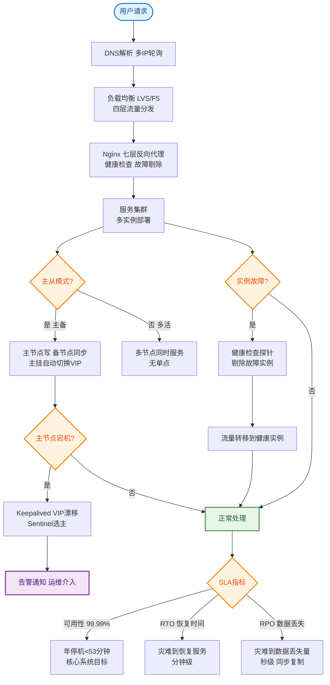

# 如何设计一个高可用的注册中心集群？Nacos/Eureka对比。

【场景分析】
注册中心是微服务核心基础设施，其可用性直接影响所有服务。

【注册中心核心要求】
1. 高可用：自身不能成为单点
2. 数据一致：所有节点数据一致
3. 推送实时：服务变更及时通知
4. 大规模：支持十万级服务实例

【Nacos集群架构】
```
Nacos集群（3-7节点）
  ├ 节点1 (Leader)
  ├ 节点2 (Follower)
  └ 节点3 (Follower)
       ↓
  MySQL（数据持久化）
  
客户端（服务提供者/消费者）
  ├ 注册：向任一Nacos节点注册
  ├ 心跳：30秒发送心跳
  ├ 发现：拉取服务列表 + 本地缓存
  └ 订阅：监听服务变更推送
```

【Raft协议（Nacos CP模式）】
- Leader选举：多数派投票
- 日志复制：Leader写 → 复制到Follower
- 强一致性：写入需多数节点确认
- 故障转移：Leader宕机 → 重新选举

【Distro协议（Nacos AP模式）】
- 各节点独立处理注册请求
- 节点间异步同步数据
- 最终一致
- 无Leader，无选举延迟

【Nacos AP vs CP】
- 临时实例（微服务）：AP模式
  - 心跳保活，实例不可用自动摘除
  - 优先可用性
- 永久实例（DB/MQ）：CP模式
  - 服务端主动健康检查
  - 优先一致性

【Eureka对比】
| 维度 | Nacos | Eureka |
|------|-------|--------|
| CAP | AP+CP | AP |
| 一致性 | Raft/Distro | P2P复制 |
| 持久化 | MySQL | 内存 |
| 推送方式 | UDP+长轮询 | 全量拉取 |
| 健康检查 | 心跳+主动探测 | 心跳 |
| 大规模 | 10万+实例 | 万级 |
| 多数据中心 | 支持 | 不支持 |
| 配置中心 | 内置 | 无 |

【高可用保障】
1. 集群部署：至少3节点
2. 异地容灾：多机房集群
3. 客户端容灾：
   - 本地缓存：注册中心不可用时用本地缓存的服务列表
   - 推本地文件：定期推送到本地文件
   - 自动恢复：注册中心恢复后自动同步
4. 数据库高可用：MySQL主从

【大规模优化】
- 分级存储：按命名空间/集群隔离
- 增量推送：只推送变更的服务
- 批量注册：减少网络请求
- 异步推送：UDP + 补偿确认

## 常见考点
1. **Nacos 为什么支持临时实例和持久实例？**
   - **临时实例**：利用 Distro 协议，客户端通过心跳上报健康，服务端若未按时收到心跳则剔除。适用于无状态微服务，扩缩容快。
   - **持久实例**：利用 Raft 协议强一致存入数据库，服务端主动探测健康。适用于对稳定性要求极高的中间件（如 MySQL、Redis），即使客户端心跳丢失，服务端也会根据探测结果决定是否下线，避免网络抖动导致误删。
2. **Nacos 1.x 到 2.x 的架构变化主要解决了什么问题？**
   - Nacos 2.0 新增了 gRPC 协议。相比 1.x 的 HTTP 短轮询，gRPC 长连接大幅减少了服务端连接数开销，提升了推送实时性（秒级推送），解决了大规模注册时的性能瓶颈和 GC 问题。
3. **CAP 理论下，注册中心为什么通常选择 AP 而不是 CP？**
   - 注册中心的核心价值是「服务发现」。如果选 CP（强一致），在发生网络分区时，为了保证一致性，部分节点不可用，导致此时无法注册新服务或发现新服务，整个集群可能停止扩容或流量调度，这对业务是灾难性的。AP 模式下，即使分区，各节点仍可用，虽然数据可能有短暂延迟，但保证了业务的持续可用性（可用性 > 一致性）。


## 核心流程图


## 记忆要点

- 选型对比：Nacos双模AP/CP且高并发强，Eureka纯AP且无持久化。
- 实例选型：临时实例用AP(心跳保活)，永久实例用CP(主动探测)。
- 为何选AP：注册中心重在服务发现，网络分区时可用性优于强一致防阻断。
- 高可用兜底：服务端集群Raft，客户端遇故障靠本地缓存和文件续命。

## 结构化回答

**30 秒电梯演讲：** 基于Raft或Distro协议的AP/CP可切换服务发现中心。打比方——像通讯录，大家(服务)都把电话登记在上面，想找谁随时查，通讯录丢了还能备份恢复。落到工程上，临时实例AP(Distro)，永久实例CP(Raft)。

**展开框架：**
1. **AP/CP切换** — 临时实例AP(Distro)，永久实例CP(Raft)
2. **健康检查** — 心跳机制自动剔除不可用实例
3. **高可用** — 集群部署，客户端本地缓存容灾

**收尾：** 这几个点都能配合实战展开。您想继续聊哪个追问——比如 「Raft和Distro协议的区别」 或者 「注册中心宕机后服务如何通信」？

## 视频脚本

> 预计时长：2 分钟 | 由浅入深

| 时间 | 画面/字幕 | 口播台词 | 讲解要点 |
|------|----------|----------|----------|
| 0:00 | 标题卡：高可用的注册中心集群 | "高可用的注册中心集群，一分钟讲透。" | 开场钩子 |
| 0:35 | 生活类比动画 | "打个比方——像通讯录，大家(服务)都把电话登记在上面，想找谁随时查，通讯录丢了还能备份恢复。" | 核心类比 |
| 1:10 | 概念定义动画 | "一句话：基于Raft或Distro协议的AP/CP可切换服务发现中心。" | 核心定义 |
| 1:50 | AP/CP切换 图解 | "临时实例AP(Distro)，永久实例CP(Raft)。" | AP/CP切换 |
