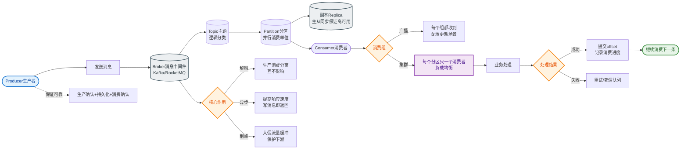

# 如何设计一个消息的可靠投递方案？从生产到消费的端到端保证。

【场景分析】
可靠投递 = 消息不丢 + 不重 + 不乱序。需从生产者、Broker、消费者三端保证。

**端到端数据流架构图**
```text
生产者                 Broker (MQ)                 消费者
  │                      │                          │
  ├─ 1.发送消息 ────────>│                          │
  │<─ 2. ACK/Sync ───────┤                          │
  │                      ├─ 3.持久化(磁盘/WAL) ────>│
  │                      │                          ├─ 4.拉取消息
  │                      │<─────────────────────────┤
  │                      │                          ├─ 5.业务处理
  │                      │<─────────────────────────┤
  │                      │                          ├─ 6.手动提交Offset
  │                      │<─ 7. Commit ACK ─────────┤
```  

【生产端可靠投递】
1. **同步发送 + 重试**：
   - `producer.send(msg)` 同步等待ACK
   - 失败自动重试（3次），注意重试可能导致消息顺序乱序，需设置 `enable.idempotence=true` (Kafka)
   - **超时控制**：`request.timeout.ms` 需大于 `acks` + `replica.lag.time.max.ms`
2. **异步发送 + 回调**：
   - `producer.send(msg, callback)`
   - 回调中处理失败逻辑（记录日志或落库重试）
3. **事务消息**（如 RocketMQ）：
   - 发送半消息（对消费者不可见）
   - 执行本地事务
   - 提交/回滚半消息
   - **回查机制**：Broker 若未收到确认（如生产者挂了），会定期回查事务状态
4. **本地消息表**（最终一致性）：
   - 业务操作和消息记录在同一本地DB事务中
   - 定时任务扫描状态为"待发送"的消息表投递MQ
   - 投递成功后更新状态为"已发送"（需支持幂等）

【Broker端可靠性】
1. **持久化**：
   - **WAL (Write Ahead Log)**：先写日志（CommitLog/Kafka Log），再写内存/索引，保证即使崩溃也不丢
2. **刷盘策略**：
   - **同步刷盘**：写入磁盘后才返回ACK（更安全，性能低）
   - **异步刷盘**：写入Page Cache即返回（性能好，机器断电可能丢少量数据）
3. **多副本同步**：
   - 消息复制到多个Broker节点
4. **ISR机制（Kafka）**：In-Sync Replicas，保持同步的副本集合
5. **ACK确认机制**：
   - `acks=0`：不等待确认（可能丢）
   - `acks=1`：Leader收到即可（Leader挂可能丢）
   - `acks=all` (or -1)：所有ISR副本确认才算成功（最可靠）

【消费端可靠性】
1. **手动 ACK**：
   - 业务处理成功后才提交 offset
   - 处理失败不提交 → 消息重投（需注意重试风暴，建议退避）
2. **消费幂等**：
   - **唯一ID去重**：利用 DB 唯一索引或 Redis Set
   - **状态机判断**：只有状态处于"未处理"才执行
3. **死信队列 (DLQ)**：
   - 超过最大重试次数（如 RocketMQ 默认 16 次）的消息进入 DLQ
   - 避免阻塞正常消费，需人工介入或告警
4. **消费位点管理**：
   - 禁用自动提交（Enable Auto Commit = false）
   - 确保业务逻辑执行完毕后再手动提交

【消息轨迹】
- 记录消息全生命周期：发送 → 存储 → 投递 → 消费
- 用于问题排查和消息追踪
- RocketMQ 原生支持，Kafka 可配合 OpenTelemetry 实现

【常见考点】
1. **RocketMQ 事务消息是如何回查的？如果回查时本地事务依然未提交怎么办？**
   - Broker 会按固定频率（默认1分钟）回查 Producer；Producer 需暴露接口供查询；如果一直不确定，通常根据业务策略回滚或继续重试。
2. **Kafka 的 `acks=all` 一定保证不丢吗？**
   - 不一定。如果 ISR 列表中只有一个 Leader（例如 `min.insync.replicas=1`），那就等同于 `acks=1`。必须配合 `min.insync.replicas > 1` 使用。
3. **数据库事务与消息发送的一致性如何保证？**
   - 最大努力通知（本地消息表）或 事务消息（半消息机制）。
4. **消费端处理成功但 ACK 失败（如网络断开）会导致重复消费吗？**
   - 会。下次重连时会从上次确认的 offset 重新拉取，必须设计幂等性。


## 核心流程图


## 记忆要点

- 生产者保不丢：同步发送带重试，结合本地消息表保障与DB的事务最终一致。
- Broker保不丢：同步刷盘+多副本机制，Kafka必须设acks=all且min.insync>1。
- 消费者保不重：关闭自动提交，业务执行成功后再手动ACK，且消费端必须幂等。
- 事务消息流程：发半消息>执行本地事务>提交/回滚，异常断连靠Broker主动回查。

## 结构化回答

**30 秒电梯演讲：** 生产端发送保证、Broker端持久化、消费端幂等处理的端到端可靠性。打比方——像寄重要挂号信，寄出要回执(ACK)，运输要备份，签收要核对身份(幂等)。落到工程上，同步发+重试或事务消息保证送达。

**展开框架：**
1. **发送端** — 同步发+重试或事务消息保证送达
2. **存储端** — 同步刷盘+多副本持久化防丢失
3. **消费端** — 手动提交Offset+业务幂等防重复

**收尾：** 这几个点都能配合实战展开。您想继续聊哪个追问——比如 「Exactly-Once如何实现」 或者 「本地消息表和事务消息的区别」？

## 视频脚本

> 预计时长：2 分钟 | 由浅入深

| 时间 | 画面/字幕 | 口播台词 | 讲解要点 |
|------|----------|----------|----------|
| 0:00 | 标题卡：消息的可靠投递方案 | "消息的可靠投递方案，一分钟讲透。" | 开场钩子 |
| 0:35 | 生活类比动画 | "打个比方——像寄重要挂号信，寄出要回执(ACK)，运输要备份，签收要核对身份(幂等)。" | 核心类比 |
| 1:10 | 概念定义动画 | "一句话：生产端发送保证、Broker端持久化、消费端幂等处理的端到端可靠性。" | 核心定义 |
| 1:50 | 发送端 图解 | "同步发+重试或事务消息保证送达。" | 发送端 |
