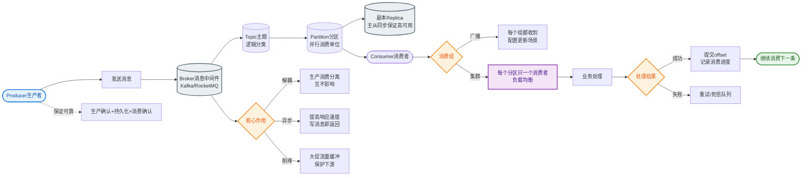

# 如何设计消息积压的处理方案？百万级消息积压如何快速消费？

【场景分析】
消息积压原因：消费者处理慢、消费者宕机、生产速度突增、消费逻辑异常。

**积压处理架构图**
```text
[积压Topic] (原有分区少)
    │
    ├──> 消费者C1 (瓶颈)
    ├──> 消费者C2 (瓶颈)
    └──> ...
           ↓ 临时扩容方案
[临时转发消费者] 仅做转发，不做复杂逻辑
    │ 消费积压消息
    ▼
[新Topic] (扩容分区数 x10)
    │
    ├──> 消费者G1 (正常业务逻辑)
    ├──> 消费者G2 ...
    └──> 消费者G10 ...
```

【积压发现】
- 监控消费者 **Lag**（最新 offset - 消费 offset）
- Lag > 阈值（如 10000 或 历史平均值的 3 倍）告警
- 消费 TPS 持续低于生产 TPS，且差距扩大

【紧急处理方案】
1. **扩容消费者（适用场景：分区数 > 当前消费者数）**：
   - 增加消费者实例（不能超过分区数）
   - K8s HPA 自动扩容
   - 注意：消费者数 > 分区数，多余消费者会空闲，无效
2. **增加分区数 + 扩容消费者（适用场景：分区数已达上限或需更高并发）**：
   - Kafka 增加分区（需注意 Key 哈希乱序问题）
   - 重新分配分区到消费者（Rebalance）
3. **临时消费者 + 临时Topic（适用于积压巨大，如百万级以上）**：
   - **搬运**：启动临时消费者，只做"搬运"（从积压 Topic 消费 → 写入新 Topic，新 Topic 分区数设为原来的 N 倍）
   - **并行处理**：新 Topic 部署 N 倍数量的消费者进行正常业务处理
   - **优势**：避开了单个 Topic 分区数不可无限增加的限制，利用临时 Topic 快速扩容
4. **降级非核心消费**：
   - 关闭非核心消息的消费（如日志、埋点）
   - 释放机器资源（CPU/IO）给核心消息消费者
5. **暂停/限流生产**：
   - 通知上游降低发送速率
   - 极端情况在网关层对非关键消息发送进行熔断

【根本优化方案】
1. **提升单条消费速度**：
   - **批量消费**：一次拉取多条（如 500 条）批量 Insert/Update（减少 DB 交互）
   - **异步处理**：消息接收后丢线程池异步处理（需注意 ACK 时机，确保逻辑成功再 ACK）
   - **并行消费**：多线程消费同一分区（需手动管理 Offset 顺序，慎用）
   - **逻辑优化**：减少循环嵌套、减少 DB 慢查询、引入本地缓存
2. **减少消息量**：
   - **消息聚合**：上游聚合多条消息发送
   - **过滤无效消息**：在 MQ 插件或消费前进行过滤
3. **消费者参数调优**：
   - 增大 `fetch.max.bytes` / `max.poll.records`：一次拉取更多数据
   - 调整 `max.poll.interval.ms`：防止单次处理时间过长触发 Rebalance

【积压恢复后处理】
- 数据补偿：积压期间可能丢失或失败的业务数据需修复
- 消息对账：抽样对比 DB 数据与 MQ 发送记录，确保一致性
- 告警复盘：分析是 DB 慢、Full GC 还是逻辑死循环

【常见考点】
1. **如果消费者报错导致无限重试，如何处理？**
   - 配合死信队列（DLQ），超过重试次数直接丢弃或进入 DLQ，避免阻塞后续消息。
2. **增加消费者实例为什么有时候反而会导致积压更严重？**
   - Rebalance（重平衡）期间会暂停消费；如果频繁扩缩容或参数配置不当导致持续 Rebalance，会造成吞吐量暴跌。
3. **临时扩容方案中，如何保证消息不丢失？**
   - 临时消费者也需手动 ACK；新 Topic 需确认持久化配置；搬运过程中记录 offset 断点。
4. **Kafka 消费者频繁 Rebalance 怎么排查？**
   - 检查 `max.poll.interval.ms` 是否过短；GC 是否频繁导致 Stop-the-world；网络是否不稳定导致心跳超时。


## 核心流程图


## 记忆要点

- 扩容限制：消费者实例数绝不能超过Topic分区数，否则多余节点空转。
- 临时Topic大法：原Topic分区不够时，新建N倍分区临时Topic做中转搬运并行。
- 单机提效：拉取大批量数据，配合异步线程池或批量DB操作减少交互耗时。
- 处理重试风暴：设置最大重试次数，超限进死信队列(DLQ)防阻塞。

## 结构化回答

**30 秒电梯演讲：** 通过横向扩容消费者、临时迁移Topic及优化消费逻辑来清理积压。打比方——像超市排队结账，人多了多开几个收银台(扩容)，或把人分流到新开的临时通道。落到工程上，增加消费者实例(需对应增加分区)。

**展开框架：**
1. **紧急扩容** — 增加消费者实例(需对应增加分区)
2. **临时方案** — 转发积压消息到新Topic扩容消费
3. **根本优化** — 批量消费、异步处理、逻辑降级

**收尾：** 这几个点都能配合实战展开。您想继续聊哪个追问——比如 「消费者数为什么不能超过分区数」 或者 「如何实现多线程消费同一分区」？

## 视频脚本

> 预计时长：2 分钟 | 由浅入深

| 时间 | 画面/字幕 | 口播台词 | 讲解要点 |
|------|----------|----------|----------|
| 0:00 | 标题卡：消息积压的处理方案 | "消息积压的处理方案，一分钟讲透。" | 开场钩子 |
| 0:35 | 生活类比动画 | "打个比方——像超市排队结账，人多了多开几个收银台(扩容)，或把人分流到新开的临时通道。" | 核心类比 |
| 1:10 | 概念定义动画 | "一句话：通过横向扩容消费者、临时迁移Topic及优化消费逻辑来清理积压。" | 核心定义 |
| 1:50 | 紧急扩容 图解 | "增加消费者实例(需对应增加分区)。" | 紧急扩容 |
