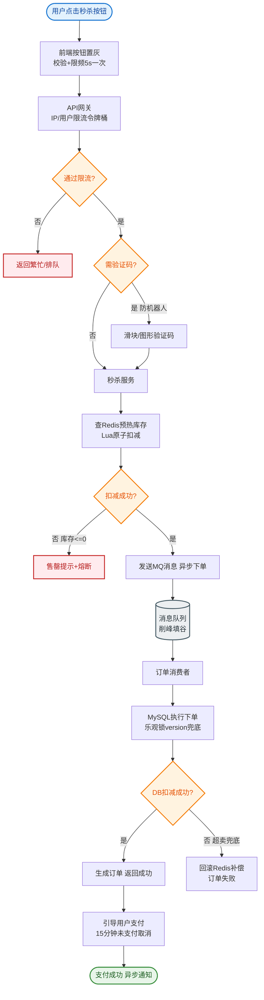

# 如何设计一个秒杀系统的流量削峰方案？保护后端不被压垮。

【场景分析】
秒杀流量特征：瞬间峰值极高（100w QPS），但实际库存有限（1000件），99%的请求注定失败。
核心目标：**将流量拦截在系统最外层，保护后端 DB 和 核心服务。**

【多层削峰架构】
```text
                    [ 用户请求 ]
                          │
          ┌───────────────┼───────────────┐
          ▼               ▼               ▼
    [ 浏览器端 ]      [ CDN 静态 ]    [ DNS/HTTP ]
    (按钮置灰/防抖)    (静态资源)      (负载均衡)
          │               │               │
          └───────────────┼───────────────┘
                          ▼
               [ Nginx/Gateway 层 ]
          (限流: 令牌桶/漏桶/IP黑名单)
               剩余流量: ~10% │
                          ▼
               [ 服务层 ]
        (读多写少: 本地缓存/Redis)
               剩余流量: ~1% │
                          ▼
               [ Redis 库存扣减 ]
        (原子递减 DECR > 0 ? 成功 : 失败)
               剩余流量: ~0.1% (1000单)
                          │
                          ▼
               [ MQ 消息队列 ]
        (异步解耦, 削峰填谷)
                          │
                          ▼
               [ 订单服务 (DB) ]
        (按能力消费, 如 1k QPS)
```

【第一层：客户端/CDN（拦截 90%+ 流量）】
1. **静态资源 CDN**：将页面 CSS、JS、图片推送到 CDN，用户就近访问，减轻源站压力。
2. **答题/验证码**：在点击"抢购"前弹出简单数学题或滑块验证，拉长用户请求时间，将瞬时流量削平为几秒内的持续流量。
3. **按钮控制**：
   - **置灰**：未开始前置灰，禁止无效请求。
   - **防抖**：点击后禁用按钮 3-5 秒，防止重复提交。

【第二层：网关限流（拦截 80% 剩余流量）】
1. **限流算法**：
   - **Nginx `limit_req_zone`**：基于令牌桶算法限制单 IP 请求频率。
   - **Sentinel/Gateway**：实现 QPS 限流或并发线程数限流。
2. **维度控制**：
   - **用户维度**：单用户限流（防止脚本刷）。
   - **总维度**：系统总 QPS 阈值（如 5w QPS），超出的直接拒绝。

【第三层：服务层/Redis 预扣减（拦截 99% 剩余流量）】
1. **库存预热**：秒杀开始前，将库存数量同步到 Redis。
2. **原子操作**：使用 `DECR key` 命令。
   - 返回值 >= 0：说明抢购成功，且 Redis 已扣减库存。
   - 返回值 < 0：说明库存不足，直接返回失败，不再向后传递。
3. **超卖控制**：Redis 的单线程模型保证了原子性，不会出现超卖。

【第四层：消息队列（异步下单，平滑流量）】
1. **流量削峰**：Redis 扣减成功的请求，只发送一条消息到 MQ（如 RocketMQ/Kafka），立即返回前端"排队中"，不阻塞线程。
2. **下游消费**：订单服务按照自己的处理能力（如 2000 TPS）拉取消息消费，落库创建订单。
3. **最终一致性**：如果 MQ 消费失败，进入死信队列人工处理；由于 Redis 已扣减，只需保证 MQ 消息最终被消费即可。

【常见考点】
1. **前端按钮置灰了，用户通过 Postman 绕过怎么办？**
   - 后端校验时间（未开始不能下单）、校验用户资格、校验签名，再结合网关限流。
2. **Redis 扣减库存成功了，但是 MQ 消息丢了，用户没拿到库存怎么办？**
   - 这是牺牲了用户体验换来了高并发。可以通过"补单"机制（Redis 扣减记录 vs 订单记录对账）或兜底策略（如允许用户在短时间内重新下单，利用 Redis 剩余库存）。
3. **为什么不在 DB 直接扣库存？**
   - DB 行锁竞争极其激烈，连接池瞬间耗尽，会导致整个系统不可用（拖垮其他业务）。Redis 内存操作快得多。
4. **秒杀系统中如何解决少卖（卖不完）的问题？**
   - Redis 扣减成功后入 MQ 必须高可靠（事务消息/本地消息表）；消费端消费失败必须重试。


## 核心流程图


## 记忆要点

- 核心原则：层层拦截，读多写少，绝不让流量触碰核心DB。
- 前置削峰：CDN静态隔离+验证码拉长请求+按钮防抖，拦截90%无效流量。
- 库存防超卖：Redis预扣减(DECR原子操作)，成功后异步化入MQ。
- 网关保护：根据单用户和总QPS维度令牌桶限流，拦截突发洪峰。

## 结构化回答


**30 秒电梯演讲：** 像多层滤网过滤泥水，大石头在最上层被挡住，细沙在下层过滤，最后只有清水流进水缸。

**展开框架：**
1. **客户端与CDN拦** — 客户端与CDN拦截静态及非合法请求
2. **网关层做精细化限** — 网关层做精细化限流（IP/用户/接口）
3. **Redis利用原** — Redis利用原子操作做库存预扣

**收尾：** 如何设计多层限流策略？


## 视频脚本

> 预计时长：2 分钟 | 由浅入深

| 时间 | 画面/字幕 | 口播台词 | 讲解要点 |
|------|----------|----------|----------|
| 0:00 | 标题卡：秒杀系统的流量削峰方案 | "秒杀系统的流量削峰方案，一分钟讲透。" | 开场钩子 |
| 0:35 | 生活类比动画 | "打个比方——像多层滤网过滤泥水，大石头在最上层被挡住，细沙在下层过滤，最后只有清水流进水缸。" | 核心类比 |
| 1:10 | 概念定义动画 | "一句话：多层过滤漏斗，将无效请求尽早拦截，让少量真实请求进入系统。" | 核心定义 |
| 1:50 | 客户端与CDN拦截静 图解 | "客户端与CDN拦截静态及非合法请求。" | 客户端与CDN拦截静 |
