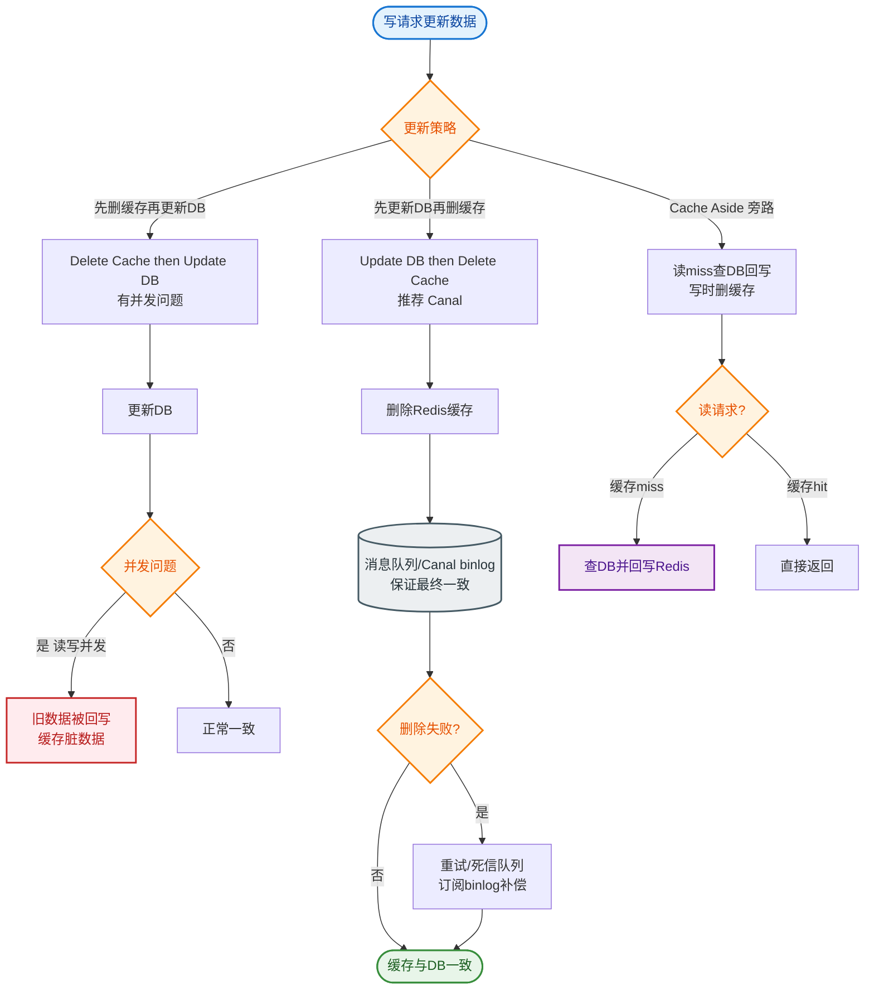

# 如何设计一个缓存预热和缓存刷新机制？

【场景分析】
缓存冷启动问题：系统重启、缓存失效或大促前，缓存为空（击穿），请求全部打到 DB，可能导致雪崩。

**缓存预热与刷新流程**
```text
      [ 启动/定时触发 ]
             │
             ▼
    ┌─────────────────┐
    │  1. 读取全量热点  │
    │     (DB/离线)    │
    └────────┬────────┘
             │
             ▼
    ┌─────────────────┐
    │ 2. 批量写入Redis │
    │ (Pipeline/MSet)  │
    └────────┬────────┘
             │
             ▼
    ┌─────────────────┐       [ 运行时数据变更 ]
    │  3. 提供只读服务 │             │
    └────────┬─────────┘             ▼
             │           ┌─────────────────────┐
             │           │ 4. 监听 Binlog/MQ   │
             │           └──────────┬──────────┘
             │                      │
             │                      ▼
             │           ┌─────────────────────┐
             └──────────>│ 5. 刷新/删除缓存    │
                         └─────────────────────┘
```

【缓存预热方案】
1. **系统启动预热**：
   - 实现 `ApplicationRunner` 或 `@PostConstruct` 接口。
   - **逻辑**：启动时从 DB 加载 Top N 热点数据（如 Top 1000 商品、配置表）。
   - **注意**：若数据量过大，会阻塞启动，建议采用异步预热或"懒加载+后台刷新"。
2. **定时任务预热**：
   - 使用 XXL-JOB 或 Spring Scheduler。
   - **场景**：低峰期（如凌晨）全量刷新预热，防止缓存长期运行出现数据不一致或冷热交替。
3. **大促主动预热**：
   - **时间**：大促前 10-30 分钟。
   - **策略**：压测期间找出热点 Key，运维脚本或管理后台一键触发预热。
   - **手段**：利用 Redis `MGET` / `Pipeline` 减少网络 RT。

【缓存刷新策略】
1. **Cache-Aside（旁路缓存）- 标准**：
   - **读**：先读缓存，miss 则读 DB 并回写缓存。
   - **写**：先更新 DB，再删除缓存（延时双删可提高一致性）。
2. **Write-Through（直写）**：
   - 写入时同时写缓存和 DB，缓存失败则写 DB 也失败（强一致，性能低，少用）。
3. **Write-Behind（回写）**：
   - 写入只更新缓存，异步批量刷入 DB（性能极高，数据有丢失风险，如 MySQL InnoDB Buffer Pool 机制）。

【刷新一致性与进阶】
1. **延时双删**：
   - 删除缓存 → 更新 DB → 休眠 500ms（读请求可能刚回写脏缓存） → 再次删除缓存。
2. **Canal 监听 Binlog（推荐）：
   - MySQL 伪装成 Slave，监听 Binlog。
   - 解析增删改操作，发送 MQ 或直接调用 Redis 删除对应 Key。
   - **优势**：解耦业务代码，保证最终一致性。
3. **过期时间（TTL）兜底**：
   - 所有缓存设置 TTL（如 1小时），即使主动刷新失败，过期后也会自动触发重新加载。

【常见考点】
1. **为什么是删除缓存而不是更新缓存？**
   - 并发场景下，更新缓存可能导致脏数据（如线程A、B同时更新，A先更新DB，B先更新缓存，导致缓存是旧数据）；删除成本更低（懒加载）。
2. **如何保证 Redis 和 DB 的强一致性？**
   - 极难做到。通常追求最终一致性（Binlog + MQ + 重试机制）。若要强一致，需使用读写锁或分布式锁（如 Redisson RWLock），但这会极大地牺牲性能。
3. **缓存预热如何避免雪崩？**
   - 给 TTL 添加随机值（如 1h + 0~300s），避免大量 Key 同时过期。
4. **布隆过滤器在缓存预热中的作用？**
   - 预热时构建布隆过滤器，查询时先判断 Key 是否存在。若不存在，直接拦截，防止缓存穿透（大量请求查询不存在的数据）。


## 核心流程图


## 记忆要点

- 预热时机：系统启动、低峰定时、大促前针对Top热点数据集中加载。
- 更新策略：先更新DB再删缓存，彻底解耦且防并发更新的脏数据。
- 进阶一致性：推荐Canal监听Binlog+MQ异步删缓存，避免业务代码侵入。
- 防雪崩兜底：给缓存TTL加上随机散列值，严格避免同一时刻集体过期。

## 结构化回答


**30 秒电梯演讲：** 比赛热身先把身体活动开，比赛过程中根据情况及时补水调整状态。

**展开框架：**
1. **启动时利用钩子加** — 启动时利用钩子加载热点数据
2. **大促前全量预加载** — 大促前全量预加载避免冷启动
3. **运行时结合MQ或** — Binlog做增量刷新

**收尾：** 大促前如何做缓存预热？


## 视频脚本

> 预计时长：1 分 30 秒 | 由浅入深

| 时间 | 画面/字幕 | 口播台词 | 讲解要点 |
|------|----------|----------|----------|
| 0:00 | 标题卡：缓存预热和缓存刷新机制 | "缓存预热和缓存刷新机制，一分钟讲透。" | 开场钩子 |
| 0:25 | 生活类比动画 | "打个比方——比赛热身先把身体活动开，比赛过程中根据情况及时补水调整状态。" | 核心类比 |
| 0:50 | 概念定义动画 | "一句话：在流量到来前主动加载热点数据，运行时根据变更策略保持数据一致。" | 核心定义 |
| 1:20 | 启动时 图解 | "启动时利用钩子加载热点数据。" | 启动时 |
