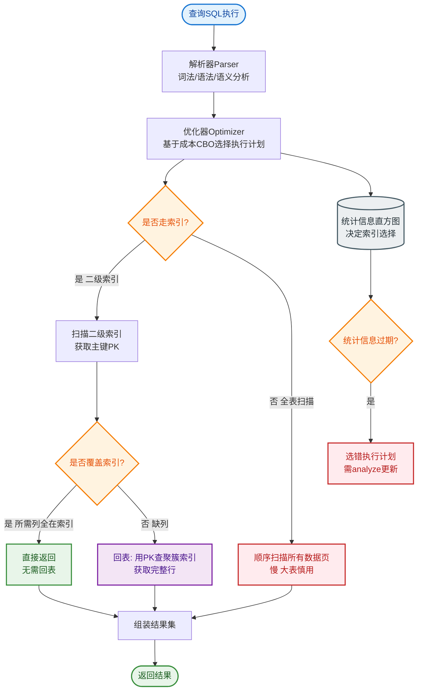

# 如何设计一个搜索系统的索引重建方案？不停机完成百亿数据索引重建。

【场景分析】
ES 索引重建场景：Mapping 变更（如字段类型修改）、分词器升级、Rollover（数据量过大）、主分片调整。
难点：**数据量大（百亿级）且不能停止服务（不停机）。**

**双索引切换架构**
```text
   写入流量                 读取流量
      │                       │
      │                       │
      ▼                       ▼
  ┌─────────┐           ┌─────────┐
  │  MySQL  │           │  App    │
  └────┬────┘           └────┬────┘
       │                     │
       │ 1. Binlog/MQ        │
       ▼                     │
  ┌─────────┐               │
  │ 消费者  │               │
  └────┬────┘               │
       │                     │
       │ 2. 双写/同步        │ 5. 读取
       ├─────────────────────┼─────────────┐
       │                     │             │
       ▼                     ▼             ▼
  ┌─────────┐           ┌─────────┐   ┌─────────┐
  │ Index v1│ (旧)      │ Index v2│   │ Alias   │◄──┘
  │ (只读)  │           │ (写入)  │   │(生产流量)│
  └─────────┘           └─────────┘   └────┬────┘
                                             │
                                     3. 切换别名指向
                                     (v1 -> v2)
                                             │
                                     4. 观察/验证
                                             │
                                     6. 删除 v1
```

【方案1：别名 + 双索引切换（标准方案）】
1. **创建新索引 v2**：应用新的 Mapping、Settings。
2. **全量数据同步（历史数据）**：
   - 利用 Logstash、DataX 或自写程序从 v1 或 MySQL 导入到 v2。
   - **性能调优**：
     - 设置 `refresh_interval=-1`（关闭刷新，构建 Segment，减少 IO）。
     - 设置 `number_of_replicas=0`（副本数设为 0，写入速度翻倍）。
     - 使用 Bulk API 批量写入（如 5MB/批）。
3. **增量数据同步（近实时）**：
   - **全量期间**：业务继续写入 v1（通过 Alias）。
   - **全量后**：开启增量同步（如 Logstash JDBC 追踪时间戳，或 MQ 消费双写）。
   - **Binlog 方案**：Canal 监听 MySQL，同时写入 v1 和 v2。
4. **数据校验**：
   - Count 对比总数。
   - 通过 Scroll API 抽样对比字段值。
5. **切换 Alias（原子操作）**：
   ```json
   POST /_aliases
   {
     "actions": [
       {"remove": {"index": "index_v1", "alias": "prod_index"}},
       {"add": {"index": "index_v2", "alias": "prod_index"}}
     ]
   }
   ```
6. **收尾**：
   - 观察 v2 运行状态（无报错、延迟正常）。
   - 恢复 v2 的副本数和刷新间隔。
   - 删除旧索引 v1。

【方案2：Reindex API（ES 内置）】
```json
POST /_reindex
{
  "source": {
    "index": "index_v1",
    "size": 5000
  },
  "dest": {
    "index": "index_v2",
    "version_type": "external"
  }
}
```
- **特点**：ES 内部滚动读取并写入，支持跨集群。
- **注意**：默认同步进行，可能会阻塞，建议使用 `wait_for_completion=false` 异步执行，通过 Tasks API 查看进度。

【方案3：滚动索引 + 别名（时序数据）】
- 适用于日志、指标类数据。
- 按 `index-2023-01`, `index-2023-02` 建立。
- 写入时 Alias 指向最新索引；查询时 Alias 指向所有索引。
- **ILM (Index Lifecycle Management)**：自动 Rollover、Delete。

【常见考点】
1. **Reindex 过程中如果有新数据写入旧索引，会丢失吗？**
   - 会的。Reindex 是基于快照读取的。所以必须配合“双写”或“Binlog增量同步”来填补全量期间的数据差。
2. **如何保证 Reindex 期间对用户查询无影响？**
   - 利用 Alias：旧索引一直是 Alias 的目标，直到新索引完全 ready 后才切换 Alias。切换是原子的，毫秒级完成。
3. **ES 分片数设置不合理，重建时如何调整？**
   - 直接在 Create Index v2 时指定新的分片数。注意：ES 分片数一旦确定不可修改，只能重建。
4. **重建索引导致磁盘空间不足怎么办？**
   - 分批次 Reindex（按时间或 ID 范围）；或者临时挂载新盘；或者将副本数设为 0 减少占用，重建完再加副本。


## 核心流程图


## 记忆要点

- 核心方案：双索引+别名无缝切换，应用层零感知实现不停机重建。
- 写入提速：全量构建时关刷新(refresh=-1)且0副本，Bulk批量写入。
- 数据同步保障：全量跑完后，用Canal监听Binlog消费追平增量数据。
- 平滑切换：通过Alias原子动作将路由从V1切至V2，验证无误后删V1。

## 结构化回答


**30 秒电梯演讲：** 给飞机换引擎，先在旁边装个新的备用引擎，调试好了再切换油路。

**展开框架：**
1. **Index** — 利用Index Alias对外提供统一入口
2. **全量加增量同** — 全量加增量同步保证新旧索引数据一致
3. **写入时关闭副** — 写入时关闭副本和刷新提升速度

**收尾：** 如何验证新索引数据正确？


## 视频脚本

> 预计时长：2 分钟 | 由浅入深

| 时间 | 画面/字幕 | 口播台词 | 讲解要点 |
|------|----------|----------|----------|
| 0:00 | 标题卡：搜索系统的索引重建方案 | "搜索系统的索引重建方案，一分钟讲透。" | 开场钩子 |
| 0:35 | 生活类比动画 | "打个比方——给飞机换引擎，先在旁边装个新的备用引擎，调试好了再切换油路。" | 核心类比 |
| 1:10 | 概念定义动画 | "一句话：建立新索引并双写同步数据，通过原子别名切换实现零停机发布。" | 核心定义 |
| 1:50 | Index 图解 | "利用Index Alias对外提供统一入口。" | Index |
