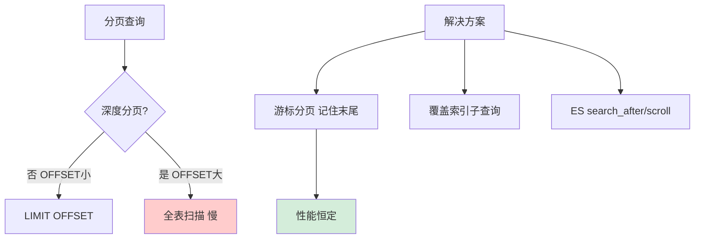

# 如何设计一个通用的分页方案？深度分页问题如何解决？

【场景分析】
分页是几乎所有系统都需要的功能，但深度分页有严重的性能瓶颈，核心原因是数据库需要扫描并丢弃大量的偏移量数据。

【传统分页及其原理】
```sql
-- 第1页：扫描 0 条，取 20 条
SELECT * FROM orders ORDER BY id LIMIT 0, 20;

-- 第10000页：扫描 199980 条，取 20 条
SELECT * FROM orders ORDER BY id LIMIT 199980, 20;
```
**执行原理细节**：
MySQL InnoDB 执行 `LIMIT offset, N` 时，服务器层向存储引擎引擎请求 `offset + N` 行记录，存储引擎读取索引并回表查询数据行，返回给服务器层。服务器层丢弃前 `offset` 行，只返回剩余的 `N` 行。
**性能瓶颈**：随着 offset 增大，回表次数和 CPU/IO 消耗线性增长。

【深度分页优化方案】

### 1. 游标分页
```sql
-- 第一页
SELECT * FROM orders WHERE id > 0 ORDER BY id LIMIT 20;

-- 第二页（假设上一页最后一条 ID 为 100）
SELECT * FROM orders WHERE id > 100 ORDER BY id LIMIT 20;
```
**原理细节**：利用索引的有序性，直接定位到游标位置（B+树叶子节点），无需扫描前序数据。
**边界条件**：
- 排序字段必须是唯一且有序的（通常使用自增 ID 或 `_id`）。
- 如果排序字段不唯一（如 `create_time`），需使用复合排序：`WHERE create_time > ? AND (create_time > ? OR id > ?) ORDER BY create_time, id`。

### 2. 覆盖索引优化
```sql
-- 延迟关联
SELECT * FROM orders o 
INNER JOIN (
    SELECT id FROM orders ORDER BY create_time LIMIT 199980, 20
) tmp ON o.id = tmp.id;
```
**原理细节**：
- 子查询只查询 `id` 字段（包含在索引中），利用覆盖索引，不需要回表查询原数据行，速度极快。
- 外层通过 `JOIN` 只需要根据获取到的 20 个 ID 进行回表，大幅减少 IO。
**适用场景**：支持跳页，但在千万级数据量下，子查询的索引扫描依然有开销。

### 3. ES 深度分页
- **from + size**：
  - 原理：协调节点在每个分片上查询 `from + size` 条，在内存中聚合排序。
  - 限制：默认 `from + size <= 10,000`，因为 `from` 很大时，内存 OOM 风险极高。
- **search_after**：
  - 原理：使用上一页最后一条记录的 sort 值作为游标。
  - 特点：无随机访问，性能恒定，但不支持跳页。
- **Scroll API**：
  - 原理：在服务端维护快照上下文。
  - 注意：维护成本高，适合全量导出，严禁用于实时分页查询。

### 4. 禁止翻页策略（业务折衷）
- 类似 Google/百度，只提供 "下一页"，不提供 "跳转到第 100 页"。
- 或者限制最大页数（如只允许查前 100 页），理由是用户极少关注后面的数据。

【对比总结】
| 方案 | 支持跳页 | 性能 | 复杂度 | 适用场景 |
| :--- | :--- | :--- | :--- | :--- |
| OFFSET LIMIT | 是 | 差（深分页） | 低 | 后台管理（数据量小） |
| 游标分页 | 否 | 极好（O(1)） | 中 | 移动端 Feed 流、无限滚动 |
| 覆盖索引 | 是 | 中等 | 低 | 允许一定深度的跳页查询 |
| ES Search After | 否 | 好 | 中 | 海量数据搜索结果 |

## 常见考点
1. **为什么主键 ID 是连续的，深度分页依然慢？**
   - 如果有删除操作，或者使用了非聚簇索引排序（如 `ORDER BY create_time`），就无法直接利用连续 ID 的范围查询，必须扫描索引树。
2. **"延迟关联" 为什么能优化性能？**
   - 考察覆盖索引（Covering Index）的概念：索引包含了查询所需的所有字段，无需回表查询数据行。
3. **如果用户非要跳转到第 50000 页怎么办？**
   - 业务上限制（如提示 "结果过多，请缩小搜索范围"）；技术上引导用户使用搜索筛选条件缩小数据集。


## 核心流程图




## 记忆要点

- 为何深分页慢：MySQL需扫描并回表大偏移量数据，再丢弃前页，引发IO暴增。
- 游标分页：记录上一页最大ID，Where id > ? 翻页，性能极高但不支持跳页。
- 延迟关联：子查询利用覆盖索引先查主键，再JOIN回表，大幅减少无效IO。
- ES限制：深度分页禁用from+size(易OOM)，实时查询用search_after，导出用Scroll。

## 结构化回答


**30 秒电梯演讲：** 翻书可以直接翻到折角页，而不需要从第一页数到那一页。

**展开框架：**
1. **传统OFFSET导致扫表** — 传统OFFSET导致扫表，深度分页极慢
2. **游标分页记住上页最后位置** — 游标分页记住上页最后位置，性能恒定
3. **覆盖索引子查询减** — 覆盖索引子查询减少回表次数

**收尾：** 游标分页如何实现跳页？


## 视频脚本

> 预计时长：1 分 30 秒 | 由浅入深

| 时间 | 画面/字幕 | 口播台词 | 讲解要点 |
|------|----------|----------|----------|
| 0:00 | 标题卡：通用的分页方案 | "通用的分页方案，一分钟讲透。" | 开场钩子 |
| 0:25 | 生活类比动画 | "打个比方——翻书可以直接翻到折角页，而不需要从第一页数到那一页。" | 核心类比 |
| 0:50 | 概念定义动画 | "一句话：避免全量扫描，利用索引游标定位数据起始点，或者限制分页深度。" | 核心定义 |
| 1:20 | 传统OFFSET 图解 | "传统OFFSET导致扫表，深度分页极慢。" | 传统OFFSET |
