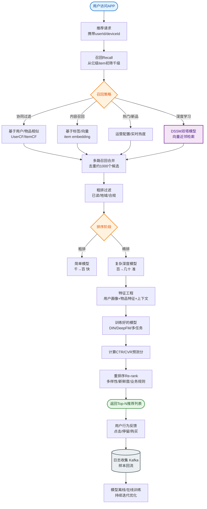

# 如何设计一个商品搜索的搜索建议和热词推荐系统？

【场景分析】
搜索建议和热词推荐是提升搜索体验的关键，兼顾了实时性、个性化和高性能。

【搜索建议类型】
1. **前缀匹配**：输入 "iph" -> "iphone 15"。
2. **拼音匹配**：输入 "ai feng" -> "iphone"（依赖拼音分词库）。
3. **纠错（模糊匹配）**：输入 "ipone" -> "iphone"（基于编辑距离或 ES Fuzzy Query）。
4. **热门/全局推荐**：输入空或未匹配时，展示全网热词。

【热词统计架构】
```
                    ┌──────────┐
                    │  Client  │
                    └────┬─────┘
                         │ 输入/搜索
                         ▼
              ┌──────────────────┐
              │  Search API      │
              │ (1.记录搜索日志)  │
              └────┬─────────────┘
                   │ Kafka (异步)
                   ▼
         ┌──────────────────────────┐
         │ Flink Real-time Agg      │
         │ (Sliding Window: 5min)    │
         │ score = count * w1 + ... │
         └────┬─────────────────────┘
              │ 更新热词
              ▼
         ┌──────────────────────────┐
         │ Redis ZSet (Sorted Set)  │
         │ Key: hotwords:global     │
         │ Value: {word, score}     │
         └──────────────────────────┘
              ▲
              │ 读取热词
              │
         ┌────┴─────────────────────┐
         │ Suggest Service          │
         │ (Merge: Redis + ES)      │
         └──────────────────────────┘
```

【核心方案详解】

### 1. 实时热词计算
- **数据流**：用户搜索行为 -> 写入 Kafka -> Flink 消费。
- **计算逻辑**：使用滑动窗口（如 5 分钟）统计搜索频次。
- **权重公式**：`Score = (搜索次数 * 1) + (点击次数 * 5) + (转化数 * 10) - 时间衰减因子`。
  - 时间衰减：`exp(-lambda * (now - event_time))`，保证新产生的热词排名上升快。

### 2. 存储选型
- **Redis ZSet**：存储实时的 Top N 热词。
  - 优点：读写性能极高，天然支持排序（`ZREVRANGE`）。
  - 结构：`ZADD hotwords:global score word`。
- **Elasticsearch**：存储全量词库，用于复杂的前缀、拼音、模糊搜索。
  - 使用 ES 的 Completion Suggester 进行高性能前缀提示。

### 3. 个性化推荐
- 结合用户历史搜索记录（`user:{uid}:history`）和用户画像。
- 逻辑：`Result = Merge(Global_Hot_Words * 0.4 + Personal_History * 0.6)`。

### 4. 性能优化
- **客户端缓存**：热词列表在客户端缓存 1-5 分钟，减少服务端压力。
- **预加载**：用户输入第一个字时，可能触发后续字母的预加载。
- **布隆过滤器**：如果输入的词前缀在布隆过滤器中不存在，直接返回空，避免查库（适用于词库量极大的情况）。

## 常见考点
1. **为什么使用 Flink 而不是直接在 Redis 中计数？**
   - 直接 Redis 计数只能做简单的累加，无法处理复杂的窗口逻辑（如去重、时间衰减、多维度加权），且数据一旦写入 Redis 难以修正历史数据。Flink 提供了强大的流式计算能力。
2. **搜索建议是查 Redis 快还是查 ES 快？**
   - 纯粹的 Top 热词榜单查 Redis 快（O(log N)）。
   - 任意前缀匹配、模糊匹配查 ES 快（基于倒排索引和 FST 结构）。
   - 通常结合使用：Redis 负责热词，ES 负责长尾和前缀匹配。
3. **如何实现 "输入即搜 " 的防抖？**
   - 前端防抖（Debounce）：用户停止输入 200ms 后再发起请求。
   - 服务端合并请求：对于同一用户极短时间内的相同前缀请求，可以共享计算结果。


## 核心流程图


## 记忆要点

- 数据链路：搜索日志写Kafka，Flink滑动窗口(5min)加权计算(搜索+点击+转化-衰减)
- Redis ZSet存实时热词TopN(O(logN)极速排序)，ES Completion负责长尾前缀/模糊匹配
- 个性化推荐融合全局热词与用户历史画像加权打分
- 性能优化：前端输入防抖(200ms)，后端布隆过滤器拦无效前缀

## 结构化回答


**30 秒电梯演讲：** 像百度搜索框，你敲几个字，它就根据大家都搜什么和你以前搜过什么，猜你想搜啥。

**展开框架：**
1. **Trie** — 利用Trie树或ES前缀查询实现补全
2. **Flink** — Flink实时计算维护热词排行榜
3. **结合** — 结合用户历史实现个性化联想

**收尾：** 拼音搜索如何实现？


## 视频脚本

> 预计时长：2 分钟 | 由浅入深

| 时间 | 画面/字幕 | 口播台词 | 讲解要点 |
|------|----------|----------|----------|
| 0:00 | 标题卡：商品搜索的搜索建议和热词推荐系统 | "商品搜索的搜索建议和热词推荐系统，一分钟讲透。" | 开场钩子 |
| 0:35 | 生活类比动画 | "打个比方——像百度搜索框，你敲几个字，它就根据大家都搜什么和你以前搜过什么，猜你想搜啥。" | 核心类比 |
| 1:10 | 概念定义动画 | "一句话：结合用户实时输入、历史行为及全局热度，利用前缀树和实时计算快速联想推荐。" | 核心定义 |
| 1:50 | Trie树或ES前缀 图解 | "利用Trie树或ES前缀查询实现补全。" | Trie树或ES前缀 |
