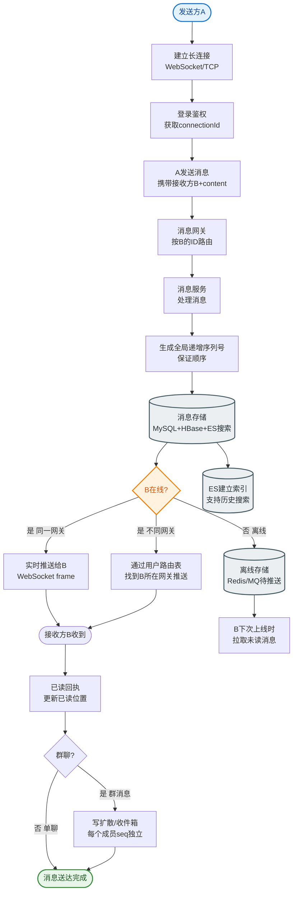

# 如何设计一个秒杀后的异步通知系统？告知用户抢购结果。

【场景分析】
秒杀系统通常采用 "同步扣减库存，异步创建订单 " 的模式。用户发起请求后，不能立即返回最终结果，而是需要一个反馈机制告知用户抢购成功或失败。要求：低延迟、高可用、不丢消息。

【状态流转与架构】
```
User (Client)       Server (Backend)          Message Queue    DB/Cache
    │                  │                          │               │
    │── 1.秒杀请求 ────>│                          │               │
    │                  │── 2.预扣库存(Redis) ─────>│               │
    │                  │<── 3.返回 TicketID ───────│               │
    │<── 4.排队中 ──────│                          │               │
    │                  │                          │               │
    │                  │── 5.异步消费(MQ) ─────────│               │
    │                  │                          │               │
    │                  │── 6.创建订单(MySQL) ──────>│               │
    │                  │                          │               │
    │                  │── 7.写结果缓存 ──────────────────────────>│
    │                  │                          │               │
    │<───────────────── 8.推送结果 (WebSocket/Push) │               │
    │                   (或 等待客户端轮询)          │               │
```

【核心方案设计】

### 1. 轮询方案
这是兼容性最好的方案，不依赖长连接。
- **流程**：
  1. 请求入队后，立即返回 `TicketID` 给前端。
  2. 前端启动定时器，按策略轮询 `/result/{ticketID}` 接口。
  3. 后端查 Redis（`seckill:result:{ticketID}`），返回状态。
- **轮询策略（指数退避）**：
  - 0-10s：每 1s 轮询一次（用户急切）。
  - 10-30s：每 3s 轮询一次。
  - 30s+：每 5s 轮询一次。
  - 超过 60s 判为超时，引导用户去 "我的订单" 查看。

### 2. WebSocket 推送方案
体验最好，实现稍复杂。
- **流程**：
  1. 用户进入秒杀页，建立 WebSocket 连接，绑定 `UserID`。
  2. 后端消费 MQ 创建订单成功后，通过 WebSocket Server 向该 `UserID` 推送消息。
  3. 前端收到消息立即更新 UI。
- **断线处理**：
  - 如果用户断开连接，消息会丢失。必须结合 **轮询兜底** 或 **离线推送（APNs/FCM）**。

### 3. 消息可靠性保障
- **结果存储**：
  - Redis：存储处理结果，TTL 设置为 24 小时（供轮询查询）。Key 结构：`result:{ticketId}`。
  - MySQL：订单表持久化。
- **一致性**：
  - MQ 消费端开启手动 ACK（Acknowledge）。
  - 只有 "写结果缓存到 Redis" 和 "创建订单" 都成功后，才 ACK 消息。
  - 若失败，利用 MQ 的重试机制重新消费。

### 4. 降级与兜底
- **WebSocket 故障**：自动降级为前端轮询模式。
- **MQ 积压**：秒杀流量洪峰可能导致 MQ 处理延迟，此时轮询接口应返回明确的 "系统繁忙，请稍后" 状态码，避免无效打爆数据库。
- **最终一致性**：若所有即时通知失败，依赖用户主动刷新 "我的订单" 页面（订单数据是最终一致的数据源）。

## 常见考点
1. **为什么不直接用 HTTP 长连接代替 WebSocket？**
   - HTTP 长连接通常指的是 Keep-Alive，是为了复用 TCP 连接减少握手开销，但服务端无法主动向客户端推送数据。WebSocket 是全双工通信，允许服务端主动推送。
2. **如何防止消息重复通知（如 MQ 重试）？**
   - 接口设计幂等性。推送时先检查 Redis/DB 中该 TicketID 是否已经是 "终态"（成功/失败），如果是，则不再推送，直接返回。
3. **如果 Redis 挂了，轮询接口怎么处理？**
   - 降级：直接查询 MySQL 订单表。虽然 MySQL 压力大，但秒杀结束后流量峰值已过，可以承受。或者返回 "系统繁忙"，让用户稍后再试。


## 核心流程图


## 记忆要点

- 秒杀通知两方案：前端指数退避轮询(查Redis)，WebSocket全双工主动推送(体验最佳)
- WebSocket断线易丢消息，必须配合前端轮询兜底或离线Push
- MQ消费手动ACK，双写(Redis缓存+MySQL订单)成功后才确认，防消息丢失
- 防重复通知：推送或轮询前检查TicketID终态，实现接口幂等

## 结构化回答

**30 秒电梯演讲：** 以轮询为兜底，WebSocket为主推，结合Redis中间状态存储，实现异步结果同步。打比方——去餐厅点餐，给你个叫号器，你可以自己看屏(轮询)，也可以等响了(推送)再取餐。落到工程上，客户端返回排队凭证，而非直接结果。

**展开框架：**
1. **客户端返回排队凭证** — 客户端返回排队凭证，而非直接结果
2. **MQ消费端写入** — MQ消费端写入Redis状态供客户端查询
3. **优先** — 优先使用长连接推送，降级策略为客户端轮询

**收尾：** 这几个点都能配合实战展开。您想继续聊哪个追问——比如 「轮询频率如何控制」 或者 「WebSocket推送如何保证可靠」？

## 视频脚本

> 预计时长：2 分钟 | 由浅入深

| 时间 | 画面/字幕 | 口播台词 | 讲解要点 |
|------|----------|----------|----------|
| 0:00 | 标题卡：秒杀后的异步通知系统 | "秒杀后的异步通知系统，一分钟讲透。" | 开场钩子 |
| 0:35 | 生活类比动画 | "打个比方——去餐厅点餐，给你个叫号器，你可以自己看屏(轮询)，也可以等响了(推送)再取餐。" | 核心类比 |
| 1:10 | 概念定义动画 | "一句话：以轮询为兜底，WebSocket为主推，结合Redis中间状态存储，实现异步结果同步。" | 核心定义 |
| 1:50 | 客户端返回排队凭证 图解 | "客户端返回排队凭证，而非直接结果。" | 客户端返回排队凭证 |
