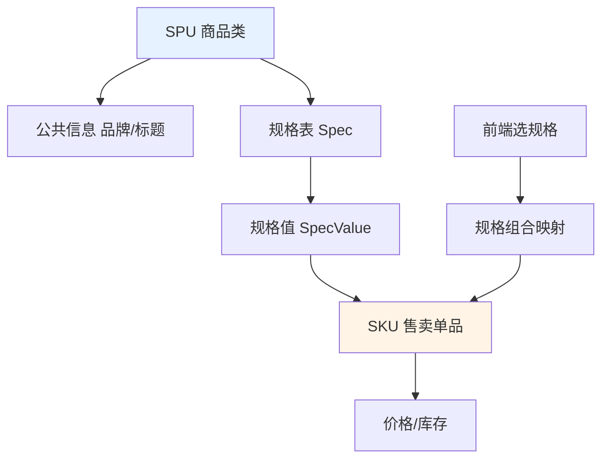

# 如何设计一个电商SKU和SPU的数据模型？支持多规格商品管理。

【场景分析】
商品管理核心概念：SPU（标准化产品单元）和SKU（库存量单元）。

【SPU vs SKU】
- SPU：iPhone 15（产品维度）
- SKU：iPhone 15 256G 银色（可购买的最小单元）
- 一个SPU有多个SKU（不同颜色/容量组合）

【数据模型设计】
```text
SPU表(product):
  id, name(商品名), category_id, brand_id
  description, main_images, status
  
规格表(spec):
  id, name(如"颜色"/"内存"), sort_order
  
规格值表(spec_value):
  id, spec_id, value(如"银色"/"256G"), sort_order
  
SPU规格关联(spu_spec):
  spu_id, spec_id
  -- (可选) 用于定义该SPU启用了哪些规格
  
SKU表(product_sku):
  id, spu_id, sku_code(唯一索引), price, stock
  -- attributes(JSON: {"颜色":"银色","内存":"256G"})
  -- 新增: no_stock(是否无货), barcode(条形码)
  
SKU规格值关联(sku_spec_value):
  sku_id, spec_id, spec_value_id
  -- (唯一索引 uk_sku_spec) 
  -- 这里的组合必须能唯一确定一个SKU
```

【架构关联图】
```text
   [SPU] (iPhone 15)      [Spec] (规格定义)
     | 1                   | 1
     |                     |
     | *             [Spec Value] (银色/256G)
     |                     | *
     | *        (关联)      |
   [SKU] (可售单元)-------+---*
   (256G 银色)           (存储具体属性映射)
```

【前端SKU组合算法】
核心难点：当选中"银色"时，若"银色+128G"无货，则"128G"按钮应置灰。

```javascript
// 1. 构建邻接表，快速查找哪些规格值组合是有效的
function buildSkuTree(skus) {
    // key: spec_id_value_id, value: count (库存>0才计数)
    const map = {}; 
    skus.forEach(sku => {
        if (sku.stock > 0) {
            sku.attrs.forEach((valId, specId) => {
                const key = `${specId}_${valId}`;
                map[key] = (map[key] || 0) + 1;
            });
        }
    });
    return map;
}

// 2. 获取可选规格值（灰色不可选的规则）
function getDisabledSpecs(selectedSpecs, allSKUs) {
    // 逻辑：遍历所有SKU，如果某SKU包含当前已选项，
      且该SKU有库存，则该SKU的其他属性值均“可能”可选。
    // 如果没有任何SKU满足（包含已选项且有库存），则需回溯。
    // 更简单的做法：后端返回该SPU下所有有货SKU的枚举组合，前端笛卡尔积计算。
}
```

【库存管理】
- 库存按SKU维度管理
- 每个SKU独立库存数量
- **Redis预扣 + DB实际扣减**（防止超卖）
- **扣减逻辑**：`decr stock_key`，若返回值 >= 0 则成功，否则回滚并返回库存不足。

【搜索优化】
- ES索引按SPU建（一个文档包含所有SKU信息 nested object）
- 搜索结果展示SPU，用户选择规格后查SKU
- **价格区间**：SPU索引中存储 `min_price` 和 `max_price` 供筛选。

【价格管理】
- SPU有价格范围（min-max）
- SKU有精确价格
- 促销价格按SKU或SPU维度

【## 常见考点】
1. **多规格组合笛卡尔积爆炸问题**：如果一个商品有5个规格，每个规格10个值，如何高效生成和管理SKU？（通常限制SPU下的规格数量不超过3-4个，或者后台只允许在有限范围内生成SKU）。
2. **SKU库存更新延迟**：Redis扣减成功但DB下单失败（如退款流程），如何保证数据一致性？（使用消息队列异步补库存，或定时任务对账）。
3. **价格计算**：购物车中不同SKU（不同SPU）的优惠叠加计算逻辑，是在网关层还是服务层计算？
4. **商品变更历史**：SPU属性变更（如修改描述）与SKU上下架的审计日志设计。


## 核心流程图




## 记忆要点

- SPU是产品集(如iPhone 15)，SKU是最小库存单元(如银色256G)，一个SPU含多SKU
- 核心表：SPU表、规格表、SKU表、以及SKU与规格值的关联表(唯一索引)
- SKU组合防笛卡尔积爆炸：限制规格数量，前端依赖邻接矩阵算法置灰无货属性
- 库存按SKU维度管，Redis预扣防超卖，ES以SPU建索引存min/max_price

## 结构化回答

**30 秒电梯演讲：** SPU聚合公共信息，SKU确定具体交易属性，通过规格键值对关联两者。打比方——SPU是“ iPhone 15”这款手机壳，SKU是里面具体的“银色、256G”那一部手机。落到工程上，SPU代表一类商品，SKU代表唯一售卖单品。

**展开框架：**
1. **SPU** — SPU代表一类商品，SKU代表唯一售卖单品
2. **规格表(Spec)和** — 规格表(Spec)和规格值(SpecValue)解耦属性
3. **SKU表存储唯一标识** — SKU表存储唯一标识和价格库存

**收尾：** 这几个点都能配合实战展开。您想继续聊哪个追问——比如 「SKU组合如何高效查询」 或者 「前端规格选择器如何实现」？

## 视频脚本

> 预计时长：2 分钟 | 由浅入深

| 时间 | 画面/字幕 | 口播台词 | 讲解要点 |
|------|----------|----------|----------|
| 0:00 | 标题卡：电商SKU和SPU的数据模型 | "电商SKU和SPU的数据模型，一分钟讲透。" | 开场钩子 |
| 0:35 | 生活类比动画 | "打个比方——SPU是“ iPhone 15”这款手机壳，SKU是里面具体的“银色、256G”那一部手机。" | 核心类比 |
| 1:10 | 概念定义动画 | "一句话：SPU聚合公共信息，SKU确定具体交易属性，通过规格键值对关联两者。" | 核心定义 |
| 1:50 | SPU 图解 | "SPU代表一类商品，SKU代表唯一售卖单品。" | SPU |
