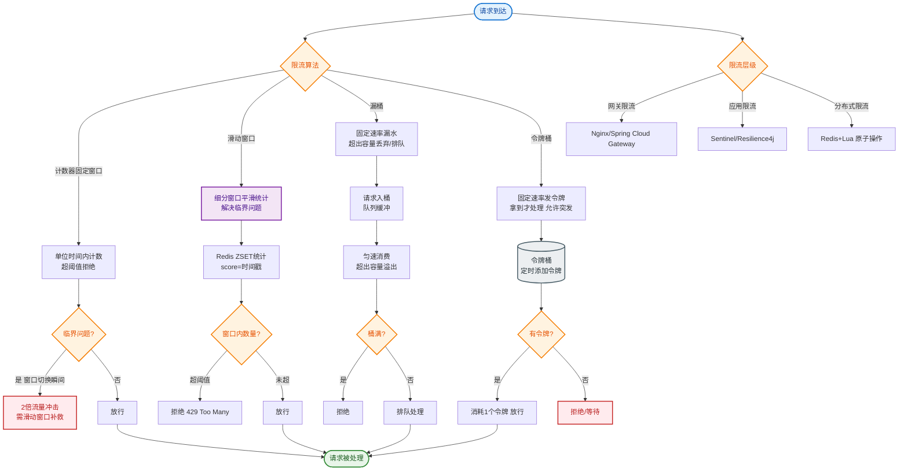
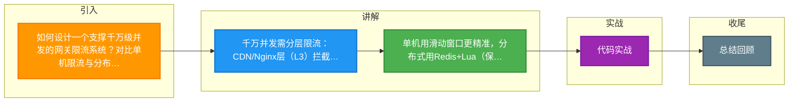

# 如何设计一个支撑千万级并发的网关限流系统？对比单机限流与分布式限流的方案。

【场景分析】
千万级并发限流的核心矛盾：既要精准控制全局流量，又要保证网关本身不成为瓶颈。

【单机限流（适合中小流量）】
1. **令牌桶**：
   - 原理：以恒定速率向桶中放入令牌，请求消耗令牌。
   - 特性：允许突发流量（桶的大小决定突发上限），平滑流量。
   - 实现：Guava RateLimiter, Sentinel。
2. **漏桶**：
   - 原理：请求先入桶，桶以恒定速率流出（处理请求）。
   - 特性：强制匀速，拒绝溢出请求。保护下游能力极强，但无法应对突发。
3. **滑动窗口**：
   - 原理：将时间分为多个小格，统计当前窗口内的总请求数。
   - 特性：精度高于固定窗口（"临界突变"问题）。

【分布式限流（适合千万级并发）】
1. **Redis + Lua 脚本**：
   - 核心：将 "读取当前计数-判断是否超限-自增" 逻辑封装在 Lua 脚本中，保证原子性。
   - 优化：Redis 集群部署，避免单点瓶颈；使用 `pexpire` 设置 key 过期时间自动滚动窗口。
2. **网关层限流**：
   - 核心：利用 Nginx/OpenResty 的高性能特性，在流量进入应用层前拦截。
   - 优势：C 语言实现，内存操作，性能极高（百万级 QPS）。
3. **Sentinel 集群流控**：
   - 架构：独立的 Token Server 服务负责计算全局限流阈值，多个 Token Client（网关节点）向 Server 申请令牌。

【推荐架构（分层限流）】
```text
用户请求
   │
   ▼
[CDN/HTTP-DNS]           (L1: DNS 封禁/区域限流)
   │
   ▼
[OS/TCP Kernel]          (L2: Syn Cookie 防护)
   │
   ▼
[Nginx/OpenResty]        (L3: IP/QPS 限流，拒绝恶意流量)
   │
   ▼
[API Gateway Cluster]    (L4: 业务接口限流，用户维度限流)
   │   ├─ 本地限流
   │   └─ Redis 分布式限流 (精确控制)
   │
   ▼
[Microservices]          (L5: 自我保护 Sentinel)
```

【性能要点】
- **本地限流优先**：请求先过本地限流，拦截大部分正常流量，减少 Redis 压力。仅对需要精确全局控制的资源（如秒杀库存）才调用 Redis。
- **Lua 原子性**：避免多次 RTT (Round-Trip Time)。
- **优雅降级**：Redis 挂了时，自动降级为单机限流，宁可稍微超卖/超载，也不能让整个系统不可用。

【## 常见考点】
1. **固定窗口 vs 滑动窗口**：为何固定窗口在边界处会出现"两倍流量"问题？（例如 00:01 的 100 请求和 00:02 的 100 请求在 00:01:59 扫描时可能被同时统计）。
2. **Redis 性能瓶颈**：千万并发下，所有请求都去 Redis `incr` 会不会压垮 Redis？（会的，因此需要分层，且核心接口才走 Redis，普通接口走本地限流）。
3. **Sentinel 集群限流**：Token Server 挂了怎么办？（Client 会自动切换到本地限流模式（降级）或连接备用 Token Server）。
4. **限流后的策略**：是直接拒绝 429，还是排队？（高并发场景建议直接拒绝，排队会堆积线程导致网关 OOM）。


## 核心流程图


## 记忆要点

- 千万并发需分层限流：CDN/Nginx层(L3)拦截恶意流量，网关层(L4)做精确业务限流
- 单机用滑动窗口更精准，分布式用Redis+Lua(保证原子性)或令牌桶
- 高并发绝不全走Redis：先过本地限流，仅秒杀等核心资源才申请分布式Token
- Redis挂掉要优雅降级为单机限流，宁可局部超载，绝不能阻断全局服务

## 结构化回答


**30 秒电梯演讲：** 像游园验票：门口保安粗筛，入口闸机细查，场馆内区控。

**展开框架：**
1. **本地限流抗高频** — 本地限流抗高频，无网延迟
2. **分布式限流用Lua** — 分布式限流用Lua，保原子性
3. **网关层拦截最优** — 网关层拦截最优，成本最低

**收尾：** 令牌桶和漏桶的核心区别是什么？


## 视频脚本

> 预计时长：3 分钟 | 由浅入深

| 时间 | 画面/字幕 | 口播台词 | 讲解要点 |
|------|----------|----------|----------|
| 0:00 | 标题卡：支撑千万级并发的网关限流系统 | "支撑千万级并发的网关限流系统，这题我会分三步讲。" | 开场钩子 |
| 0:41 | 概念定义动画 | "一句话：漏斗式分级限流，本地拦底，分布控全局。" | 核心定义 |
| 1:22 | 生活类比动画 | "打个比方——像游园验票：门口保安粗筛，入口闸机细查，场馆内区控。" | 核心类比 |
| 2:03 | 本地限流抗高频 图解 | "本地限流抗高频，无网延迟。" | 本地限流抗高频 |
| 2:50 | 分布式限流用Lua 图解 | "分布式限流用Lua，保原子性。" | 分布式限流用Lua |

### 视频流程图



