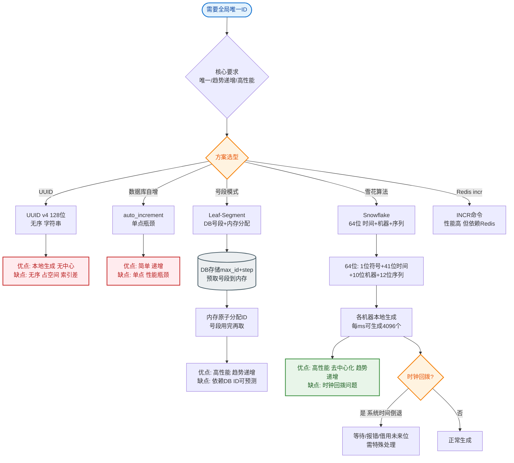
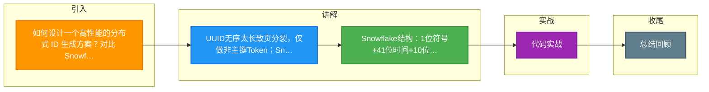

# 如何设计一个高性能的分布式 ID 生成方案？对比 Snowflake、号段、UUID 的优劣。

【核心需求】
- 全局唯一
- 趋势递增（利于 B+ 树索引性能）
- 高性能（10万+ QPS）
- 高可用（容灾）

【方案对比】

1. **UUID**
   - 原理：基于时间戳、机器MAC、随机数生成 128 位字符串。
   - 优点：本地生成，无网络开销，性能极高。
   - 缺点：
     - **无序**：MySQL InnoDB 插入会导致频繁页分裂，降低写入性能。
     - **太长**：36 字符串，占用存储大，查询慢。
   - 适用：Token、SessionID、非 DB 主键。

2. **Snowflake (雪花算法)**
   - 结构 (64bit)。
     ```text
     0 | 0000000000 0000000000 0000000000 0000000000 0 | 0000000000 | 000000000000
       ^                                     ^           ^            ^
       |                                     |           |            |
    符号位(1)                          时间戳(41bit)   机器ID(10bit) 序列号(12bit)
     ```
   - 优点：
     - 趋势递增（基于时间），索引友好。
     - 不依赖 DB，性能高。
     - 包含时间信息，可排序。
   - 缺点：
     - **时钟回拨问题**：服务器时钟回拨可能导致 ID 重复。
     - 机器 ID 分配管理复杂（依赖 ZooKeeper 或手动配置）。
   - **时钟回拨解决**：
     - 等待（简单，但阻塞线程）。
     - 利用备用位（如利用序列号高位，暂存回拨时间差）。
     - 报错拒绝（要求业务侧重试）。

3. **号段模式**
   - 原理：数据库表存储 `max_id` 和 `step`。服务每次取一个号段（如 1000-2000），在内存中分发。
   - **双 Buffer 优化**：
     ```text
     Current Segment: [1000 ~ 2000] (正在发号)
     Next Segment:    [2000 ~ 3000] (异步加载中)
     ```
     当 Current 用到 10% 时，异步更新 DB 获取 Next Segment。若 DB 挂了，Next 可支撑一段时间。
   - 优点：
     - 性能极高（内存操作）。
     - ID 严格递增。
   - 缺点：
     - 若服务重启，内存中未发出的 ID 会丢失（导致 ID 不连续，但不影响唯一性）。
     - DB 仍是单点压力源（虽压力小，但需主备）。

4. **Redis INCR**
   - 原理：利用 Redis 的原子自增命令 `INCR`。
   - 优点：简单，性能不错。
   - 缺点：
     - 强依赖 Redis 可用性。
     - 数据持久化配置（AOF/RDB）可能导致重启后 ID 回退。

【架构选型建议】
```text
订单号/业务主键:
   ├── 规模中小，追求简单:  DB号段模式 (Leaf-Segment)
   ├── 规模大，允许微弱不连续: Snowflake (美团 Leaf-Snowflake 优化版)
   └── 需要含业务含义:   "日期" + "时间戳" + "机器码" + "序列号"

分布式追踪/Token:
   └── UUID (方便生成，长度忽略不计)
```

【## 常见考点】
1. **Snowflake 时钟回拨**：如果回拨超过 1ms 怎么处理？（通常直接报错或停服务；优化方案：记录上次回拨时间，一段时间内回拨利用序列号位补偿）。
2. **Snowflake 并发量**：QPS 上限计算？（单机 QPS = 1000 (2^10ms) * 4096 (2^12) ≈ 400万/s，受限于时间戳回拨频率，实际单机百万级没问题）。
3. **号段模式 ID 连续性**：为什么重启后 ID 会不连续？（内存中剩余的号段丢失了，重启后从新的号段开始，中间出现空洞，对业务无影响但审计时需注意）。
4. **雪花算法 WorkerID 分配**：在 Docker/K8s 动态扩缩容环境下，如何保证 WorkerID 不冲突？（使用 ZooKeeper 持久顺序节点自动注册，或基于 IP Hash 生成，但需注意 IP 漂移）。


## 核心流程图


## 记忆要点

- UUID无序太长致页分裂，仅做非主键Token；Snowflake趋势递增做业务主键
- Snowflake结构：1位符号+41位时间+10位机器+12位序列(防时钟回拨是考点)
- 号段模式双Buffer：内存发号极速，消耗10%异步加载下一段，防DB单点瓶颈
- Redis自增做ID易回退，强依赖可用性，K8s下雪花WorkerID用ZK注册防冲突

## 结构化回答


**30 秒电梯演讲：** 像发号码牌：UUID乱发快，Snowflake按序发，号段批发发。

**展开框架：**
1. **UUID** — UUID无序但本地快，不适做索引
2. **Snowflake** — Snowflake趋势递增，强依赖时钟
3. **DB** — 号段模式内存发，性能高但依赖DB

**收尾：** Snowflake 时钟回拨问题怎么解决？


## 视频脚本

> 预计时长：3 分钟 | 由浅入深

| 时间 | 画面/字幕 | 口播台词 | 讲解要点 |
|------|----------|----------|----------|
| 0:00 | 标题卡：高性能的分布式 ID 生成方案 | "高性能的分布式 ID 生成方案，这题我会分三步讲。" | 开场钩子 |
| 0:41 | 概念定义动画 | "一句话：在唯一性、有序性、性能间权衡取舍。" | 核心定义 |
| 1:22 | 生活类比动画 | "打个比方——像发号码牌：UUID乱发快，Snowflake按序发，号段批发发。" | 核心类比 |
| 2:03 | UUID无序但本地快 图解 | "UUID无序但本地快，不适做索引。" | UUID无序但本地快 |
| 2:50 | Snowflake趋 图解 | "Snowflake趋势递增，强依赖时钟。" | Snowflake趋 |

### 视频流程图



