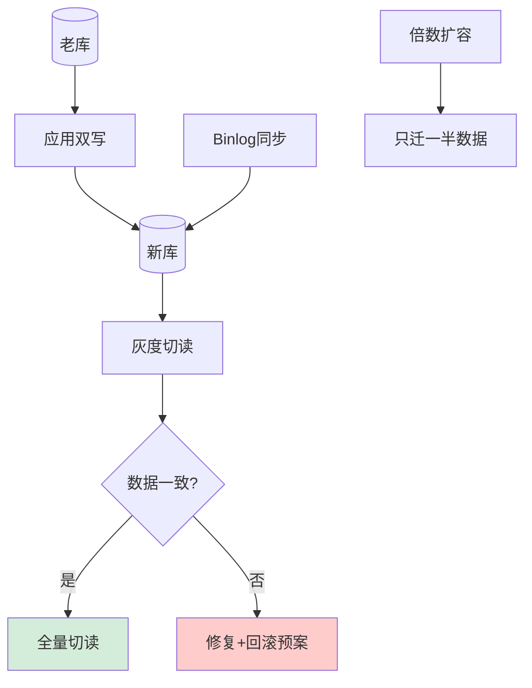

# 分库分表后如何做不停机的数据迁移和扩容？

【场景】
原 16 库 × 4 表需扩到 32 库 × 8 表，业务不能停，数据一致性要求高。

【方案一：双写 + 数据同步（最通用，非 2 的幂次方也可用）】

1.  **配置双写**：
    - 代码改造，同时对新库和旧库写入。
    - **一致性策略**：以旧库为主（先写旧库成功再写新库），或写新库失败记录日志异步补偿（对账）。

2.  **历史数据全量同步**：
    - 使用 DataX、Canal 或自写脚本，将旧库存量数据迁移到新库。

3.  **数据校验**：
    - 迁移过程中进行新旧库数据比对。
    - **比对策略**：先比对 Count，再比对 Checksum (如 CRC32)，最后抽样比对具体行内容。

4.  **灰度切读**：
    - 灰度策略：按 UserID 尾号、按地区或按流量比例（1% -> 10% -> 50%）。
    - 切读期间，读新库，写依然是双写。

5.  **停写旧库 & 清理**：
    - 确认读新库稳定后，停止写入旧库。
    - 保留旧库一段时间（如 1 周）作为兜底回滚。

【方案二：成倍扩容（2 的 N 次方分片，效率最高）】
**原理**：
取模逻辑从 `hash % N` 变为 `hash % 2N`。
根据模运算性质：
- 若 `hash % 2N < N`，数据仍在原节点。
- 若 `hash % 2N >= N`，数据需要迁移到新节点（新节点索引 = 原索引 + N）。

**无需重新 Hash**：只需迁移一半的数据，且路由规则更改极简。

**流程**：
1. 新增 16 个分片实例。
2. 从原分片拷贝数据到对应新分片（例如 DB0 数据的一半拷贝到 DB16）。
3. 修改路由配置，应用层发布新版本（将分片数配置改为 32）。
4. 验证无误后下线旧数据（或保留）。

【方案三：一致性 Hash（无扩容风暴）】
- 使用虚拟节点（如每个物理节点 150 个虚拟节点）。
- 扩容时，只需将相关数据迁移到新节点，影响范围小。
- **缺点**：数据分布不均需调优，实现复杂，通常依赖中间件（如 Redis Cluster, Codis）。

【关键难点与细节】

1.  **双写失败处理**：
    - 新库写入失败时，不能影响主流程（旧库写入成功即返回成功）。
    - 必须引入“重试队列”或“补偿日志”，定期扫描修补新库数据，防止最终不一致。

2.  **数据校验深度**：
    - 不要逐行 Select 比较（太慢）。
    - 使用 `CRC32(table_name) + count(*)` 进行快速校验。

3.  **回滚方案**：
    - 如果切读后新库出现问题，必须能秒级切回旧库。
    - 这要求双写必须持续，直到确认完全无误才能切断旧库写入。

4.  **外键与联合索引**：
    - 确保新库的表结构、索引、外键约束已提前创建并优化。

【## 常见考点】
1. **迁移期间的数据一致性**：双写模式下，如果旧库写成功新库写失败，用户读旧库看到最新数据，读新库（如果此时已切读）看到旧数据，怎么办？（这是短暂的不一致窗口期。通常通过消息队列最终一致性修复，或者在灰度期允许短暂延迟，用户刷新即可）。
2. **停机迁移 vs 在线迁移**：什么情况下选择停机迁移？（数据结构发生根本性变化，无法兼容双写；或者运维人力不足，无法承担复杂的灰度流程）。
3. **ID 如何处理**：如果从自增 ID 变为了 Snowflake ID，迁移过程中如何处理冲突？（通常建议迁移前先修改代码生成 ID 策略，存量数据保留自增 ID，增量数据用 Snowflake，ID 类型改为 bigint/string 即可）。
4. **BigKey 问题**：迁移过程中如果某个单表数据量巨大（亿级），如何避免对主库造成影响？（使用开源工具的流式读取/写入，限制传输速度，或者分批次迁移）。

## 核心流程图

## 记忆要点

- 不停机扩容首选双写方案：代码改造双写新库旧库，工具全量同步历史数据
- 双写期间切读要灰度（按尾号或1%->10%），新库读稳后停旧库，保留旧库防回滚
- 成倍扩容(2的N次)最高效：路由仅从hash%N变为hash%2N，数据仅迁移一半
- 数据校验：不逐行Select，用CRC32+Count快速比对，双写失败走补偿日志

## 结构化回答

**30 秒电梯演讲：** 像搬家：先在新旧家都收信，确认信都到了，再正式把家搬走。

**展开框架：**
1. **应用双写新老库** — 应用双写新老库，数据同步补齐
2. **灰度切读** — 灰度切读，逐步验证数据一致性
3. **倍数扩容只迁一半** — 倍数扩容只迁一半，减少数据搬运

**收尾：** 双写时如果写老库成功但写新库失败怎么办？

## 视频脚本

> 预计时长：4 分钟 | 由浅入深

| 时间 | 画面/字幕 | 口播台词 | 讲解要点 |
|------|----------|----------|----------|
| 0:00 | 标题卡：分库分表后如何做不停机的数据迁移和扩容 | "分库分表后如何做不停机的数据迁移和扩容，30 秒讲清楚核心。" | 开场钩子 |
| 0:45 | 概念定义动画 | "一句话：双写保新，同步补旧，灰度验证。" | 核心定义 |
| 1:30 | 生活类比动画 | "打个比方——像搬家：先在新旧家都收信，确认信都到了，再正式把家搬走。" | 核心类比 |
| 2:15 | 应用双写新老库 图解 | "应用双写新老库，数据同步补齐。" | 应用双写新老库 |
| 3:00 | 灰度切读 图解 | "灰度切读，逐步验证数据一致性。" | 灰度切读 |
| 3:50 | 倍数扩容只迁一半 图解 | "倍数扩容只迁一半，减少数据搬运。" | 倍数扩容只迁一半 |
