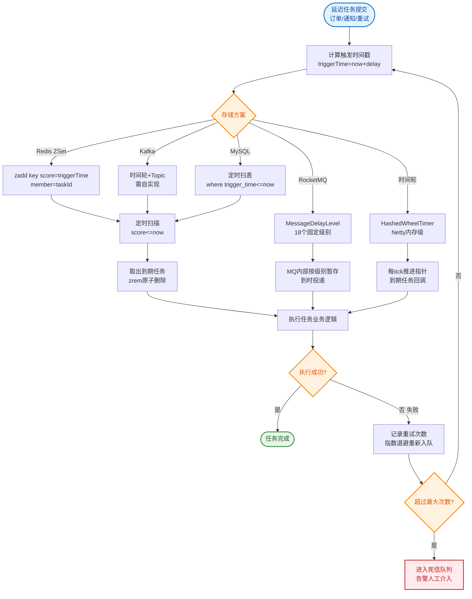

# 如何设计一个支持百万级任务的延迟队列？要求精确触发、高可用。

【场景】订单超时关闭、延迟通知、定时发布等延迟任务，百万级堆积。

【方案对比】
1. **数据库轮询**：定时扫表 WHERE execute_time <= NOW()。
   - **细节**：利用覆盖索引（包含 id, execute_time, status）减少回表；分片轮询（如按 user_id 取模）并行扫描。
   - **边界**：轮询间隔（Poll Interval）需权衡实时性与 DB 压力，通常为 1s-5s。
   - **缺点**：数据量大时扫描慢，有延迟，DB 压力大。适合：任务量小（<1万）。

2. **Redis ZSet**：score 存执行时间，member 存任务 ID（或唯一序列化内容），定时 ZRANGEBYSCORE 取到期任务。
   - **细节**：使用 Lua 脚本保证“读取+删除”的原子性；避免阻塞，一次取出数量（如 100）限制。
   - **缺点**：单机内存限制、不可靠（宕机丢数据，需配合 AOF/RDB）。适合：任务量中等（<100万）。

3. **RocketMQ 延迟消息**：
   - **4.x 版本**：原生支持 18 个特定延迟级别（1s 1m 1h 等），不支持任意时间。
   - **5.0 版本**：基于 TimerWheel（时间轮）算法，支持任意精度延迟。
   - **优点**：天然高可用、吞吐量大。适合：对可靠性要求极高的核心业务。

4. **时间轮**：
   - **原理**：环形数组 + 指针。每个槽代表一个时间刻度（tick），任务存入对应槽位的链表。指针转动触发任务。
   - **优点**：插入/触发 O(1)。
   - **缺点**：单机、内存存储、重启丢任务。适合：Netty 内部超时、Kafka 底层机制。

5. **Redis + 时间轮 + MQ 组合（生产推荐）**：
   - **架构**：Redis ZSet 作为持久化的“任务待办表”，JDK HashedWheelTimer（或 Netty）作为本地“触发器”。
   - **流程**：定时任务扫描 ZSet -> 到期任务 -> 投递到 MQ -> 消费者异步执行业务逻辑。

【架构流程图】
```text
      生产者                          任务调度中心                      消费者
         |                              |                              |
   1.添加任务                      |                              |
   (写入DB)                        |                              |
         |                              |                              |
   +----->|  2.写入 Redis ZSet      |                              |
   |      |  (Score=执行时间)        |                              |
   |      |                          |                              |
   |      |    <定时轮询/通知>        |                              |
   |      |                          |                              |
   |      |  3.扫描 ZSet             |                              |
   |      |  (ZRANGEBYSCORE 0..Now)  |                              |
   |      |                          |                              |
   |      |  4.投递 MQ (Topic=DLY)    |                              |
   |      |------------------------->|                              |
   |      |                          |   5.消费消息                  |
   |      |                          |   (执行业务逻辑/超时关闭)      |
   |      |                          |                              |
   |      |  6.ACK/删除 ZSet 记录     |                              |
   |      |<-------------------------|                              |
``` 

【关键细节】
- **幂等执行**：任务可能重复触发（MQ 重投），必须幂等（如 DB 唯一索引、状态机检查）。
- **分片消费**：百万级任务要分片（Redis Cluster / 多个 Worker 扫描不同 Slot），避免单点瓶颈。
- **死信处理**：执行失败重试 N 次（指数退避）后进死信队列（DLQ），人工介入。
- **空轮询优化**：ZSet 为空时休眠，避免 CPU 飙升。

## 常见考点
1. 如果 Redis 挂了，延迟任务会丢失吗？如何解决？（答：结合 DB 做持久化，重启后从 DB 加载未执行任务到 Redis）
2. RocketMQ 5.0 的任意延迟底层是如何实现的？（答：基于时间轮算法 TimerWheel，将分层的时间刻度映射到文件存储）
3. 如何保证任务的精确触发，即卡点执行？（答：通常结合“短间隔轮询”或“Netty 时间轮”，牺牲一点 CPU 换取精度）
4. 如果任务量激增，Redis ZSet 读写性能下降怎么办？（答：拆分 Key，按业务类型或 Hash 分片到不同的 ZSet）


## 核心流程图


## 记忆要点

- 方案对比：DB轮询(量小)、Redis ZSet(中等<100万)、MQ延迟(高可靠)、时间轮(纯内存O(1))
- 生产推荐组合：Redis ZSet做持久化待办表，扫描后投递MQ异步执行(解耦)
- ZSet方案：Score存执行时间，Lua脚本保证读取+删除的原子性防重复消费
- 百万级任务需分片并行扫，消费端必须幂等(状态机/唯一索引)，失败入死信DLQ

## 结构化回答


**30 秒电梯演讲：** 像闹钟：把任务记在日历上，钟表指针转到时刻就响铃。

**展开框架：**
1. **DB轮询性能差** — DB轮询性能差，适合小规模
2. **Redis ZSet利用分…** — Redis ZSet利用分数存时间，扫描高效
3. **时间轮算法实现O** — 时间轮算法实现O(1)触发

**收尾：** Redis ZSet 延迟队列如何分片？


## 视频脚本

> 预计时长：3 分钟 | 由浅入深

| 时间 | 画面/字幕 | 口播台词 | 讲解要点 |
|------|----------|----------|----------|
| 0:00 | 标题卡：支持百万级任务的延迟队列 | "支持百万级任务的延迟队列，这题我会分三步讲。" | 开场钩子 |
| 0:41 | 概念定义动画 | "一句话：时间轮扫描驱动，持久化存储兜底。" | 核心定义 |
| 1:22 | 生活类比动画 | "打个比方——像闹钟：把任务记在日历上，钟表指针转到时刻就响铃。" | 核心类比 |
| 2:03 | DB轮询性 图解 | "DB轮询性能差，适合小规模。" | DB轮询性 |
| 2:50 | Redis ZSet 图解 | "Redis ZSet利用分数存时间，扫描高效。" | Redis ZSet |
