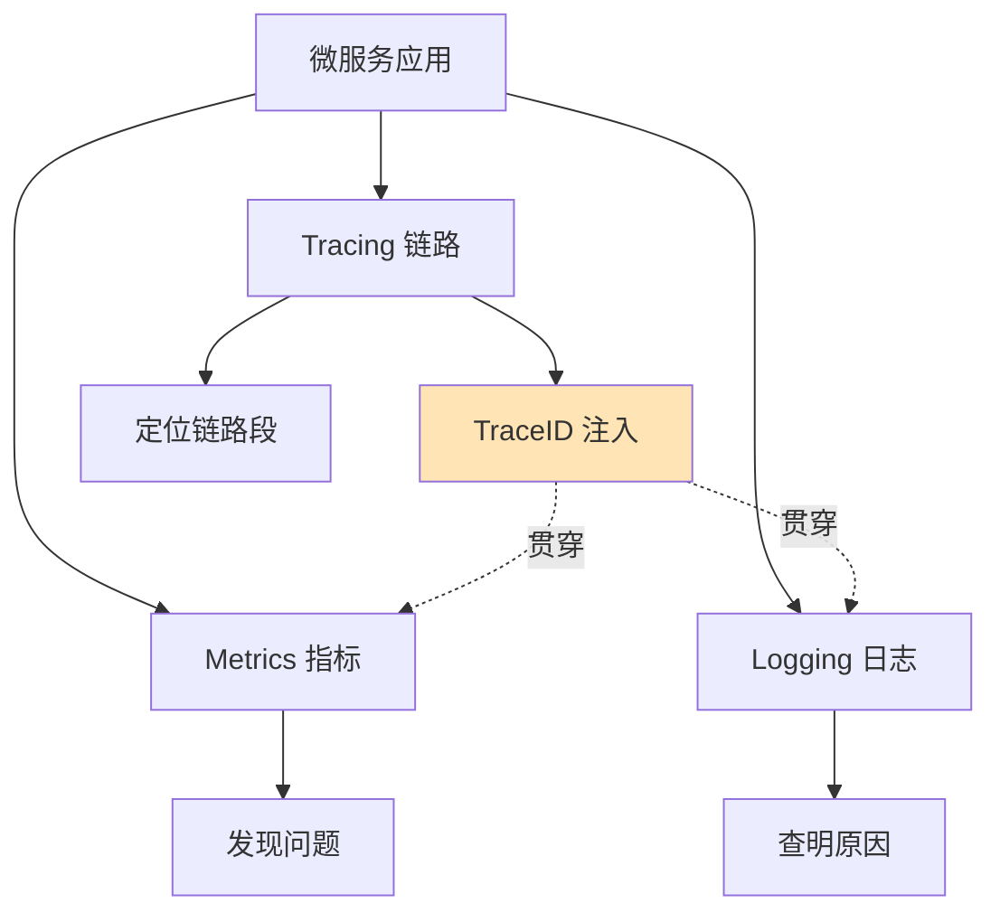

# 如何从零搭建微服务的全链路可观测性体系？覆盖 Metrics、Logging、Tracing 三大支柱。

【可观测性三大支柱】

1. **Metrics（指标）**——回答「系统有什么问题」
工具：Prometheus + Grafana。核心指标：RED（Rate/Errors/Duration）、USE（Utilization/Saturation/Errors）。四大黄金信号：延迟、流量、错误、饱和度。JVM/GC、线程池、DB 连接池、MQ 堆积等系统指标。

2. **Logging（日志）**——回答「为什么出问题」
工具：ELK（Elasticsearch + Logstash + Kibana）或 Loki。关键：结构化日志（JSON）、traceId 贯穿、日志分级。采样策略：ERROR 全量、INFO 采样，降低存储成本。

3. **Tracing（链路追踪）**——回答「问题在哪一层」
工具：Jaeger / SkyWalking / Zipkin。原理：Trace = 多个 Span 的树，SpanId/ParentSpanId 串联。关键：自动埋点（Java Agent）+ 手动埋点（业务关键节点）。traceId 注入到日志，实现三者关联。

【架构设计】
采集：Micrometer（Metrics）+ Logback JSON（Logging）+ OpenTelemetry Agent（Tracing）。传输：OTLP 协议统一上报。存储：Prometheus（时序）+ ES（日志）+ Jaeger（链路）。展示：Grafana 统一大盘。告警：AlertManager → 钉钉/企微/PagerDuty。

【告警分级】
P0：核心接口 5xx > 1%（电话叫醒）；P1：P99 延迟翻倍（企微）；P2：非核心服务异常（日报）

---

**【实战案例】**
某次大促期间，订单服务出现偶发超时。通过 TraceID 发现耗时全在下游「库存服务」的 DB 查询，但该服务的 Metrics 显示 DB 连接池并未耗尽。结合日志中的 SQL 慢查询记录，定位到是某条特定 SQL 扫描了过多行数据，导致 CPU 飙升。最终通过添加联合索引解决，证明了三大支柱关联分析的重要性。

**【代码示例】
Java (Logback + MDC 关联 TraceId)**
```java
// 在过滤器或拦截器中获取 TraceId 并放入 MDC
@Component
public class TraceFilter implements Filter {
    @Override
    public void doFilter(ServletRequest request, ServletResponse response, FilterChain chain) {
        String traceId = request.getHeader("X-B3-TraceId"); // 从 Zipkin/SkyWalking 上下文获取
        if (traceId == null) traceId = UUID.randomUUID().toString();
        MDC.put("traceId", traceId); 
        chain.doFilter(request, response);
        MDC.clear();
    }
}
// logback-spring.xml 配置输出格式: %d{yyyy-MM-dd HH:mm:ss} [%thread] %-5level %logger{36} - traceId:%X{traceId} - %msg%n
```

**【对比表格：ELK vs Loki】

| 特性 | ELK Stack (Elasticsearch) | Loki (Grafana Stack) |
| :--- | :--- | :--- |
| **存储原理** | 全文索引，倒排索引 | 仅索引 Label，日志内容不索引 |
| **内存占用** | 高 (构建索引消耗大) | 低 (适合云端大规模) |
| **查询速度** | 极快 (复杂聚合查询强) | 较快 (依赖 Label 过滤) |
| **成本** | 高 (磁盘/内存要求高) | 低 (约 ELK 的 10%-20%) |
| **适用场景** | 需要复杂全文检索、日志分析 | 追求低成本、以 Metrics 为主的可观测性 |


## 核心流程图



## 记忆要点

- 支柱分工：Metrics看系统问题、Logging查具体原因、Tracing定问题层级
- 串联关键：因为TraceId注入MDC，所以日志和链路能打通关联分析
- 告警分级：P0核心错误电话叫醒，P1延迟翻倍企微通知，P2非核心看日报
- 日志对比：ELK重全文检索但成本高，而Loki仅索引Label适合低成本场景

## 结构化回答


**30 秒电梯演讲：** 像医生看病：体温计看指标（Metrics），问诊听描述（Logging），CT扫病灶（Tracing）。

**展开框架：**
1. **Metrics 聚合指标** — Metrics 聚合指标，监控黄金信号
2. **Logging 记录上下文** — Logging 记录上下文，JSON结构化
3. **Tracing 串联调用** — Tracing 串联调用，全链路追踪

**收尾：** traceId 如何在微服务间传递？


## 视频脚本

> 预计时长：3 分钟 | 由浅入深

| 时间 | 画面/字幕 | 口播台词 | 讲解要点 |
|------|----------|----------|----------|
| 0:00 | 标题卡：从零搭建微服务的全链路可观测性体系 | "从零搭建微服务的全链路可观测性体系，这题我会分三步讲。" | 开场钩子 |
| 0:41 | 概念定义动画 | "一句话：Metrics 发现问题，Logging 查明原因，Tracing 定位链路。" | 核心定义 |
| 1:22 | 生活类比动画 | "打个比方——像医生看病：体温计看指标(Metrics)，问诊听描述(Logging)，CT扫病灶(Tracing)。" | 核心类比 |
| 2:03 | Metrics 聚合 图解 | "Metrics 聚合指标，监控黄金信号。" | Metrics 聚合 |
| 2:50 | Logging 记录 图解 | "Logging 记录上下文，JSON结构化。" | Logging 记录 |
