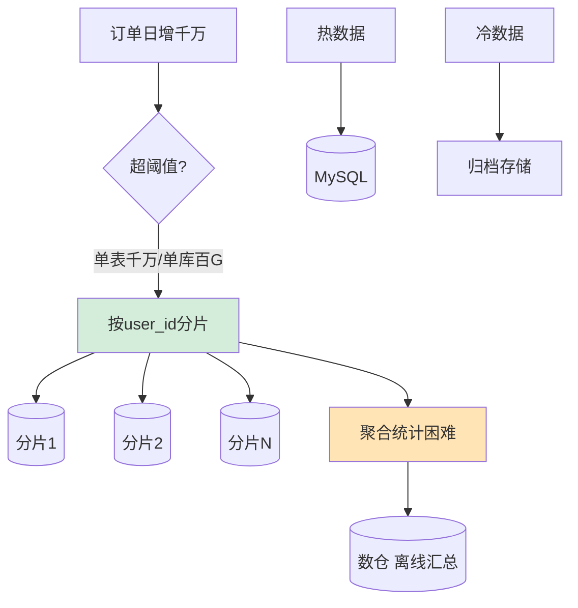

# 电商订单系统日增千万级数据，如何设计存储方案？什么时候该分库分表？

【判断是否需要分库分表】
- **性能瓶颈**：单表数据量 > 1000 万、单库物理文件 > 100GB（B+树层级变深，IO 增加）。
- **运维痛点**：慢查询变多、DDL（加字段/索引）耗时极长（锁表风险）、单机 IO/CPU 打满。
- **阈值参考**：MySQL InnoDB 单表建议 500万-2000万行。

【分片键选择】
- **推荐**：user_id（买家维度）。
  - **理由**：90% 的查询是“我的订单列表”，路由精准。
- **不推荐**：order_id。
  - **理由**：查询历史订单时无法直接定位分片，需广播所有分片，性能差。
- **折中方案**：基因法。
  - **实现**：生成 order_id 时，将 user_id 的后几位作为“基因”嵌入 order_id。
  - **路由**：解析 order_id 中的基因位，映射回 user_id 的分片。

【分片策略】
1. **范围分片**（Range，如 0-100万, 100-200万）：
   - **优点**：范围查询快。
   - **缺点**：热点集中在新数据，写压力大。
2. **Hash 分片**（Hash(user_id) % N）：
   - **优点**：数据均匀，扩容简单。
   - **缺点**：范围查询需全表扫描；扩容时数据需大量迁移（除非采用一致性 Hash）。
3. **一致性 Hash**：
   - **优点**：节点增减只影响相邻数据，最小化迁移量。

【分片组件】
- **ShardingSphere**（客户端分片）：应用层 JDBC 代理，轻量、无中心化，逻辑可控。
- **MyCat**（Proxy 层分片）：独立部署代理服务，对应用透明，多了一跳网络延迟。

【分片后的问题及解决】
1. **跨片查询**：
   - **原则**：严禁 `SELECT * FROM orders LIMIT 1000000, 10`。必须带上分片键。
   - **聚合**：需要聚合统计时，分发到各分片执行后再在内存合并，或使用 ClickHouse/Doris。
2. **分布式事务**：
   - **强一致**：Seata AT 模式（需 DB 支持 XA 或 AT 代理）。
   - **最终一致**：基于 MQ 的可靠消息（本地消息表）或 TCC（Try-Confirm-Cancel）。
3. **全局唯一 ID**：
   - **方案**：Snowflake（雪花算法，依赖机器时钟）、号段模式（Batch，数据库批量获取）。
4. **深度分页**：
   - **方案**：禁止 `OFFSET` 过大。改用“游标”翻页：`WHERE id > last_seen_id LIMIT 10`。

【数据生命周期管理】
- **热数据**（近 3 个月）：MySQL 分片集群，支持高频读写。
- **温数据**（3-12 个月）：归档到 TiDB 或只读实例。
- **冷数据**（>12 个月）：下沉到 HBase/OSS/S3，通过 Hive 或 Spark 进行离线分析。

---

**【实战案例】**
在「我的订单」列表翻页时，越往后翻页越慢，甚至超时。原因是分库分表后，没有带上 user_id 分片键导致全表扫描，且 `LIMIT offset` 过大。优化后要求前端改为「向下滚动加载」，后端接口改为使用 `WHERE id > last_max_id LIMIT 10` 的游标分页方式，性能稳定在 10ms 内。

**【代码示例：Snowflake ID 生成】
Java (Twitter Snowflake 算法实现)
```java
public class SnowflakeIdGenerator {
    private final long workerId;
    private final long twepoch = 1288834974657L;
    private long sequence = 0;
    private long lastTimestamp = -1L;
    
    public synchronized long nextId() {
        long timestamp = System.currentTimeMillis();
        if (timestamp < lastTimestamp) throw new RuntimeException("Clock moved backwards");
        if (lastTimestamp == timestamp) {
            sequence = (sequence + 1) & 0xFFF; // 12位序列号
            if (sequence == 0) timestamp = tilNextMillis(lastTimestamp);
        } else {
            sequence = 0;
        }
        lastTimestamp = timestamp;
        // 组合：时间戳(41) + 机器ID(10) + 序列号(12)
        return ((timestamp - twepoch) << 22) | (workerId << 12) | sequence;
    }
}
```

**【对比表格：客户端分片 vs 代理分片】

| 对比项 | ShardingSphere (Client) | MyCat / ShardingSphere-Proxy (Proxy) |
| :--- | :--- | :--- |
| **架构位置** | 应用层 (JAR包依赖) | 中间件层 (独立服务) |
| **性能** | 高 (少一次网络跳转) | 中 (多一次网络交互) |
| **复杂度** | 语言绑定 (Java强，其他弱) | 语言无关 (任意语言连接) |
| **运维** | 需重启应用升级 | 可独立升级，对应用透明 |
| **适用场景** | 高性能、微服务架构 | 异构语言、旧系统改造 |


## 核心流程图




## 记忆要点

- 拆分阈值：因为单表超1000万或文件超100G引发深层IO瓶颈，所以需分片
- 分片键选择：推荐user_id，因买家维度查询最多，路由最精准
- 基因法折中：将user_id后几位嵌入order_id，既保分散又支持订单维度的反查
- 深度分页：禁用大OFFSET，改用游标WHERE id > last_id分页避免全表扫

## 结构化回答


**30 秒电梯演讲：** 像分账本：按人头记流水，太厚了就换新本子，旧账打包封存。

**展开框架：**
1. **单表千万或单库百** — 单表千万或单库百GB即考虑分片
2. **分片键选user_id** — 分片键选user_id，避免跨片查询
3. **分片后聚合统计困难** — 分片后聚合统计困难，引入数仓

**收尾：** 基因法分片是什么原理？


## 视频脚本

> 预计时长：3 分钟 | 由浅入深

| 时间 | 画面/字幕 | 口播台词 | 讲解要点 |
|------|----------|----------|----------|
| 0:00 | 标题卡：电商订单系统日增千万级数据，如何设计存储 | "电商订单系统日增千万级数据，如何设计存储，这题我会分三步讲。" | 开场钩子 |
| 0:41 | 概念定义动画 | "一句话：按用户ID分片，数据冷热分离。" | 核心定义 |
| 1:22 | 生活类比动画 | "打个比方——像分账本：按人头记流水，太厚了就换新本子，旧账打包封存。" | 核心类比 |
| 2:03 | 单表千万或单库百 图解 | "单表千万或单库百GB即考虑分片。" | 单表千万或单库百 |
| 2:50 | 分片键选user 图解 | "分片键选user_id，避免跨片查询。" | 分片键选user |
