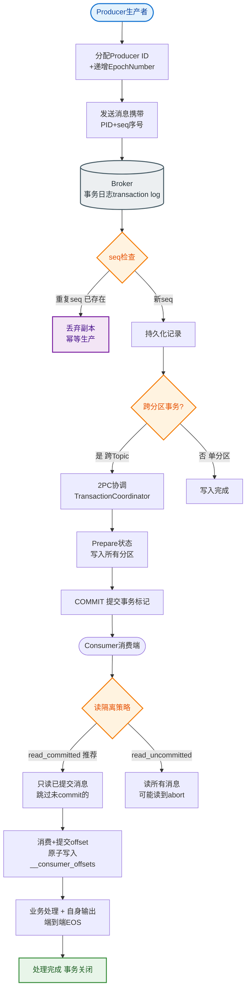

# 线上 Kafka 消息积压百万条如何快速处理？给出系统化的排查和恢复方案。

【排查步骤】
1. **确认积压范围**：
   - **命令**：`kafka-consumer-groups.sh --bootstrap-server <addr> --describe --group <group_id>`。
   - **指标**：关注 LAG（积压量），确认是所有 Partition 积压还是仅特定 Partition（可能是单机故障）。
2. **定位原因**：
   - **消费者挂了**：检查服务状态、OOM、GC 频繁。
   - **消费太慢**：下游 DB 慢查询、第三方接口超时、锁等待。
   - **生产突增**：大促活动、上游重试风暴导致流量倍增。
   - **Rebalance 频繁**：`max.poll.interval.ms` 超时导致组内频繁重平衡，消费停止。

【恢复方案】

**阶段一：紧急止损（5 分钟内）**
- **横向扩容**：
  - **前提**：Topic Partition 数 > 当前消费者数。
  - **操作**：增加消费者实例，直接分担 LAG。
  - **瓶颈**：如果 Consumer 数 >= Partition 数，增加实例无效。
- **临时扩 Partition**：
  - **注意**：Kafka 不支持减少 Partition，且扩容后需手动触发 Rebalance 或重启应用。

**阶段二：短期提速（30 分钟内）**
- **消费降级**：
  - 逻辑裁剪：跳过非核心逻辑（如非强依赖的通知、积分计算），只做核心落库。
  - 拒绝非核心流量：上游限流。
- **批量优化**：
  - **参数**：`max.poll.records` 调大（如 500）。
  - **逻辑**：业务层攒批插入 DB（`INSERT INTO ... VALUES (...), (...)`），减少 IO 交互。
- **并发消费**：
  - **模式**：单线程拉取消息 + 内存队列 + 线程池异步处理。
  - **风险**：丧失消息顺序性，仅适用于无序消息；需处理好异常，避免 poll 间隔超时触发 Rebalance。

**阶段三：根本解决（长期）**
- **优化下游**：DB 加索引、缓存预热、异步化（调用改为 MQ 发送）。
- **容量规划**：大促前提前扩容 Partition 和 Consumer。
- **架构升级**：
  - **分级队列**：核心业务与非核心业务拆分 Topic。
  - **死信队列**：处理失败消息不阻塞主流程。

【架构调整示意图：扩容消费】
```text
Topic: T_Order (4 Partitions)
+-------+  +-------+  +-------+  +-------+
|  P0   |  |  P1   |  |  P2   |  |  P3   |
+---+---+  +---+---+  +---+---+  +---+---+
    |          |          |          |
    | (Consumer Group A) |
    v          v          v          v
+-------+  +-------+  +-------+  +-------+
|  C1   |  |  C2   |  |  C3   |  |  C4   |
+-------+  +-------+  +-------+  +-------+
(当前状态: Consumer 数 = Partition 数)

若需提速 -> 扩容 Partition 到 8 个，并新增 C5-C8
```

【注意事项】
- **消息丢失是底线**：严禁直接修改 Offset 跳过积压。如必须跳过，需记录 Offset 范围，事后通过日志或快照补偿数据。
- **顺序性**：如果业务要求严格顺序（如金融转账），不能使用多线程并发消费，只能通过增加 Partition 和 Consumer 来提升吞吐。
- **监控告警**：设置 LAG 阈值告警（如 > 1万），在积压初期介入。

---

**【实战案例】**
某次营销活动，上游瞬间推送了 10 倍于平时的数据，导致消费者直接 OOM。虽然重启了服务，但 LAG 已积压上千万。由于 Partition 只有 10 个，扩容 Consumer 无效。最终采用「将积压的 Topic 数据通过自定义脚本转发到一个扩容了 100 个 Partition 的临时 Topic」，然后用 50 个消费者并发清洗处理，耗时 2 小时消化完毕。

**【代码示例：Java Kafka 多线程消费模型】
```java
// 主线程：只负责 Poll 消息
while (true) {
    ConsumerRecords<String, String> records = consumer.poll(Duration.ofMillis(100));
    // 将消息放入内存阻塞队列，由线程池异步处理
    for (ConsumerRecord<String, String> record : records) {
        blockingQueue.offer(record.value()); 
    }
    // 异步提交 offset (注意：可能丢数据，需配合业务幂等)
    consumer.commitAsync();
}
// 子线程：从队列取消息处理逻辑
executorService.submit(() -> {
    while(true) processMessage(blockingQueue.take());
});
```

**【对比表格：Kafka 消费模式】

| 特性 | 单线程消费 (Per Partition) | 多线程消费 (内存队列分发) |
| :--- | :--- | :--- |
| **顺序保证** | 严格保序 (Partition内) | **不保序** (除非额外加锁) |
| **吞吐量** | 受限于单线程处理速度 | 高 (取决于线程池大小) |
| **位移管理** | 自动/简单，处理完提交 | 复杂，需防止 Rebalance 丢数据 |
| **适用场景** | 顺序敏感业务 (金融、库存) | 吞吐敏感业务 (日志处理、推荐) |


## 核心流程图


## 记忆要点

- 止损前提：因为单Partition上限，所以扩容Consumer必须要求Partition数更多
- 短期提速：裁剪非核心逻辑，调大max.poll.records并攒批插入DB
- 保序扩容：若业务要求严格顺序，禁用多线程消费，只能靠加Partition扩容
- 底线原则：严禁直接改Offset跳过积压，必须用死信队列或临时Topic承接

## 结构化回答


**30 秒电梯演讲：** 像流水线堵料：先招临时工（扩容）突击处理，再优化流程（逻辑）提效。

**展开框架：**
1. **LAG** — 排查LAG，定位消费慢的根因
2. **Consumer** — 紧急增加Consumer，数量不超Partition
3. **消费逻辑降级** — 消费逻辑降级，只做核心落库

**收尾：** 为什么消费者数超过 Partition 数就无效？如何增加并发？


## 视频脚本

> 预计时长：3 分钟 | 由浅入深

| 时间 | 画面/字幕 | 口播台词 | 讲解要点 |
|------|----------|----------|----------|
| 0:00 | 标题卡：线上 Kafka 消息积压百万条如何快速 | "线上 Kafka 消息积压百万条如何快速，这题我会分三步讲。" | 开场钩子 |
| 0:41 | 概念定义动画 | "一句话：紧急扩容提速，根本优化产能。" | 核心定义 |
| 1:22 | 生活类比动画 | "打个比方——像流水线堵料：先招临时工(扩容)突击处理，再优化流程(逻辑)提效。" | 核心类比 |
| 2:03 | 排查LAG 图解 | "排查LAG，定位消费慢的根因。" | 排查LAG |
| 2:50 | 紧急增加Cons 图解 | "紧急增加Consumer，数量不超Partition。" | 紧急增加Cons |
