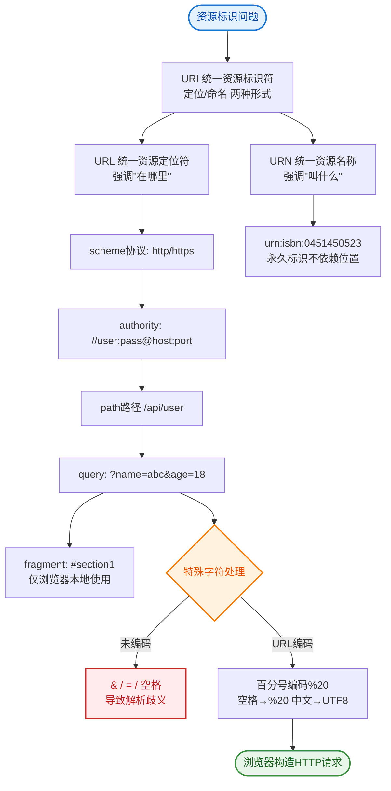

# 如何设计一个短链系统（短URL服务）？

🎯 **本质**：短链系统将长URL映射为短URL，核心是发号器+存储+重定向。

🧒 **类比**：图书馆的书架编号系统。一本厚书有很长的书名（长URL），但只需要一个简短的书架编号（短URL）就能找到它。

📊 **系统设计**：

**1. 发号策略（核心选型）**
- **方案A：自增ID + Base62编码（推荐生产环境）**
  - 流程：DB 自增 ID (如 1001) -> 转换为 62 进制 (G7) -> 拼接域名。
  - 优点：序列极短，不冲突，存储紧凑。
  - **挑战**：ID 生成需分布式（雪花算法 / 数据库号段模式 / Flickr 算法）。
- **方案B：Hash(MD5/MurmurHash) + 截断**
  - 流程：`md5(long_url)` -> 取前 6/7 位 Base62。
  - 优点：无状态，计算快。
  - **缺点**：
    - 冲突处理：需查库，若存在则进行“再哈希”（加随机盐）重试。
    - 长度不确定：可能需要更多字符来减少冲突。

**2. 存储设计**
```
Table: short_url
---------------------------------------------------
| id (PK) | code (Unique) | long_url | created_at |
---------------------------------------------------
| 10001   | 8m0mE         | http://...| 2023-...  |
---------------------------------------------------
```
- **Redis**：`String` 类型，Key=short_code, Value=long_url。设置合理 TTL。

**3. 重定向流程**
```
User: short.url/Ab3xK
   │
   ├─> CDN (可选: 缓存热门短链)
   │
   ├─> Nginx/LB
   │
   ├─> 短链服务
   │     │
   │     ├─> 查 Redis
   │     │   ├─> Hit -> 返回 301/302 + Location
   │     │   └─> Miss -> 查 MySQL
   │     │                ├─> Hit -> 回写 Redis -> 返回 301/302
   │     │                └─> Miss -> 返回 404
   │     │
   └─> Browser Redirect -> Long URL
```
- **301 vs 302**：
  - **301 (永久重定向)**：浏览器会缓存短链与长链的映射，后续访问不再请求服务器，**性能最好但无法统计**点击量。
  - **302 (临时重定向)**：每次都访问服务器，**适合做数据分析**（点击数、来源统计）。

**4. 关键优化**
- **高性能发号**：使用 Leaf（美团）或 TinyID（百度）等分布式 ID 服务，避免单机 DB 压力。
- **布隆过滤器**：在查 DB 之前，先经过布隆过滤器，快速拦截不存在的恶意短链查询，防止打挂 DB。
- **分库分表**：若数据量极大，按 `code` 尾数分库分表（0-9, a-z）。
- **安全**：长URL入库前做安全扫描，防止生成钓鱼短链；可增加短链访问鉴权（校验 Token）。

## 常见考点
1. **为什么选择 62 进制？**
   - 答：62 包含 `[0-9a-zA-Z]`，相比 64 进制去掉了易混淆的符号（如 +, /），适合 URL 传输。6 位 62 进制可表示约 568 亿个组合，满足绝大部分需求。
2. **如何保证高并发下的读性能？**
   - 答：多级缓存（浏览器缓存 CDN Redis）；布隆过滤器挡掉无效流量；DB 分库分表减少单表压力。
3. **短链如何设计自定义后缀（如京东 jd.com/abc）？**
   - 答：放弃自动发号，采用 Hash 方案或预分配段。用户指定时，检查是否已被占用（DB 唯一索引），若占用则提示用户更换。
4. **如果 URL 超长怎么办？**
   - 答：数据库字段使用 `TEXT` 或 `LONGTEXT` 类型存储；发送 MQ 时注意消息体大小限制。


## 核心流程图


## 记忆要点

- 发号策略：自增ID转Base62长度确定无冲突，而Hash截断需处理冲突补齐长度
- 进制选择：因62进制含[0-9a-zA-Z]且避开了特殊符号，故适合URL传输
- 重定向选型：301永久重定向性能好，而302临时重定向方便统计点击量
- 缓存拦截：DB前加布隆过滤器，可快速拦截不存在的恶意短链查询

## 结构化回答

**30 秒电梯演讲：** 长短映射，核心是发号器算法与存储。打比方——像图书馆给厚书编一个简短的书架号以便查找。落到工程上，自增ID/Base62或Hash截断。

**展开框架：**
1. **发号策略** — 自增ID/Base62或Hash截断
2. **存储层** — Redis缓存热点，MySQL持久化
3. **访问时** — 读缓存，未命中查库并回填

**收尾：** 以上三点都能配合实战聊。我可以展开任一要点，您想先深入哪一块？

## 视频脚本

> 预计时长：3 分钟 | 由浅入深

| 时间 | 画面/字幕 | 口播台词 | 讲解要点 |
|------|----------|----------|----------|
| 0:00 | 标题卡：短链系统（短URL服务） | "短链系统（短URL服务），这题我会分三步讲。" | 开场钩子 |
| 0:41 | 概念定义动画 | "一句话：长短映射，核心是发号器算法与存储。" | 核心定义 |
| 1:22 | 生活类比动画 | "打个比方——像图书馆给厚书编一个简短的书架号以便查找。" | 核心类比 |
| 2:03 | 发号策略 图解 | "自增ID/Base62或Hash截断。" | 发号策略 |
| 2:50 | 存储层 图解 | "Redis缓存热点，MySQL持久化。" | 存储层 |
