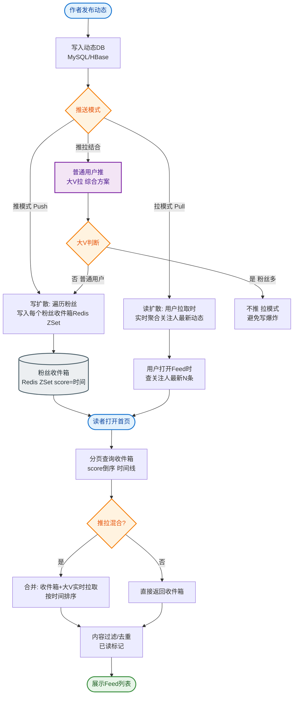

# 如何设计一个Feed流系统（类似微博/朋友圈）？

🎯 本质：Feed流系统需要高效地将内容推送到关注者的时间线中，核心是推(push)/拉(pull)模式的选择。

📊 三种核心模式：

1. **推模式（Fan-out on write）**
发布内容时，主动写入所有粉丝的收件箱
优点：读极快（直接读自己的timeline）
缺点：写放大（大V发帖要写千万条）、存储成本高
适用：粉丝数适中的用户

2. **拉模式（Fan-out on read）**
读Feed时，实时拉取关注人的最新内容，合并排序
优点：写轻量、存储小
缺点：读放大（每次读需要拉多个用户）、延迟高
适用：大V（粉丝百万级）

3. **推拉结合（Hybrid）**
普通用户：推模式（主动写入粉丝收件箱）
大V用户：拉模式（粉丝读时实时拉取）
活跃用户：推模式优先
非活跃用户：拉模式

这是微博/Instagram的实际架构。

**Feed流推拉结合架构图：**
```text
[User A (大V)] 发布消息
      |
      v
[逻辑层] 判断：A是大V，采用写扩散至活跃粉丝 + 读扩散处理普通粉丝
      |
      +---------------------------> [收件箱 Timeline DB/Cache]
      |                                      |
      | (不直接写入)                         v
      |                              [活跃粉丝 B] 读取极快
      |
      v
[内容库 Content Store]
      ^
      | (读取时聚合)
      |
[普通粉丝 C] 读取首页 -> 聚合 [内容库A的消息] + [其他关注者的Timeline]
```

数据模型设计：
// 内容存储（发件箱）
content: { content_id, user_id, text, media, timestamp }

// Feed流（收件箱）
timeline:{user_id}: [ {content_id, timestamp}, ... ]  // Redis Sorted Set

// 关注关系
following:{user_id}: [user_id1, user_id2, ...]  // Redis Set
followers:{user_id}: [user_id1, ...]

技术选型：
- Redis Sorted Set：存储用户timeline（按时间排序）
- 存储分片：按user_id分库分表
- 冷热分离：热数据在Redis，冷数据在MySQL
- 消息队列：Kafka异步推送到粉丝收件箱

面试加分点：
- 讨论活跃度模型（用户在线时推，离线时不推）
- 缓存设计（首页Feed缓存，翻页时实时计算）
- 去重（同一条内容不重复展示）

## 常见考点
1. **Feed流的“读扩散”与“写扩散”**：如何根据用户粉丝数动态切换策略？（设定阈值，如粉丝>1万走读扩散）。
2. **大数据量下的翻页性能**：如何解决跳页、翻页越深越慢的问题？（使用游标Cursor代替传统Offset分页，记录上次读取的最小Score）。
3. **一致性保证**：推模式下，如果写粉丝收件箱失败怎么办？（使用消息队列重试，记录失败日志做补偿）。


## 核心流程图


## 记忆要点

- 核心推拉模型：普通用户用推模式（写扩散），大V用拉模式（读扩散）
- 大V优化策略：只推活跃粉丝，非活跃粉丝读时实时拉取聚合
- 存储技术选型：收件箱用Redis Sorted Set，冷热数据分离存储
- 深度翻页优化：抛弃传统Offset，使用游标记录上次读取的最小Score

## 结构化回答

**30 秒电梯演讲：** 权衡读/写放大，推拉结合分发内容。打比方——像报纸订阅，普通客户投递到家，大V内容去报刊亭自取。落到工程上，写时扩散，读快适合小V。

**展开框架：**
1. **推模式** — 写时扩散，读快适合小V
2. **拉模式** — 读时聚合，省空间适合大V
3. **推拉结合** — 活跃用户推，大V内容拉

**收尾：** 以上三点都能配合实战聊。我可以展开任一要点，您想先深入哪一块？

## 视频脚本

> 预计时长：3 分钟 | 由浅入深

| 时间 | 画面/字幕 | 口播台词 | 讲解要点 |
|------|----------|----------|----------|
| 0:00 | 标题卡：Feed流系统（类似微博/朋友圈） | "Feed流系统（类似微博/朋友圈），这题我会分三步讲。" | 开场钩子 |
| 0:41 | 概念定义动画 | "一句话：权衡读/写放大，推拉结合分发内容。" | 核心定义 |
| 1:22 | 生活类比动画 | "打个比方——像报纸订阅，普通客户投递到家，大V内容去报刊亭自取。" | 核心类比 |
| 2:03 | 推模式 图解 | "写时扩散，读快适合小V。" | 推模式 |
| 2:50 | 拉模式 图解 | "读时聚合，省空间适合大V。" | 拉模式 |
