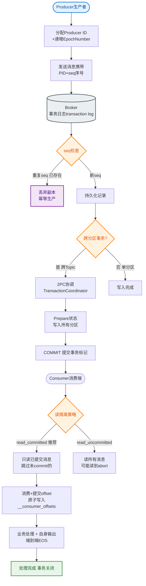
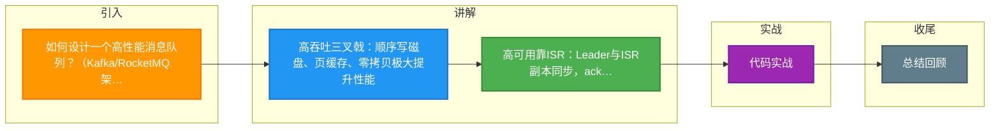

# 如何设计一个高性能消息队列？（Kafka/RocketMQ架构设计）

🎯 本质：消息队列的核心是高吞吐、低延迟、可靠性和顺序性的平衡。

📊 Kafka架构设计要点：

1. **分区(Partition)并行**
- Topic分为多个Partition，每个Partition独立
- Consumer Group中每个Consumer消费不同Partition
- 并行度 = Partition数

2. **顺序写磁盘**
- 消息追加写入日志文件(append-only log)
- 顺序写速度可达600MB/s（远超随机写）
- 零拷贝(sendfile)减少数据从内核态到用户态的拷贝

3. **批量处理**
- Producer批量发送（linger.ms + batch.size）
- Consumer批量拉取
- 压缩（snappy/lz4/zstd）

4. **页缓存(Page Cache)**
- 利用操作系统页缓存，不维护应用层缓存
- 消费者读数据通常直接命中Page Cache

**Kafka 消息读写流程（零拷贝）：**
```text
Producer --> [Broker Disk (Log Segment)]
                   |
                   | (sendfile syscall: DMA transfer)
                   v
Consumer <-- [Network Card] <-- [Page Cache] <-- [Disk File]
```
*说明：数据不经过应用程序内存，直接从内核态的Page Cache通过DMA传输到网卡。*

**Kafka 高可用架构（ISR机制）：**
```text
[Producer] --> [Leader Partition] 
                    |
        +-----------+-----------+
        | (Sync Replica)       |
        v                       v
[ISR Follower 1]        [ISR Follower 2] (In-Sync Replicas)
        |                       |
        +----------> [ZK] <-----+
                   (Controller)
```

RocketMQ相比Kafka的改进：
1. 支持事务消息（半消息+回查）
2. 支持延时消息（固定级别/任意延时）
3. 支持消息过滤（Tag/SQL92）
4. 单机支持百万级Topic（Kafka大量Topic性能下降）
5. CommitLog统一存储（所有Topic消息写入同一个文件）

消息可靠性保证：
**生产者端：**
- acks=all（所有副本确认）
- retries=MAX（自动重试）
- 幂等Producer（enable.idempotence=true）
- 事务Producer（跨分区原子写入）

**Broker端：**
- 副本机制（replication.factor=3）
- min.insync.replicas=2
- unclean.leader.election.enable=false（禁止非同步副本成为Leader）

**消费者端：**
- 手动提交offset（enable.auto.commit=false）
- 消费完成后提交
- 消费失败：重试 + 死信队列

面试关键问题：如何保证消息不丢、不重、有序？
- 不丢：acks=all + 副本 + 手动提交offset
- 不重：幂等Producer + 业务去重
- 有序：同一key的消息发到同一Partition，单线程消费

## 常见考点
1. **消息丢失场景**：Kafka在什么极端情况下仍可能丢消息？（min.insync.replicas=1且ack=all时，ISR只有Leader自己，Leader挂了数据就丢了）。
2. **消息积压处理**：如果消费速度远慢于生产速度导致积压，如何紧急恢复？（临时扩容Consumer，但注意Partition数限制，或者新建Topic转发数据进行扩容消费）。
3. **顺序性实现**：如何保证全局有序？（单一Partition，牺牲并发；通常只要求Key局部有序）。


## 核心流程图


## 记忆要点

- 高吞吐三叉戟：顺序写磁盘、页缓存、零拷贝极大提升性能
- 高可用靠ISR：Leader与ISR副本同步，ack=all保证消息不丢
- 不丢不重有序：acks=all防丢，幂等Producer防重，同Key同Partition保序
- 架构对比：Kafka主打日志吞吐，RocketMQ主打事务/延时与多Topic

## 结构化回答


**30 秒电梯演讲：** 像高速送货车，装满一车走直线（顺序写）直达终点。

**展开框架：**
1. **Partitio** — n分区并行处理提高吞吐
2. **磁盘顺序写优于随机写** — 磁盘顺序写优于随机写，性能极高。
3. **利用页缓存与零拷** — 利用页缓存与零拷贝减少IO。

**收尾：** 这是我实战中的理解，您想深入哪一段？


## 视频脚本

> 预计时长：3 分钟 | 由浅入深

| 时间 | 画面/字幕 | 口播台词 | 讲解要点 |
|------|----------|----------|----------|
| 0:00 | 标题卡：高性能消息队列 | "高性能消息队列，这题我会分三步讲。" | 开场钩子 |
| 0:41 | 概念定义动画 | "一句话：利用磁盘顺序写与零拷贝实现高吞吐。" | 核心定义 |
| 1:22 | 生活类比动画 | "打个比方——像高速送货车，装满一车走直线(顺序写)直达终点。" | 核心类比 |
| 2:03 | Partitio 图解 | "Partition分区并行处理提高吞吐。" | Partitio |
| 2:50 | 磁盘顺序写优于随机写 图解 | "磁盘顺序写优于随机写，性能极高。" | 磁盘顺序写优于随机写 |

### 视频流程图



