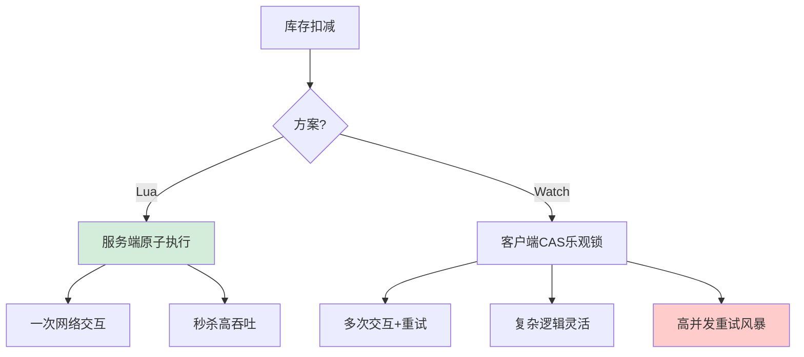

# 在设计秒杀系统时，为了防止库存超卖，Redis Lua 脚本和 Watch 机制（CAS 乐观锁）是实现原子性扣减的两种常见手段。对比它们的优缺点及适用场景。

Redis Lua 脚本和 Watch 机制都能保证原子性，但原理不同。Lua 脚本在 Redis 中是原子执行的，因为它在执行期间会阻塞其他命令，且不需要网络交互，一次性完成“查询-判断-扣减”逻辑，性能极高，适合高并发、逻辑简单的秒杀扣减。Watch 机制是基于乐观锁（CAS），客户端读取数据后标记 Key，在提交事务时检查 Key 是否被修改，若被修改则事务失败需重试。Watch 的缺点是需要多次网络交互（读取+发送事务），且在高并发冲突严重时，大量客户端会重试，导致“惊群效应”。因此，秒杀场景首选 Lua 脚本以保证高吞吐和强一致性；而在业务逻辑复杂、需要跨多个 Redis 操作或依赖外部状态判断的场景，Watch 或分布式锁可能更灵活，但需牺牲部分性能。

**1. 实战案例**：
在“双11”大促预热活动中，我们曾误用 Watch 机制抢购少量稀缺库存，导致 QPS 远低于预期，且客户端重试风暴占用了大量 CPU 资源；改用 Lua 脚本将“查库存-扣减-记录流水”打包原子执行后，吞吐量提升了 10 倍。

**2. 代码示例**：
```lua
--扣减库存 Lua 脚本 (Redis)
local stock = redis.call('get', KEYS[1])
if not stock then return 0 end
if tonumber(stock) > tonumber(ARGV[1]) then
    return redis.call('decrby', KEYS[1], ARGV[1])
else
    return -1
end
```

**3. 对比表格**：
| 维度 | Redis Lua 脚本 | Watch 机制 (CAS) |
| :--- | :--- | :--- |
| **原子性原理** | 服务器端单线程阻塞执行 | 乐观锁，版本号比对 |
| **网络开销** | 一次交互（发送脚本+参数） | 至少两次（读+执行） |
| **并发性能** | 极高，无回滚成本 | 低，高冲突下大量重试 |
| **适用场景** | 简单的库存扣减、计数 | 复杂逻辑、需客户端干预 |
| **阻塞风险** | 脚本过长会阻塞 Redis | 无阻塞，但增加客户端延迟 |

## 技术原理

两种方案的本质差异在于「原子性的实现位置」——Lua 在服务端串行化，Watch 在客户端乐观重试：

- **Lua 的服务端原子性**：Redis 是单线程模型，执行 Lua 脚本期间不会被其他命令打断（Redis 4.0 后 Lua 在独立解释器，但仍串行）。客户端用 `EVAL`/`EVALSHA` 一次发送脚本和参数，Redis 在内部完成「读取库存 → 判断 → 扣减 → 记录流水」全流程，再返回结果。整个过程只有一次网络往返（RTT），且无锁竞争——这是高吞吐的根因。理论上单实例 Redis Lua 可支撑 10 万+ QPS 的原子扣减。
- **Watch 的 CAS 乐观锁**：客户端先 `WATCH stock_key`，再 `GET` 读取当前库存，本地判断后用 `MULTI/EXEC` 提交扣减。Redis 在 EXEC 时检查 `stock_key` 是否自 WATCH 后被修改过——若有其他客户端改了它，整个事务 abort，客户端收到 nil 需重新 WATCH + 读 + 提交。这是典型的 CAS（Compare-And-Swap）。
- **惊群效应（Thundering Herd）**：秒杀场景下 1000 个客户端同时 WATCH 同一商品库存，只有 1 个能 EXEC 成功，999 个失败重试。重试又触发新一轮竞争，CPU 消耗在无谓的重试上，有效吞吐骤降。冲突率 $p \approx 1 - 1/n$（$n$ 为并发数），$n=1000$ 时 99.9% 的请求都在重试。
- **Lua 的阻塞代价**：Lua 脚本执行期间 Redis 完全阻塞，其他命令（包括普通读写）都要排队。如果脚本逻辑复杂或包含耗时操作（如循环处理大集合），会拖慢整个 Redis 实例。因此 Lua 脚本必须「短小精悍」，避免复杂计算和大量循环。

## 代码示例

```lua
-- 扣减库存 Lua 脚本（生产级，含记录流水）
-- KEYS[1] = 库存key, KEYS[2] = 流水list key
-- ARGV[1] = 扣减数量, ARGV[2] = 订单ID
local stock = tonumber(redis.call('GET', KEYS[1]))
if not stock then return -2 end                   -- -2: 库存key不存在
if stock < tonumber(ARGV[1]) then return -1 end   -- -1: 库存不足
redis.call('DECRBY', KEYS[1], ARGV[1])            -- 扣减库存
redis.call('RPUSH', KEYS[2], ARGV[2])             -- 记录订单流水（可异步消费）
return stock - tonumber(ARGV[1])                  -- 返回剩余库存
```

```java
// Java 客户端调用 Lua 脚本（Spring Data Redis）
@Service
public class SeckillService {
    @Autowired private RedisTemplate<String, String> redis;
    private DefaultRedisScript<Long> script;

    @PostConstruct
    public void init() {
        script = new DefaultRedisScript<>();
        script.setLocation(new ClassPathResource("seckill.lua"));
        script.setResultType(Long.class);
    }

    public boolean deduct(String skuId, int qty, String orderId) {
        String stockKey = "stock:" + skuId;
        String logKey = "orders:" + skuId;
        Long result = redis.execute(script,
            Arrays.asList(stockKey, logKey),
            String.valueOf(qty), orderId);
        if (result == null || result == -1) return false;   // 库存不足
        if (result == -2) throw new IllegalStateException("库存未初始化");
        return true;  // 扣减成功
    }
}

// 反例：Watch 机制（高并发下性能差，不推荐用于秒杀）
public boolean deductWithWatch(String skuId, int qty) {
    for (int retry = 0; retry < 3; retry++) {       // 最多重试 3 次
        redis.watch("stock:" + skuId);
        String val = redis.get("stock:" + skuId);
        if (val == null || Integer.parseInt(val) < qty) {
            redis.unwatch(); return false;
        }
        redis.multi();
        redis.decrBy("stock:" + skuId, qty);
        List<Object> res = redis.exec();            // 可能为 null（被其他客户端抢先）
        if (res != null) return true;               // 提交成功
    }
    return false;  // 重试耗尽
}
```

## 注意事项

- **Lua 脚本要预加载**：用 `EVALSHA` 传 SHA1 而非 `EVAL` 传完整脚本，节省带宽。Redis 启动后用 `SCRIPT LOAD` 预加载所有脚本，避免运行时 `NOSCRIPT` 错误。
- **Lua 脚本不能有随机性**：Redis 要求 Lua 脚本在主从复制下结果一致，因此脚本内不能调用 `TIME`、`RANDOMKEY` 等随机命令（除非先 `redis.replicate_commands()`）。
- **集群模式下的 Lua 限制**：Redis Cluster 中，Lua 脚本访问的所有 Key 必须在同一 slot（hash tag）。秒杀场景用 `{skuId}:stock`、`{skuId}:orders` 保证同 slot。
- **Watch 的最大重试次数**：无限重试会拖垮客户端，必须设上限（如 3~5 次）并配合退避。冲突率高的场景应直接换 Lua 或分布式锁。
- **防超卖的终极方案**：Lua 解决了 Redis 层的原子性，但「Redis 扣减成功 + DB 下单失败」仍会导致库存与订单不一致。生产方案是 Lua 扣减 + 异步消息队列下单 + 定时对账补偿，或「Redis 预扣 + DB 最终扣减」的两阶段。
- **热点 Key 的分片**：单一爆款商品的库存 Key 是热点，单 Redis 实例可能扛不住。可将库存拆分到多个 Key（如 `stock:sku:0` ~ `stock:sku:9`），扣减时随机选一个，分摊压力。


## 核心流程图




## 记忆要点

- 执行原理：Lua在服务端单线程阻塞执行，Watch依赖客户端CAS乐观锁
- 性能对比：Lua无重试无网络交互极高，Watch高并发下冲突重试致惊群
- 秒杀首选Lua：将查、判、扣打包原子执行，吞吐量远超Watch机制

## 结构化回答

**30 秒电梯演讲：** Lua是服务端打包处理，Watch是客户端比对重试。打比方——Lua脚本像去自动贩卖机买饮料，塞钱直接出货，无需确认；Watch像去排队结账，你去时还有货，结账时发现被别人买走了，得重新排队。落到工程上，Lua服务端阻塞执行，Watch客户端CAS校验。

**展开框架：**
1. **原子性** — Lua服务端阻塞执行，Watch客户端CAS校验
2. **性能** — Lua一次网络交互，Watch多次交互且高并发下重试风暴
3. **场景** — 秒杀用Lua保吞吐，复杂逻辑用Watch更灵活

**收尾：** 以上三点都能配合实战聊。我可以展开任一要点，您想先深入哪一块？

## 视频脚本

> 预计时长：2 分钟 | 由浅入深

| 时间 | 画面/字幕 | 口播台词 | 讲解要点 |
|------|----------|----------|----------|
| 0:00 | 标题卡：在设计秒杀系统时，为了防止库存超卖，Re | "在设计秒杀系统时，为了防止库存超卖，Re，一分钟讲透。" | 开场钩子 |
| 0:35 | 生活类比动画 | "打个比方——Lua脚本像去自动贩卖机买饮料，塞钱直接出货，无需确认；Watch像去排队结账，你去时还有货，结账时发现被别人买走了，得重新排队。" | 核心类比 |
| 1:10 | 概念定义动画 | "一句话：Lua是服务端打包处理，Watch是客户端比对重试。" | 核心定义 |
| 1:50 | 原子性 图解 | "Lua服务端阻塞执行，Watch客户端CAS校验。" | 原子性 |
